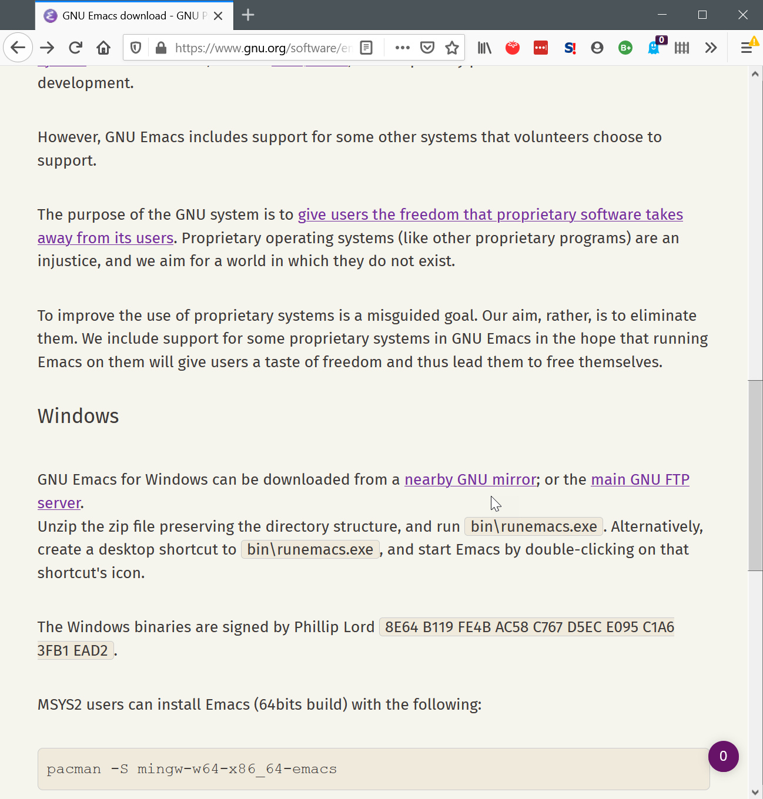
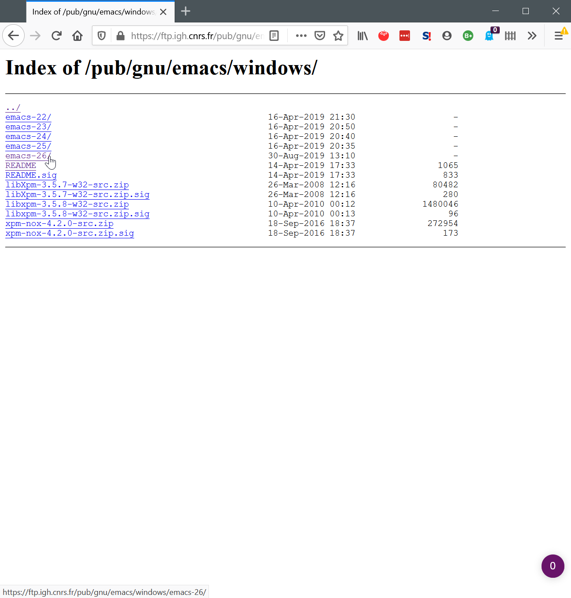
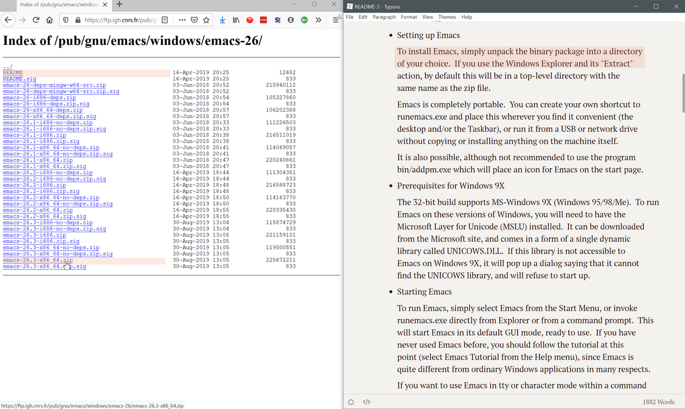
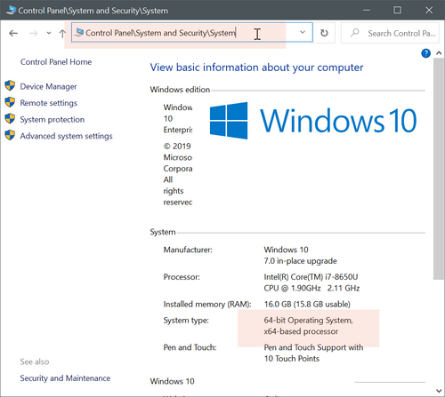
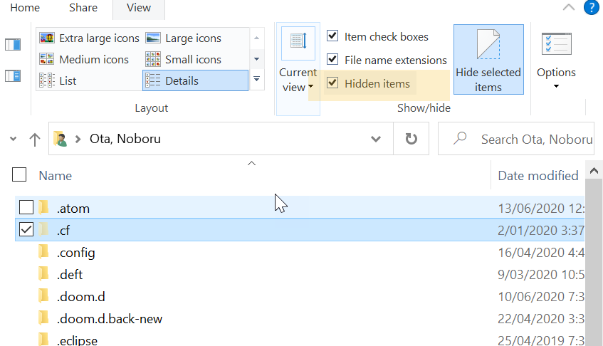
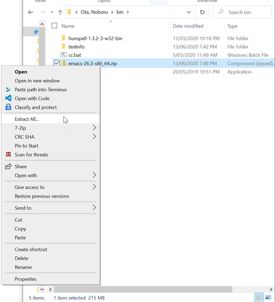
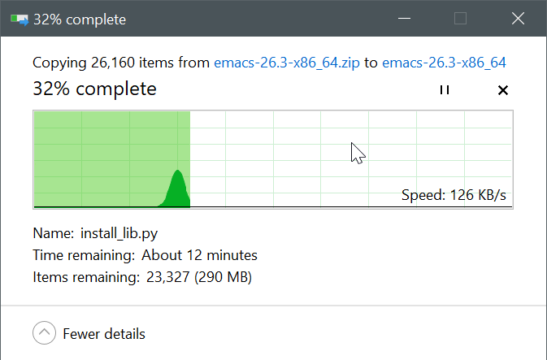

## Get Emacs for Windows

There are many ways to get Emacs for Windows. If you google that, you are likely end up somewhere on [GNU Emacs official website](https://www.gnu.org/software/emacs/download.html).
Let's follow this way.

Go "nearby GNU mirror" under Windows section, and then click on the latest version (as at the time of writing, it is emacs-26). 

Some experienced people might talk about version 27. I don't even know how to get that version for Windows. I think you need to build it from source. Don't worry about all this. Version 26 is good. 

### Get right Emacs zip archive

I will assume you have the 64-bit version of Windows. If you are not sure, see the next section to learn how to tell if your Windows is the 32-bit or 64-bit version. 

For 64-bit, get the second zip file from the bottom, named `emacs-26.3-x86_64.zip`. This includes software that Emacs uses to show JPG and other image files, and so on. You can learn more about differences by reading README. You can open it in your text editor. I'm using Typora here, but it can be Atom, Notepad, etc…

### Check if your Windows is 64-bit or 32-bit version 

You can see if your Windows is 64-bit or 32-bit version in Control Panel > System Security > System.

### Make hidden files visible (just in case)

This may not be necessary for you, but it might help you if you know about hidden files on Windows.

Open File Explorer, and go to your home folder – this should be `C://Users/your-user-name`.
On the ribbon menu at the top, open View tab. Make sure the check box "Hidden items" is ticked on. Explorer will display files and folders that are marked as "hidden". In the example below from my PC, the icon next to the folder named `.cf` is half-transparent. It means it is a hidden folder – you can see this by showing its properties (right click on the folder, and show them).

Starting a folder or file name with a dot `.` is Unix convention to indicate that these are "hidden" – in most cases, they are files and directories used for technical configuration. Windows does not necessarily follow this convention, and you may not have noticed this feature before.

For Emacs, you will be likely dealing with a folder named `.emacs.d` or a file named `.emacs` to configure your Emacs – have you seen people refer to their Emacs configuration file as "dotemacs", dot-Emacs? I have not had them to be set as hidden by default on Windows. But just in case, as a good measure, tick the checkbox to show hidden items. You may save a lot of time trying to find them. 

### Install Emacs

You might be wondering where the installer is to double-click on. There is no such a thing. README tells you t put the zip file anywhere you like and extract it. That's it, really. 

Minds you, though, it's a big zip file. You may not have seen anything like it before – it has more than 26,000 files and it will take a while to extract – maybe half an hour, or 10 minutes. See the images below. This is completely normal.

In my example below, I'm putting the Emacs zip file in a folder named `bin` (it stands for binary) under my home folder. Right click on the file, select "Extract All…". Choose the name of the folder to extract to, if you like. I just used the default. 

This is it. Now you have Emacs installed in your PC. Next section, we will look at how to use Emacs to edit some text. 

