## Get Emacs for Windows

There are many ways to get Emacs for Windows. If you google that, you are likely end up somewhere on [GNU Emacs official website](https://www.gnu.org/software/emacs/download.html). Let's follow this way.

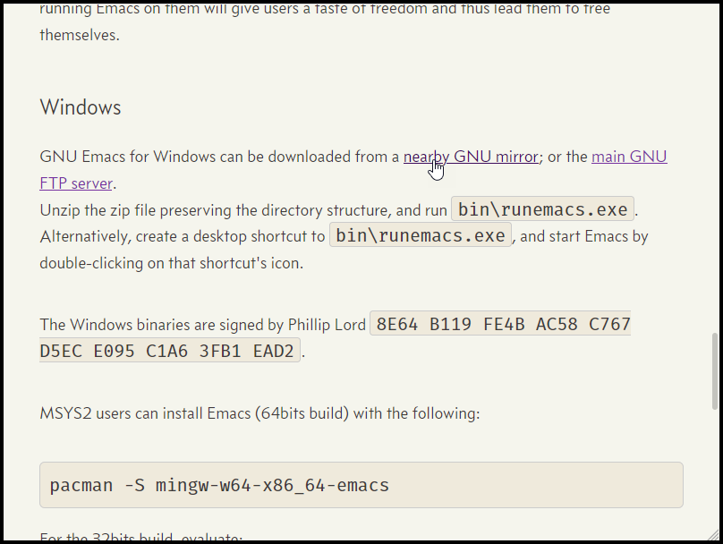

Go "nearby GNU mirror" under Windows section, and then click on the latest version (as at the time of this writing, it is emacs-27 [^1]).

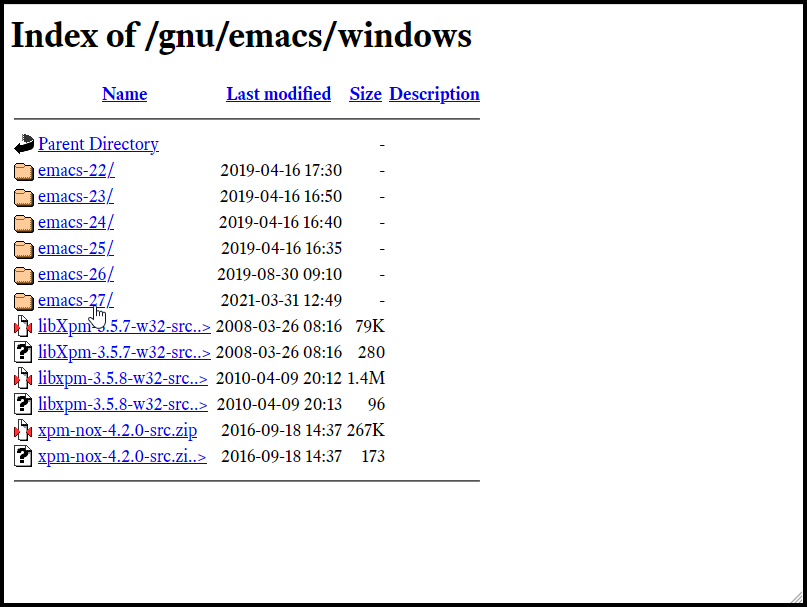

[^1]: I recommend getting the latest version. Orgr-roam requires a fairly recent versin of Org mode (9.4 or onwards). The Emacs version tht includes a compatible version of Org (9.4.4) is Emacs 27.2. If there is no reason, avoid Emacs 27.1, whcih contains Org 9.3, not compatible with Org-roam's requirement.

### Get right Emacs installer executable (or zip file)

I will assume you have the 64-bit version of Windows. If you are not sure, see the next section to learn how to tell if your Windows is the 32-bit or 64-bit version. 

For the 64-bit version, get a installer executable file named `emacs-27.2-x86_64-installer.exe`. This includes software that Emacs uses to show JPG and other image files, and so on. 

Learn  more about differences by reading `README-windows-binaries`. No file extention and you don't know which app to use to open it? Use your text editor. I'm using Visual Studio Code here; it can be Atom, Notepad, etc…

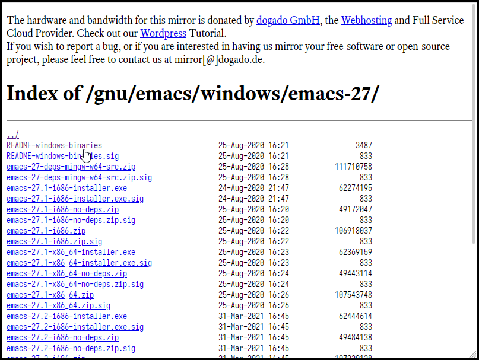
README-windows-binaries file

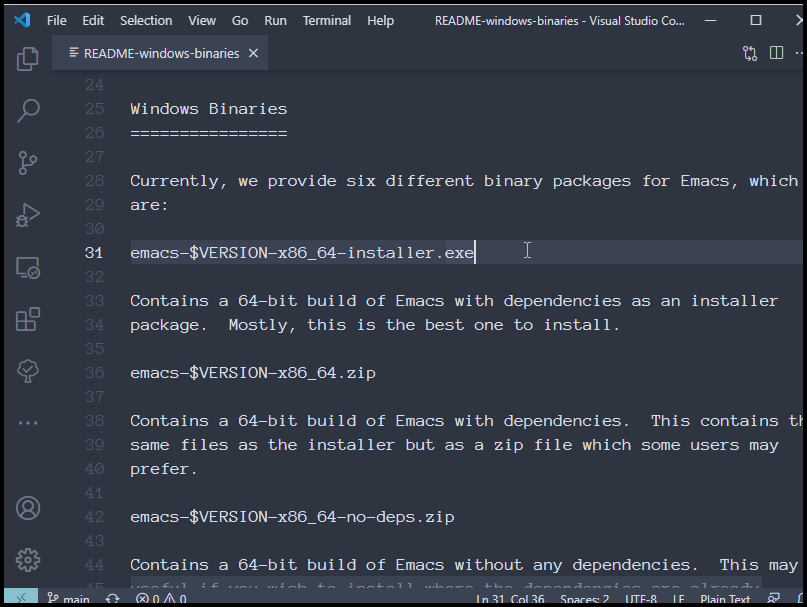
README file opened in Visual Studio Code

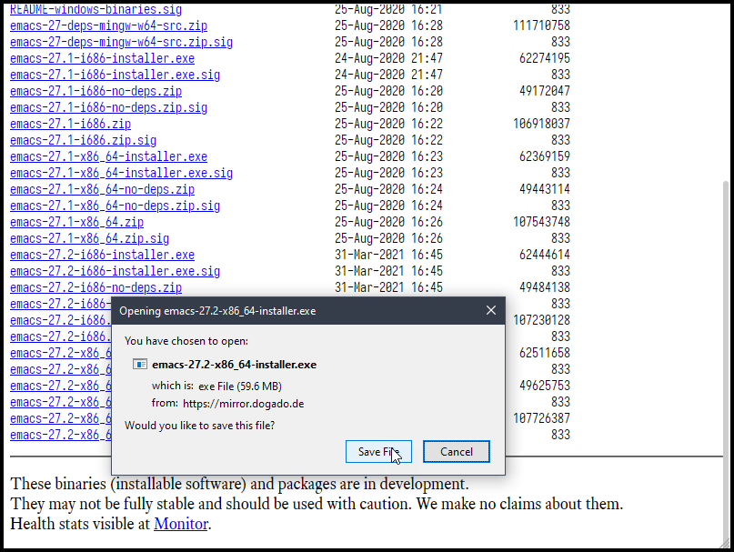
Start download

### Install Emacs

Once downloading has completed, double-click on it. 

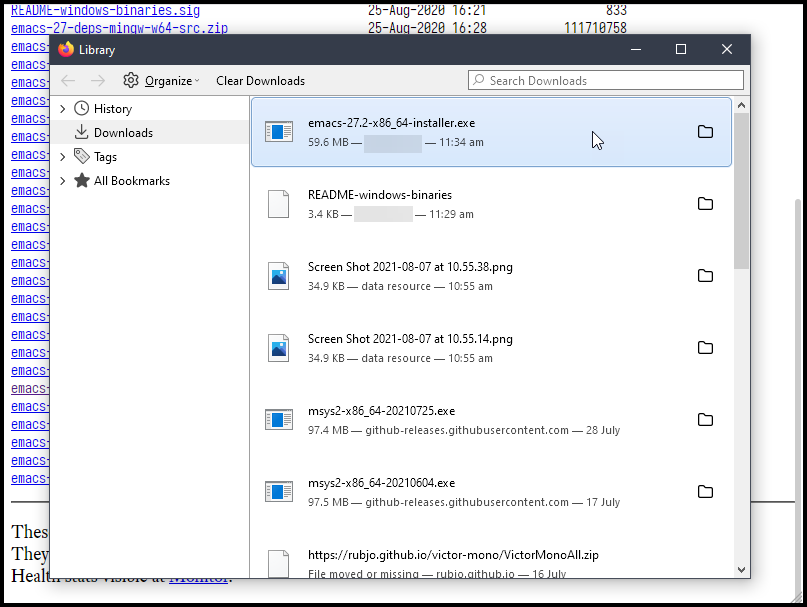
Double click on the installer.exe file

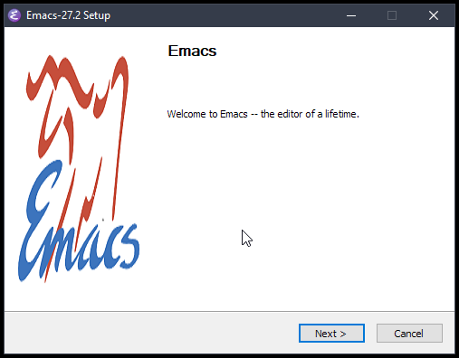
Installation wizard will guide you

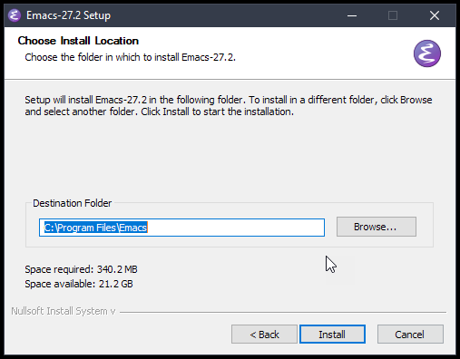
Choose intall location.  I  accept the default

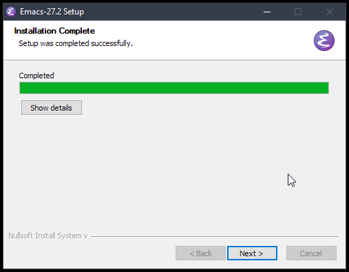
Wait until installation process completes

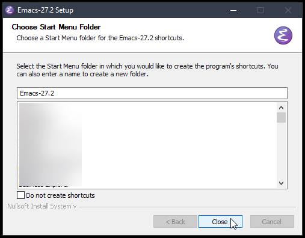
Choose to create a shortcut; you can find Emacs in Start Menu

Open Windows Start Menu, and type "emacs"; run it

See it's the Emacs version you have downloaded. 27.2 in my example

This is it. Now you have Emacs installed in your PC. Next section, we will look at how to use Emacs to edit some text. 

### Check if your Windows is 64-bit or 32-bit version 

You can see if your Windows is 64-bit or 32-bit version in Control Panel > System Security > System.

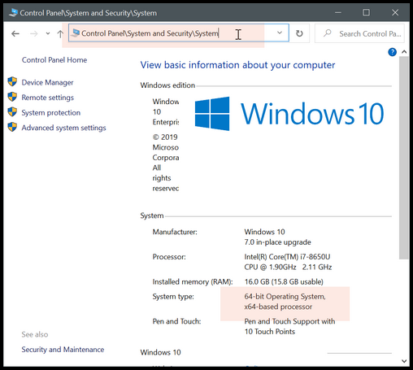
