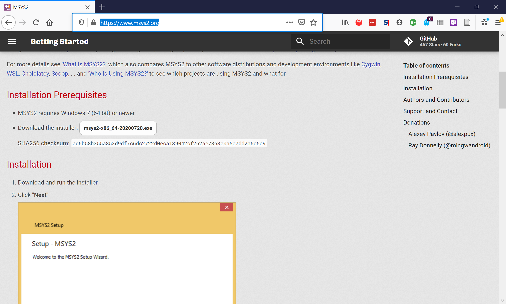
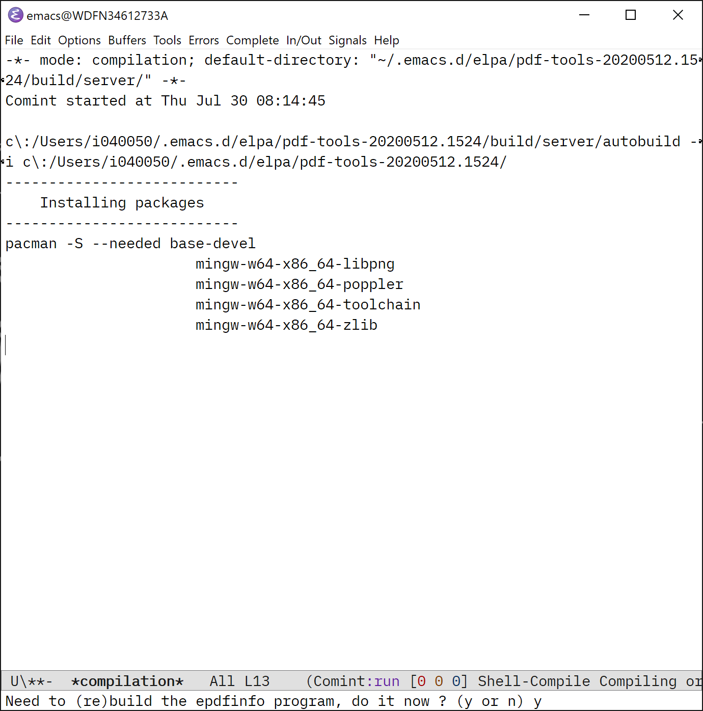
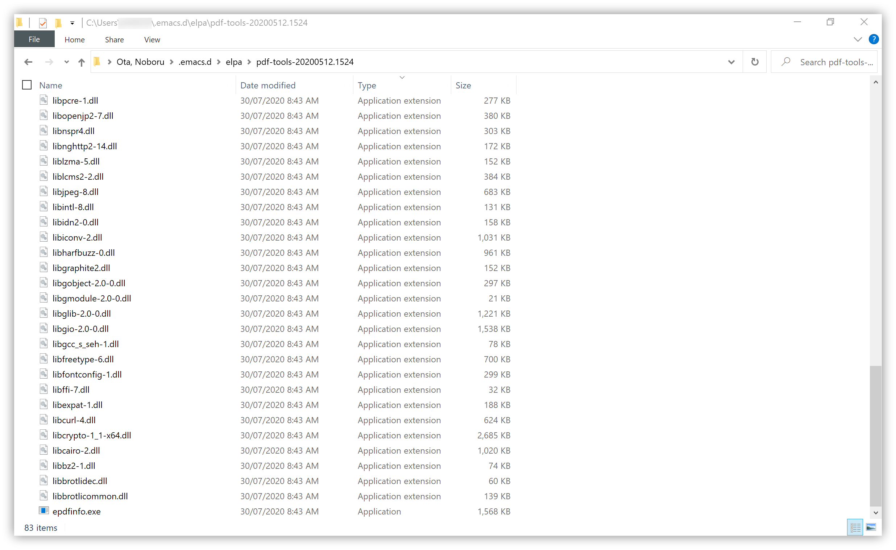
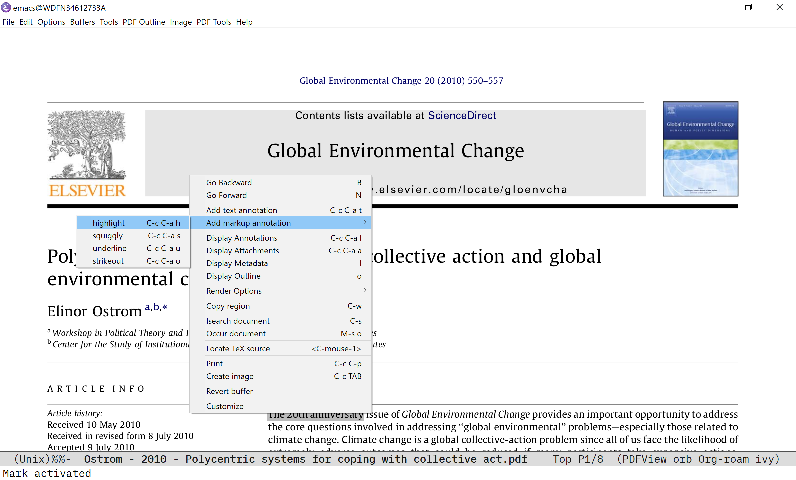

## Work with PDF files in Emacs with PDF-Tools and Org-noter

**Note** In August 2020, while I was ~~writing this chapter~~ putting it on the side, a new version of Emacs was released: 27.1. Most of the settings of this chapter were done with using 26.3, but later finalized with 27.1. I do not believe this will materially change anything demonstrated here, but I thought I should make it explicit.

In this chapter, we will be looking at tools to let you work with PDF files within Emacs: namely, PDF-Tools, Org-noter, and ORB. The focus is how we can install them, and get them to work together. Once that’s done, you are good to start roaming on your own by using them, and learn more by reading their respective manuals, forums, etc.

The primary tool we will be at PDF-Tools. It lets you do more than read PDF files. You can highlight sentences, view highlights you have created in other tools (e.g. iPad), work with annotations, and [much more](https://github.com/politza/pdf-tools#features).

Org-noter uses many of the features of PDF-Tools[^3] to make it easy for you to take notes in Org Mode, while synchronise the notes and PDF article while you read and scroll the article. 

As Org-noter connects the PDF world and Org Mode world, we can look to use ORB to be the glue among your bibliography (`.bib` file), literature notes via Org-noter, and Org-roam for your Zettelkasten and digital garden. 

[^3]: PDF-Tools is not mandatory for using Org-noter; it is one of the tools it needs to work with for PDF (the other being DocView). PDF-Tools is recommended. Many of Org-noter’s powerful features rely on it; you can only use a subset of the features of Org-noter without it. PDF-Tools was originally developed to replace DocView with better features.

### Steps to install and configure PDF-Tools

I believe it is fair to say that many in the Windows community consider it a big challenge (near impossible) to install `PDF-Tools` and get it to work on Windows. I certainly thought so before trying it this time. To my surprise, it has turned out to be straightforward once you get it.

The key is:
1. Use [MSYS2](https://www.msys2.org/) as a build tool to compile necessary software pieces from sources

2. Do NOT follow the official Windows instruction to the letter on PDF-tools [GitHub page](https://github.com/politza/pdf-tools)[^1]

3. Instead of using "msys2 shell" (as instructed), build (compile) PDF-Tools from within Emacs

[^1]: the official instruction will probably not work, and send you to rabbit holes of endless Googling, Cask and Python 2, which, it has turned out in the end, you don’t need (it did). 

Let me get straight to the steps you can follow. Overall, I would estimate that you need to set aside 45-60 minutes of your time. 

#### 1. Install MSYS2 

Go to MSYS2 from its website at https://www.msys2.org/.



Download the installer, execute it to install MSYS2. You can follow the rest of the instruction, but for PDF-Tools, you may not have to do much more than installing MSYS2. I did not even call `pacman Syu` to update the package database (I think it would be a good idea to do that so that you can get the latest version of the packages).
    


#### 2. Install PDF-Tools in Emacs

Launch Emacs. Install `pdf-tools` from MELPA, or any mechanism you use.

MSYS2 has its own Emacs in its package database, but you don't need to use it. The normal Emacs that you download from the GNU Emacs site, as described in the previous chapters of this guide, works fine.

#### 3. Build (Compile) program files required by PDF-Tools

Don't worry, it needs one manual trigger and automatic. Within Emacs, call `M-x pdf-tools-install RET` to start automatic build. Then wait.

When Emacs prompts for your input, take the default option and say "yes" to the questions.



This will automatically start to build (compile) software files (`.dll` and `.exe` files). It took me about 30 minutes; the duration will vary depending on how good your PC is. New files will appear in the `pdf-tools` sub-folder in your `~/.emacs.d/elpa` folder.



Now you should be able to open PDF files with PDF-Tools. To do so, simply visit a PDF document like any other file via `C-x C-f`; Emacs should open the PDF document in "PDFView" mode with PDF-Tools. Check this if have a PDF document handy[^4].



[^4]: I do not intend to explain how we can use individual major modes. I suggest that you can look through in-system help via `C-h m` when you in the PDFView mode, and quickly learn how you can zoom in and out to scale the document with the `+` and `-` keys, for example.

#### 4. Add a one-line configuration in your `.emacs` config file

Add `(pdf-tools-install)` or `(pdf-loader-install)` in your config file, following the official instruction on PDF-Tools' [GitHub page](https://github.com/politza/pdf-tools#installing).

> To complete the installation process, you need to activate the package by putting

```
(pdf-tools-install)
```

> somewhere in your .emacs. Alternatively, and if you care about start-up time, you may want to use

```
(pdf-loader-install)
```

This is it. You should be able to quit Emacs, launch it again, and open a PDF file with PDF-Tools within Emacs.

### Org-noter

Install [`org-noter`](https://github.com/weirdNox/org-noter) via MELPA, or any method you use. This works without additional configuration.

Usage is simple, and concisely described in the [GitHub documentation](https://github.com/weirdNox/org-noter#usage). You can either start an Org-noter session from an `.org` file, or from a PDF document.

... now for us, Org-roam users, an interesting challenge is to set up Emacs with which we can easily flow from a literature note written in `.org` (probably within your Org-roam directory) and Org-noter for a PDF document.

We will look at a flow that starts from Helm-bibtex to open a PDF file for a bibliographic entry, and then to opening a `.org` note as an Org-noter session. We will use ORB (Org-roam-bibtex). I am not saying this is the best or the only work flow. My intention is to show an example for you to get started. As with any work flow with Emacs, you have freedom to explore and find your own personal way that tailored to your own needs.

The reason I think this flows from an Org note to PDF document to be more natural than that starting from a PDF document is because of the Org-noter's logic below; I am not sure how it can be adjusted for Helm-bibtex and ORB.

```
- Creating the session from the document ---------------------------------------
This will try to find a notes file in any of the parent folders.
The names it will search for are defined in `org-noter-default-notes-file-names'.
It will also try to find a notes file with the same name as the
document, giving it the maximum priority.
When it doesn't find anything, it will interactively ask you what
you want it to do. The target notes file must be in a parent
folder (direct or otherwise) of the document.
```

Let's look at how we can configure ORB to work with Org-noter.

## ORB with Org-noter

There is an section and sample implementation for this very purpose in the the official [documentation](https://github.com/org-roam/org-roam-bibtex#org-noter-integration-orb-process-file-field-key) of ORB.

I have liberally copied the sample code into the [`.emacs`](#) file.

~~~
(setq orb-preformat-keywords
   '(("citekey" . "=key=") "title" "url" "file" "author-or-editor" "keywords"))

(setq orb-templates
      '(("r" "ref" plain (function org-roam-capture--get-point)
         ""
         :file-name "${citekey}"
         :head "#+TITLE: ${citekey}: ${title}\n#+ROAM_KEY: ${ref}

- tags ::
- keywords :: ${keywords}

* ${title}
:PROPERTIES:
:Custom_ID: ${citekey}
:URL: ${url}
:AUTHOR: ${author-or-editor}
:NOTER_DOCUMENT: %(orb-process-file-field \"${citekey}\")
:NOTER_PAGE:
:END:")))
~~~


If you have followed this guide so far, this configuration works as it is, except one critical element: `:NOTER_DOCUMENT:`. Org-noter uses this property to locate the PDF document associated with this note.

You likely need one more step of configuration to let Helm-bibtex recognise links to PDF files you maintain in your bibliographic entries; without it, you are like to have this property empty when you call "Edit note" action from Helm-bibtex.

### Opening PDF Document in Helm-Bibtex

In this section, I would like to briefly describe my way of configuring Helm-Bibtex to open a PDF document associated with a bibliographic entry. See this screen shot of my Helm-Bibtex. This step is necessary


You notice that a looped square symbol (⌘) next to an entry (highlighted in yellow) is an indicator that means a PDF is available for the entry. A pen symbol (✎) indicates that there is a note file associated to the entry ([Helm-Bibtex GitHub](https://github.com/tmalsburg/helm-bibtex#example)) [^4]

[^4]: You can change the symbols with configuration.

More practically, the looped square symbol (⌘) means that Helm-Bibtex can open a PDF for the biographic entry, if you tell it to. 

I use you Zotero to maintain bibliographic database with it, and use [Better BibTex for Zotero](https://retorque.re/zotero-better-bibtex/) to sync Zotero database and `.bib` file. I usually manually drag & drop a PDF document to an entry[^5]. 

Set variable like this: `(setq bibtex-completion-pdf-field "File")`

```
;;; Open PDF file stored in Windows' standard Zotero storage
(setq bibtex-completion-pdf-field "File")
```

[5:] You could use [ZotFile](http://zotfile.com/) to make this attaching process, naming of PDF files, and organisation easier. As a non-academic, the volume is not much so I can manage this easily without ZotFile. I have not tried it myself, but I believe the method and principles described in this section should apply to work flows that rely on ZotFile.

