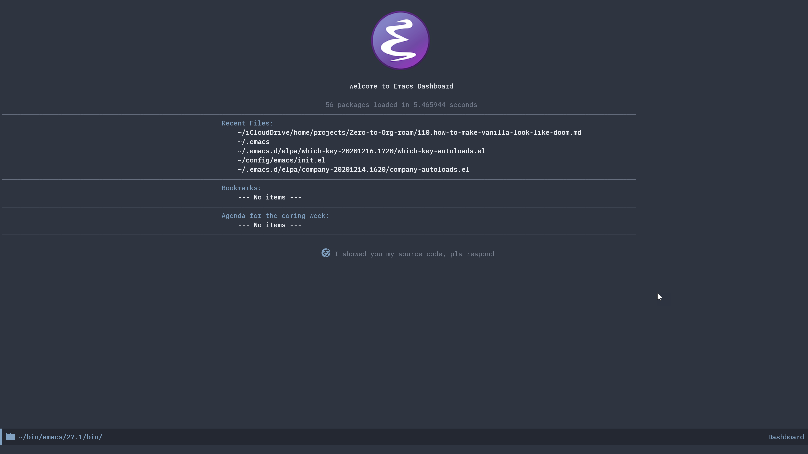
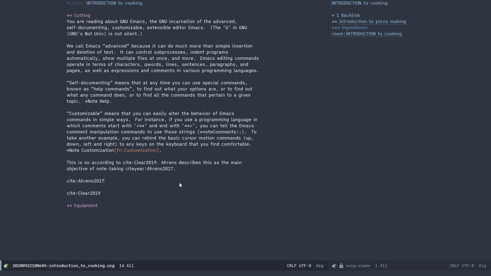

This is another optional demonstration for Org-roam and Emacs. This time, however, it is not specific to Org-roam. We will decorate our vanilla Emacs to emulate what Doom looks like. 

This is what we will aim for. In vanilla Emacs.


It's surprisingly easy to achieve. We just need to add some packages on top of what we have done in the guide with a minimal set of configuration to get them to work on Emacs startup.

It would be remiss of me if I didn't add one thing I noticed during the writing of this chapter with using the configuration described here. The `switch-to-buffer` command (bound to `C-x b` by default) has become significantly slower. I do not know exactly which package has caused the most drag.

## Mode-line with icons, themes, etc.

Install the four new packages as below, and edit the `.emacs` file by adding the configuration below.

Upon launching Emacs, you get a dashboard that looks like this.


Your Org-roam looks like this.


- doom-mode-line
- doom-themes
- all-the-icons
- dashboard

```
;; (load-theme 'modus-operandi)
(load-theme 'doom-nord)
(doom-modeline-mode 1)
(require 'dashboard)
(dashboard-setup-startup-hook)
;; Below Dashboard config adapted from
;; https://github.com/emacs-dashboard/emacs-dashboard
;; Set the title
(setq dashboard-banner-logo-title "Welcome to Emacs Dashboard")
;; Set the banner
(setq dashboard-startup-banner 'logo)
;; Value can be
;; 'official which displays the official emacs logo
;; 'logo which displays an alternative emacs logo
;; 1, 2 or 3 which displays one of the text banners
;; "path/to/your/image.png" or "path/to/your/text.txt" which displays whatever image/text you would prefer
;; Content is not centered by default. To center, set
(setq dashboard-center-content t)
;; To disable shortcut "jump" indicators for each section, set
(setq dashboard-show-shortcuts nil)
```

## Other changes
Other changes are also easy to do. Install the packages listed, and add the configuration to your `.emacs` file. 

### Enhance minibuffer for Ivy
- ivy-rich
- all-the-icon-ivy-rich
```
(ivy-rich-mode 1)
(all-the-icons-ivy-rich-mode 1)
```

### Project directory tree
- neotree
```
(setq neo-theme 'icons)
```

### Which-key to discover commands
- which-key
```
(add-hook 'after-init-hook 'which-key-mode)
```

You might like to know more about how `which-key-mode` can be configured better. If there is a demand, I might add more explanation to it at some point later.

Well, for now, I will stop at the demonstration of these packages with a really minimum amount of configuration.  From graphical UI perspective, it should be almost identical to what Doom looks lik (given the same theme and mode line are used). Personally speaking, I genuinely prefer the look of characters against a minimum colors against a white background to the Doom-like modern look of a dark theme with flat icons  -- for some reason, the geometric shapes of ASCII characters are more attractive to me than the modern text editor's look with icons. I guess that's just my personal taste, and it's great that Emacs can cater to my kind of aesthetics as well as that of those who love icons and dark themes (I guess I am on the minority side).

Until next time, have a great festive season, and have fun roaming :)

