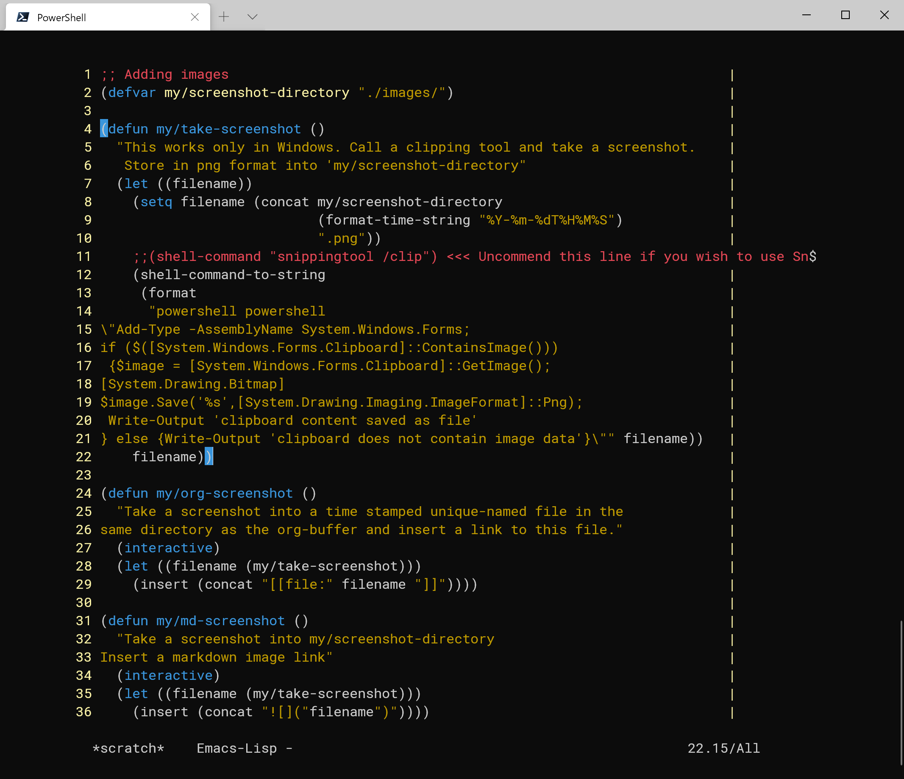
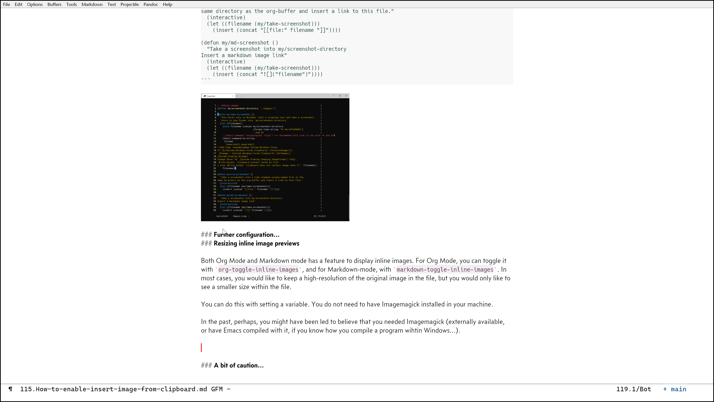

## How to insert image from clipboard

Inserting an image easily into my Markdown or Org files was one of the last pieces of puzzle in my Emacs document generation workflow. 

I am certain there are many solutions to this problem; however, I have not been able to use [`org-download`](https://github.com/abo-abo/org-download) and similar Org Mode tools. I think Doom comes with it already configured out of the box. I am sure it works a magic on Linux and perhaps macOS, but I could not get it to work on my Windows set up.

I will also talk about how you can adjust the size of the image displayed in-line in Org Mode and Markdown-mode. This way, even when you have done a screen grab of a 4K monitor, the in-line image "preview" can be a thumbnail size; easy viewing when you are editing the text (like I will show later). 

### Functions

Here is my Windows solution in the source code exhibit below. It does not do drag & drop, unfortunately. I have taken the original solution **somewhere** from Stack Exchange. I have had it long time, and lost the link to the original since (apologies for not taking enough care about attributions; I have become better since then). I have revisited and cleaned it in the new year with my renewed knowledge in Elisp coding.

Please try not to be overwhelmed by the amount of lines. In the end, it is rather simple. It consists of the following parts:

1. **Definition of variable**

    It defines the folder where the image file should be saved. The default I have is a folder named "images" relative to the current file you are working on.

2. **Main function**

    It copies the image in your Windows' clipboard, names it with the current time stamp (`yyyy-mm-ddThhmmss.png`), and saves it as a PNG image file in the folder defined above.

3. **An interactive command to insert a image link in the Org Mode syntax** 

4. **An interactive command to insert a image link in the Markdown syntax**

That's it. You would either use 3. or 4. 

It delegates the work to PowerShell to deal with Windows' clipboard, and saving it. So (I think) this solution only works on Windows (I realize PowerShell is available cross-platform, but I haven't tested other OSs if it works; I won't). 

It is important to note two things:

1. The current code **assumes** that you have an image in the clipboard before calling one of the commands. 

    This means that you clip an image first with some other tool beforehand. In my case, I have Snagit (commercial software) so I use it. You can use Snipping Tool; or the "Print Screen" button also works. 
    
2. The current code **assumes** the folder (`my/screenshot-directory`) existis.

    It does not make an effort to create one for you like `find-file`might.

Having mentioned these assumptions, you can choose to get this code to call Snipping Tool, so that you can select a region of your screen to capture it into your clipboard after you have called a command. 

I will talk a bit more about this, and how you can further "customize" this solution in the next section.

```emacs-lisp
;; Adding images
(defvar my/screenshot-directory "./images/")

(defun my/take-screenshot ()
  "This works only in Windows.  Take the image in the
clipboard, name it with a timestamp,and store it in png format
into `my/screenshot-directory' 
  (let ((filename))
    (setq filename (concat my/screenshot-directory
                           (format-time-string "%Y-%m-%dT%H%M%S")
                           ".png"))
    ;;(shell-command "snippingtool /clip") <<< Uncomment this line if you wish to use Snipping Tool
    (shell-command-to-string
     (format
      "powershell powershell
\"Add-Type -AssemblyName System.Windows.Forms;
if ($([System.Windows.Forms.Clipboard]::ContainsImage()))
   {$image = [System.Windows.Forms.Clipboard]::GetImage();
    [System.Drawing.Bitmap]$image.Save('%s',[System.Drawing.Imaging.ImageFormat]::Png);
    Write-Output 'clipboard content saved as file'
} else {
    Write-Output 'clipboard does not contain image data'
}\"" filename))
    filename))

(defun my/org-screenshot ()
  "Save a screenshot in clipboard into`my/screenshot-directory'. 
Insert an Org link to the image file."
  (interactive)
  (let ((filename (my/take-screenshot)))
    (insert (concat "[[file:" filename "]]"))))

(defun my/md-screenshot ()
    "Save a screenshot in clipboard into `my/screenshot-directory'.
Insert a markdown image link."
  (interactive)
  (let ((filename (my/take-screenshot)))
    (insert (concat ""))))
```



### Further configuration

You can change some bits and pieces easily to customize this solution. Here is a list I can think of:

1. **Change the folder where you store the image files**

    Easy. Change the variable `my/screenshot-directory` directly, or set it with `setq`. 
   
2. **Change the filename**

    A bit more involved, but still easy enough. This part of the code generates the file name based on the current time -- yyyy-mm-ddThhmmss. You can change it to customize the template filename.

```emacs-lisp
       (setq filename (concat my/screenshot-directory
                           (format-time-string "%Y-%m-%dT%H%M%S") ;;...[omitting the rest]...))
```

3. **Open Snipping Tool to grab a screen shot when you call the command**

    You can enable this feature by uncommenting the following part of the code. It, then, gets PowerShell call Snipping Tool, returns the control back to you to capture a region of screen with a mouse, and puts the resultant image into the clipboard. It works well, too, if you prefer this sequence of operations. 

```emacs-lisp
    ;;(shell-command "snippingtool /clip")  <<< Uncomment this line if you wish to use Snipping Tool
```

4. **Improve the PowerShell script**

    I can't do it, but if you know how to do it, probably you could do all sorts of good things with it (e.g. you can save the image in a different format [^2]). 
   
   One thing: In the main function, `powershell` appears twice in a row. It is not redundant. I have no idea why, but it needs to be there twice [^1]. I tried to make it do with only one, but the image was not correctly stored. I would appreciate it if someone with more knowledge can enlighten me with the way PowerShell works.

[^1]: I suspect it is related to the fact that the default shell in Windows is set to `cmd` rahter than PowerShell with variable `w32-system-shells`; that is, the `shell-command` in Emacs launches `cmd`, and then within it our command string tells it to launch `powershell`. However, this still does not explain why it needs the second `powershell` command, because wihtin PowerShell, or even in `cmd`, you don't need to do it. I will leave it as it is for now. It works with the current default PowerShell version 5.1 that comes with Windows 10. The script itself works wtih PowerShell 7 that I have separately installed, so it should be fine for a long term. 

[^2 ]: I have also confirmed that `[System.Drawing.Imaging.ImageFormat]::Png` is not really needed. Without it, PowerShell still saves the image as PNG **no matter what extension you gives to the method**. You can, nevertheless, tell it to save the image file in a different format. For example, `[System.Drawing.Imaging.ImageFormat]::Tiff` or `[System.Drawing.Imaging.ImageFormat]::Bmp`. Refer to [Microsoft's documentation](https://docs.microsoft.com/en-us/dotnet/api/system.drawing.imaging.imageformat?view=dotnet-plat-ext-5.0. .) for other accepted formats.

### Resizing in-line image previews

Both Org Mode and Markdown mode have a feature to display in-line images. For Org Mode, you can toggle it with `org-toggle-inline-images`, and for Markdown-mode, with `markdown-toggle-inline-images`. In most cases, you would like to keep a high-resolution of the original image in the file, but you would only like to see a smaller size displayed in-line when you are editing the text. 

You can do this with setting a variable. You do not need to have Imagemagick installed in your machine.

- For Org Mode: `org-image-actual-width`; e.g. I have this value: `300`
- For Markdown-mode: `markdown-max-image-size`; e.g. I have this value: `(800 . 800)`

In the past perhaps, you might have been led to believe that you needed Imagemagick (externally available, or have Emacs compiled with it, if you know how you compile a program within Windows...). As of the current releases of Org Mode and Markdown-mode, I have confirmed that you do not need Imagemagick. Having said this, I cannot really be sure what versions of Emacs, and Org Mode you need. I am running Emacs 27.1 and Org Mode 9.4.4. For Markdown-mode, you need version 20210107.101 or later (I know this because I did the pull request based on how Org Mode does it; hope it does not break anything...). 

See this screen shot below that I have just done with `my/md-screenshot` (I have done slight post-production editing by adding a border to make it easier to see). The actual size of the screen shot above showing the source code is much bigger in my file system, but it is displayed in-line with much smaller scale (I cannot measure it, but it should be maximum height of 800 pixels). 


    
### A bit of caution

This solution works, but it is not necessarily designed to handle errors well. I have never had a bag error, but what would happen if the PowerShell script does not work as intended? -- so far, I only have had an empty png file saved. It can be easily checked by opening the link. Just be mindful of the fact that the solution is not intended to be robust when an error occurs, though I do not believe it would cause any grave issues in your system should it error. 

Oh there is a small added bonus: you can use this solution from within the terminal version of Emacs (like I have done for the image file of this article within PowerShell -- yes, I am writing it in Emacs launched within Powershell). This is possible because it delegates handling of images to PowerShell. Emacs does not need to be able to open an image (it is all data and text link in the end).
