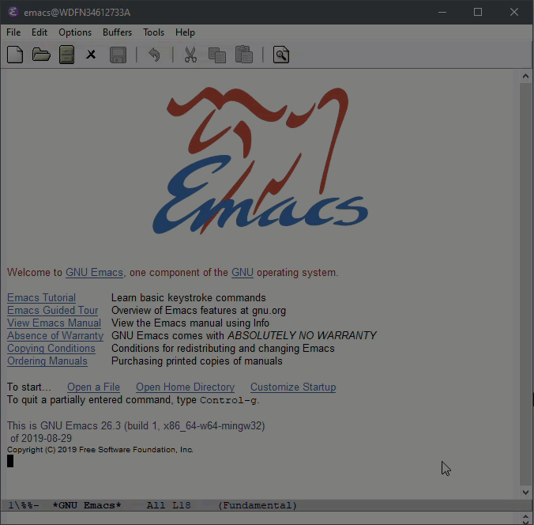

## Use Emacs to write some text (including copy & paste)

So Let's open Emacs. And more importantly, let me show you how to quit it. 

Why mention quitting, you may ask. When I first started using Emacs, my first question was "How do I quit this thing?". I panicked becasuse I didn't know what I was doing. I don't remember how I managed to close it. Probably I googled. And I did not open Emacs again for a while; I was traumatized. 

And let me also show you how to cancel stuff you are doing in Emacs. 

I think knowing you can quit and stop will make you more comfortable using Emacs. You can avoid the pain I experienced.

### Open Emacs
Double-click on `runemacs.exe`. That's it. It's located wihtin the `bin` folder under the Emacs installation folder. You can pin it to your Start Menu, or have a shortcut on your desktop, etc.

If you see a command promp window pop up when you are runining Emacs, you double-clicked on the wrong one – `emacs.exe`. 

All this is explained in README, if you wish to understand more. 


### Quit Emacs

Use the menu on top of the application window, as shown below. 

```
File > Quit.
```

If you happen to be using Doom or some other framework, you may not see the menu bar on top, becasue many frameworks hide it by default. Don't panic. There is a way to make it appear (see next section).

In the menu selection, there is "C-x C-c" next to "Quit". This is the keyboard shortcut ("key binding") assigned to the "Quit" function. 

`C` stands for <kbd>Ctrl</kbd>.  So `C-x C-c` is:

<kbd>Ctrl</kbd> + <kbd>X</kbd>, then <kbd>Ctrl</kbd> + <kbd>C</kbd> (this will be, while you keep pressing <kbd>Ctrl</kbd>, press <kbd>X</kbd> then <kbd>C</kbd>).


### Call commands, cancel command you are typing

`C-g` is to cancel what you are doing. You will see "Quit" at the bottom of Emacs (but it's not closing Emacs all together…) Like we saw above, `C` stands for <kbd>Ctrl</kbd>.

There is another important key used throughout Emacs: `M`. For Windows, it's <kbd>Alt</kbd>. 
For example, `M-x` means you press <kbd>Alt</kbd> + <kbd>X</kbd>.

`M-x` is a special command in Emacs. When you do it, your cursor moves to the bottom part of the screen (called "minibuffer"), prompting you to type a command. 

Let's try to hide and show the menu bar as an example – here, you can make the menu bar reappear if you don't see it by default, like when you are using Doom Emacs.

Press `M-x` and type "menu bar mode", and then press <kbd>Enter</kbd>; you will notice that a space is automatically replaced by a hyphen "-". 

This operation is usually written as:

`M-x menu-bar-mode` or  `M-x menu-bar-mode RET`.

`RET` refers to <kbd>Return</kbd> – on Windows, it's <kbd>Enter</kbd>.

Notice the menu bar on top disappears with the text in minibuffer saying, "Menu Bar mode disabled". If you invoke the same command again, the menu bar appears again ("Menu Bar mode enabled").

My suggestion is to keep the Menu Bar until you are comfortable with key bindings and Emacs in general. You will see later that it is also useful to discover functions that are provided by Emacs for specific packages, like Org Mode, etc.


Back to calling commands and cancelling it. You can cancel calling a command by pressing `C-g` in the middle of typing a command.




### Create a new file

Let's create your first file. Use the menu bar, and go `File > Visit New File...`
You will see a familiar dialog box to locate a file you want to open. You can also try `C-x C-f`, and you will see a different "dialogue"; `Find file: ~/bin/emacs-folder/bin` appears. 

In Emacs, creating a new file uses the same command as opening an existing file. If the file you specify does not already exist, Emacs tries to create a new one for you.


`~/` is a shorthand for your home folder. Type that in after `Find file: ~/bin/emacs-folder/bin` like this:


And press TAB. You will see that `~/` is now shown in minibuffer instead of `~/bin/emacs-folder/bin` . TAB is often used as invoking "completion" – it is to let Emacs automatically complete what you are trying to do. 


You can press TAB again to let Emacs show a list of files and folders in your home folder – mine is not particularly informative, but here it is as an example.  This listing is the behaviour of default compeletion function. We will change it with something more beginner friendly later. 


If you type a folder that does not exist yet, Emacs does not stop you with an error. Emacs will ask you if you want to create a new folder when you try to save the file you are creating (`File > Save` or `C-x C-s`).

You can confirm the dialog by pressing <kbd>Y</kbd> or <kbd>N</kbd> (yes or no).


### Create an Org file

Now you know how to create a file. Let's create a Org file in Org-roam folder. We have not got Org-roam yet, but you will see later it will be added to Org-roam when you have it.

`C-x C-f` or `File > Visit New File`

If you choose the former, you don't need to have created the `org-roam` folder yet.  If you choose the latter, you will need to create `org-roam` folder in the normal way for Windows).


Let's add a heading in ,and some texts in. You can just type `*` of course. Or start inserting `#+title:` It's totally up to you. Just to konw that if you have created a `.org` file like in my example, you will see the whole section on the menu bar dedicated to Org mode. It is not the exhaustive list of things you can do with Org mode, but it is handy as a beginner. 


Not particularly useful or interesting, but this will do as an example. 
`C-x C-s` to save. 


 And create another `.org` file, so that you can have a link from one to the other.  When you try to insert a link via `C-c C-l`, you will be asked to specify what type of link you are inserting. Choose `file:`. This is what Org-roam uses to know links between notes to track backlinks. 


Note that I use TAB to complete the name for the first note.

If you do `M-x org-toggle-link-display`, you will see that it is typed as 

`[[file:file-name.org][descrption]]`


### Ctrl + Z, Ctrl + C, Ctrl + V, and Ctrl + X

Go to `Options` in the menu bar, and toggle on "Use CUA Keys" as shown below if you struggle with undo, copy, paste and cut text. 

Your kind and experienced Emacs friend will very likely tell you not to do this. It's fine advice from experience. But know that it's an option Emacs. I personally don't use CUA keys, and follow the Emacs convention (except `C-z`, which I assigned to an "undo" function). If you toggle CUA keys on in this way, you keep it only until you quit Emacs this time. There is a way to do it more permanently in configuration, if you want to. 

My suggestin is to try both CUA and Emacs way. The Emacs way, defined before Windows is explained in many placed on the internet. But very briefly (with unofficial function names):

`C-w cut`
`M-w copy`
`C-y paste`
`C-z hide Emacs window`

The good thing about turning CUA Keys this way is that you can still use the Emacs way in parallel with the CUA way. You can still the classic Emacs key bindings for copy and paste. Many Emacs experienced people would recommend that you should learn the Emacs way. I use Emacs way, and if I'm pressed, I would suggest that you at least give it a try. And surprisingly, I can easily switch between Emacs (`C-y`) and MS Word (<kbd>Ctrl</kdb> + <kbd>V</kbd>).

Use your good judgement. If you are not intending to use Emacs any other way than Org-roam and writing long-form materials such as academic papers, maybe you don't need to listen to us. It's your system, your application, your personalization; this is your decision. Don't let others dectate what you want. Know that you can easily switch between the two ways. I will show you how to put this in your configuration later. 

One thing that is mostly universally accepted is the default `C-z` is not useful. Even if you decide to use the Emacs way, it's very likely that you would prefer `C-z` to be assigned to an undo function. We'll see how to do that later in the section for personal configuratoin. 


### Ctrl + A, and select area of text
Similarly with CUA keys, <kbd>Ctrl</kbd> + <kbd>A</kbd> is not what it is in Windows. In Emacs `C-a` takes you to the beginning of the line.  Probably the easiest to select an area of text is to use your mouse; just drag an area. 


You can use `C-g` to remove the selection. 

The Emacs way for selecting text is to press `C-SPC` (`SPC` standas for the space bar), and then move your cursor. You might have learned that `C-n` (move the cursor to the next line) `C-p` (move the cursor to the previous line). Or you can use arrow keys, too. 

If you are looking for seleting the whole text, try the menu bar. It's also assigned to `C-x h`. This operation to select an area of text is called "mark", and selecting the whole text you are looking at is done via a function called `mark-whole-buffer`.

