# Use Emacs to write some text (including copy & paste)

Let's start with opening and quitting Emacs.

To quit, clicking on the "X" on the top right corner of the window will work, alright. But there is more you can learn about Emacs from quitting.

Let's also see how to cancel a commend you are typing in Emacs. 

Knowing you can quit and stop will make you feel more comfortable using Emacs. When I first started using Emacs, my first question was "How do I quit this thing?". I panicked because I didn't know what I was doing. I don't remember how I managed to close it. Probably I googled. And I did not open Emacs again for a while; I was traumatized. The less pain, the better.

## Open Emacs

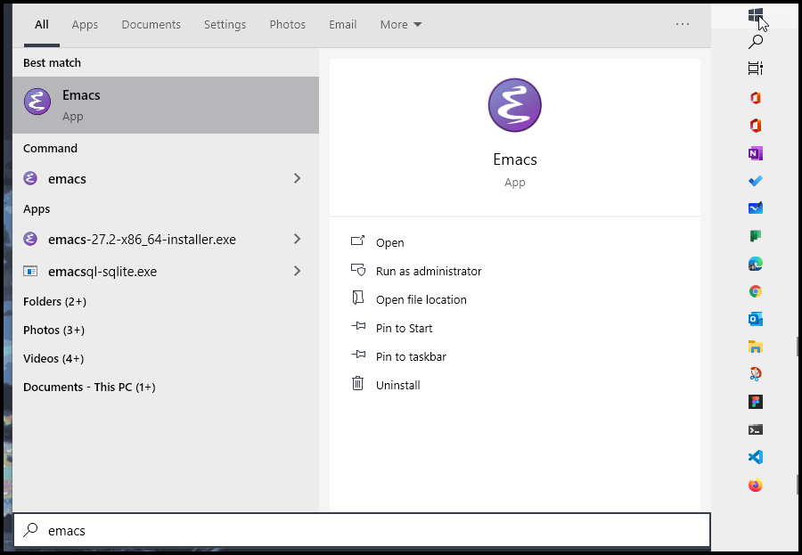
Open Windows Start Menu, and type "emacs" and run it.

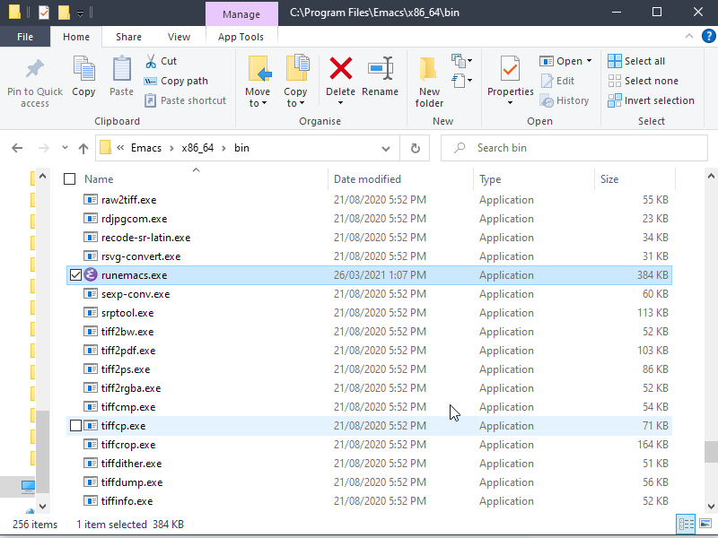
If you didn't create a shortcut in Start Menu, don't worry. Go to the folder where you installed Emacs (it should be `C:\Program Files\Emacs` by default and under a folder named `\x86_64\bin`). Run the executable named `runemacs.exe`. Make a shortcut so that it's easy to find next time.

Don't use `emacs.exe` (there is no harm using it; but you'll probably find the extra window distracting). If running Emacs also opens a command prompt window at the same time, then you have clicked the wrong file.

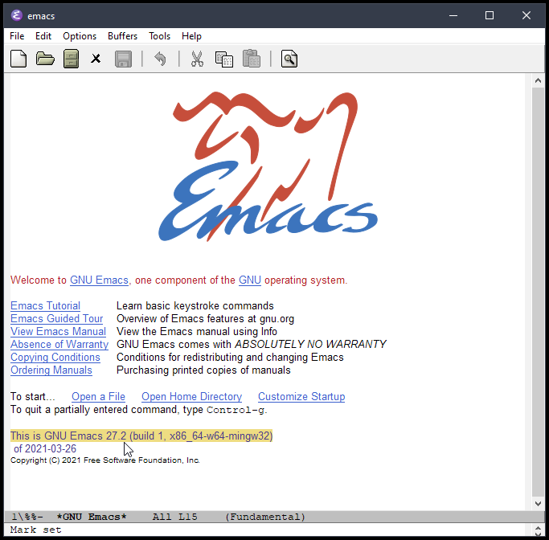
You should see Emacs open like this.

## Quit Emacs

Use the menu on top of the application window (called "menu bar"), as shown below. 

```
File > Quit.
```

I recommend to refer to the menu bar until you are really comfortable with Emacs. 

If you happen to be using Doom or some other framework, you may not see the menu bar on top; many frameworks hide it by default. Don't panic. There is a way to make it appear (see next section).

In the menu selection, there is "C-x C-c" next to "Quit". This is the keyboard shortcut ("key binding" or "keybinding") assigned to the "Quit" function. 

`C` stands for <kbd>Ctrl</kbd>.  So `C-x C-c` is:

<kbd>Ctrl</kbd> + <kbd>X</kbd>, then <kbd>Ctrl</kbd> + <kbd>C</kbd> (this will be, while you keep pressing <kbd>Ctrl</kbd>, press <kbd>x</kbd> then <kbd>c</kbd>).
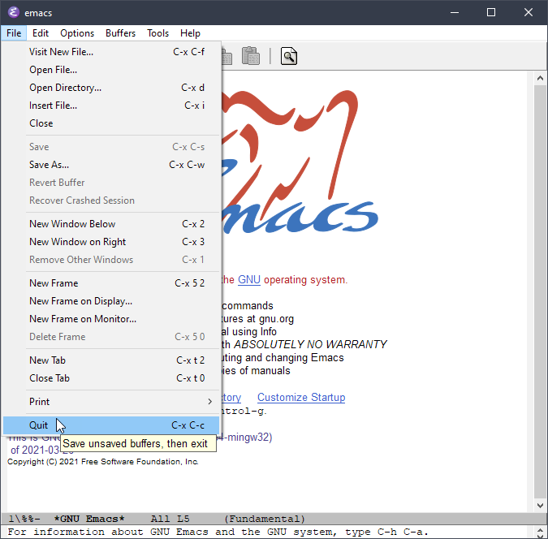

## Call commands, cancel command you are typing

`C-g` is to cancel what you are doing. You will see "Quit" at the bottom of Emacs (but it's not closing Emacs all together…). Like we saw above, `C` stands for <kbd>Ctrl</kbd>.

There is another important key used throughout Emacs: `M`. For Windows, it's <kbd>Alt</kbd>. For example, `M-x` means you press <kbd>Alt</kbd> + <kbd>X</kbd>.

`M-x` is a special command in Emacs. When you call it, your cursor moves to the bottom part of the screen, prompting you to type a command. This area looks like a "status bar"; in fact, it is more than the status and is called "minibuffer" in Emacs. 

Let's try to hide and show the menu bar as an example – here, you can make the menu bar reappear if you don't see it by default, like when you are using Doom Emacs.

Press `M-x` and type "menu bar mode", and then press <kbd>Enter</kbd>; you will notice that a space you type is automatically replaced by a hyphen "-". 

This operation is usually written as:

`M-x menu-bar-mode` or  `M-x menu-bar-mode RET`.

`RET` refers to <kbd>Return</kbd> – on Windows, it's <kbd>Enter</kbd>.

Notice the menu bar on top disappears with the text in minibuffer saying, "Menu Bar mode disabled". If you call the same command again, the menu bar appears again ("Menu Bar mode enabled").

My recommendation is to keep the menu bar until you are comfortable with key bindings and Emacs in general. Personally, I keep it on. You will see later that it is also useful to discover functions that are provided by Emacs for specific packages, like Org Mode, etc.

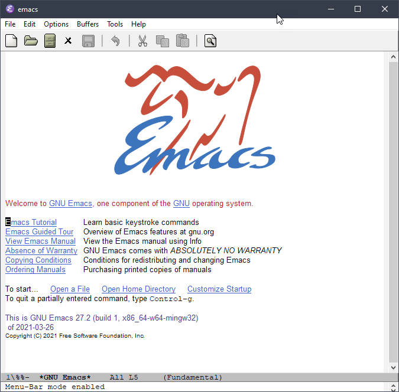

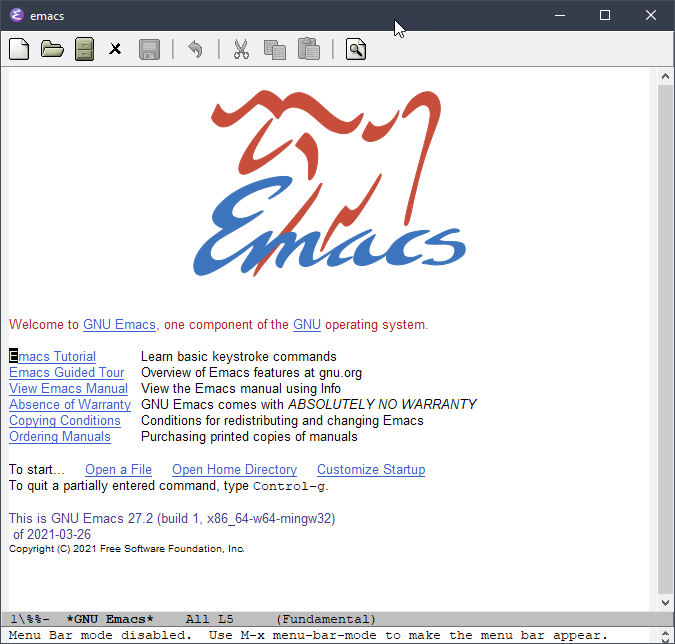

Back to calling a command and canceling it. You can cancel calling a command by pressing `C-g` in the middle of typing a command. You will see "Quit" displayed in the minibuffer as you can see in the image below.


## Create a new Org file

Let's create your first file. Use the menu bar, and go `File > Visit New File...`

You will see a familiar dialog box to locate a file you want to open. You can also try `C-x C-f`, and you will see a different "dialogue"; `Find file: c:/Program Files/Emacs/` appears in minibuffer. 

In Emacs, creating a new file uses the same command as opening an existing file. If the file you specify does not already exist, Emacs tries to create a new one for you.

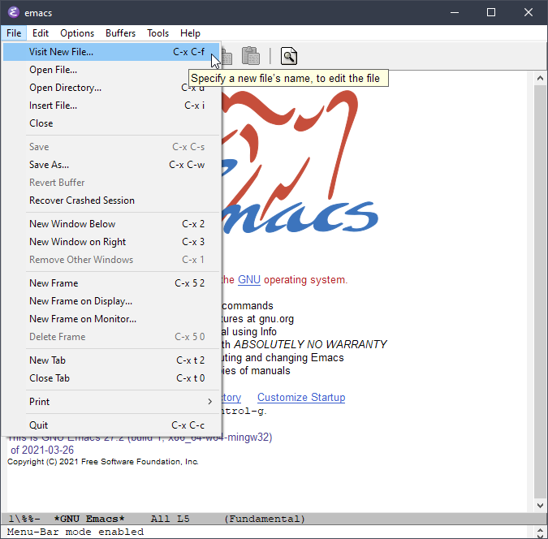

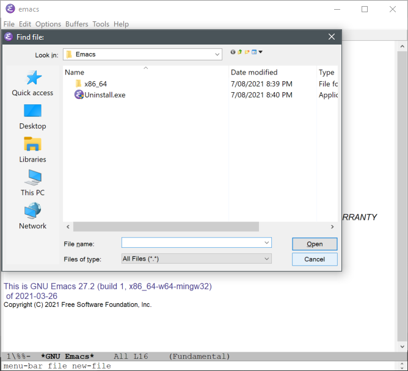

For now, cancel the Find file dialog and follow the Emacs way. 

Press `C-x C-f`(Keep pressing <kbd>CTRL</kbd> and press <kbd>x</kbd> then <kbd>f</kbd>).


`~/` is a shorthand for your home folder. Home folder is defined by your Windows environmental variable and can be customized to your liking. By default, it should be `C:\Users\USERNAME\AppData\Roaming.` 

Type `~/` after `Find file: c:/Program Files/Emacs` like in the imabe below and press <kbd>Tab</kbd>.

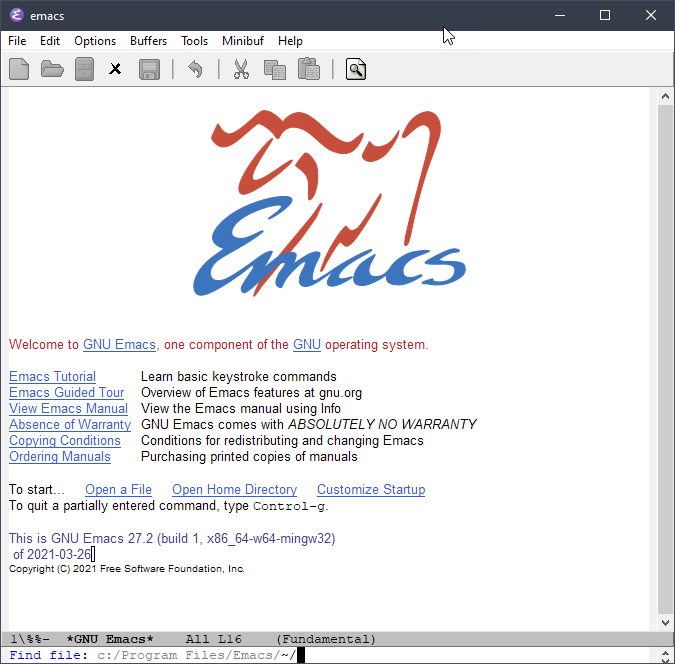

You will see that `c:/Program Files/Emacs` is slightly grayed out and `~/` added now in minibuffer. <kbd>Tab</kbd> is often used as calling "completion" – it is to let Emacs automatically complete what you are trying to type. 

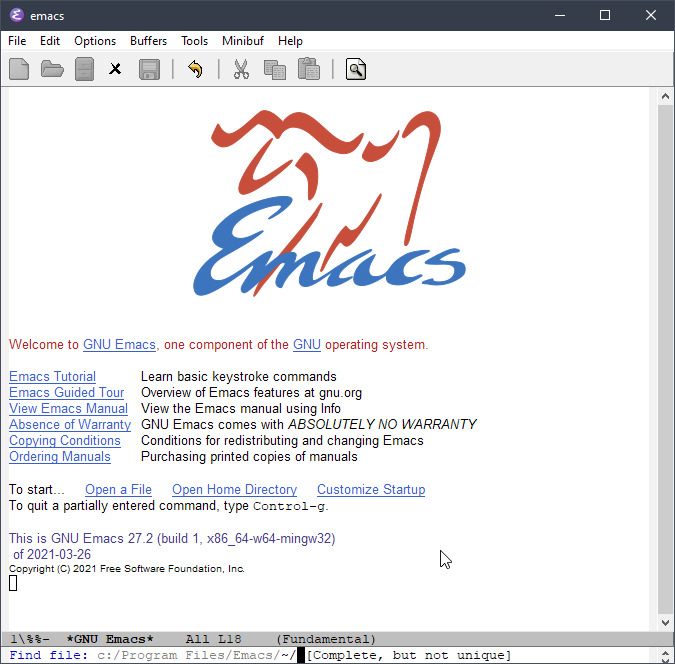

You can press <kbd>Tab</kbd> again to let Emacs show a list of files and folders in your home folder – mine is not particularly informative, but here it is as an example. This listing is the behavior of default completion function. We will change it with something more beginner friendly later.

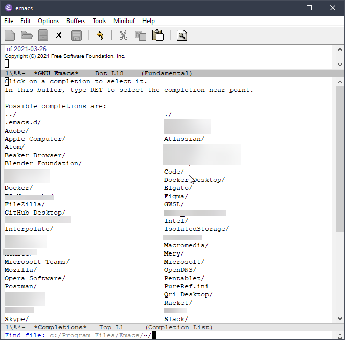

After `~/`, type a new folder and file names separated by a slash `/` like this: `org-roam/first.org`

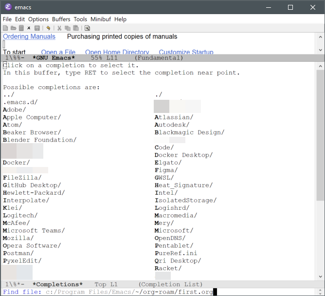

Press <kbd>Enter</kbd> and you will be editing "first.org", your first Org file.

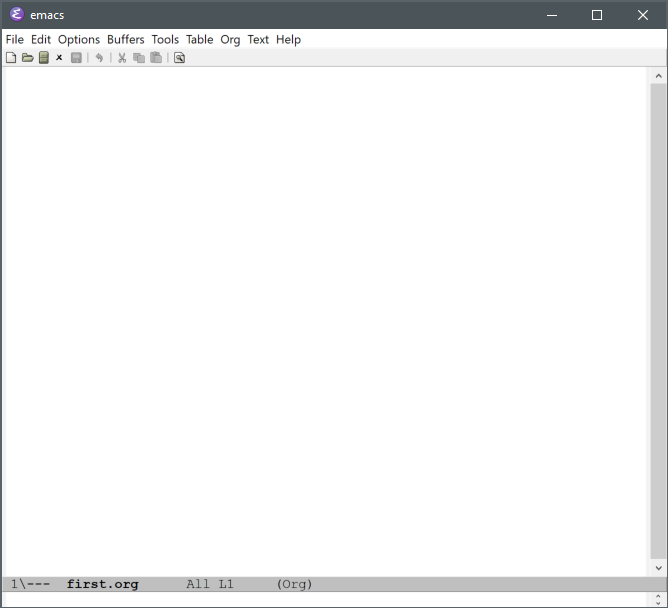

To save `first.org`, press `C-x C-s` (while keeping pressing <kbd>CTRL</kbd>, press <kbd>x</kbd> then <kbd>s</kbd>).

If you type a folder that does not exist yet, Emacs does not stop you with an error. Emacs will ask you if you want to create a new folder when you try to save the file you are creating.

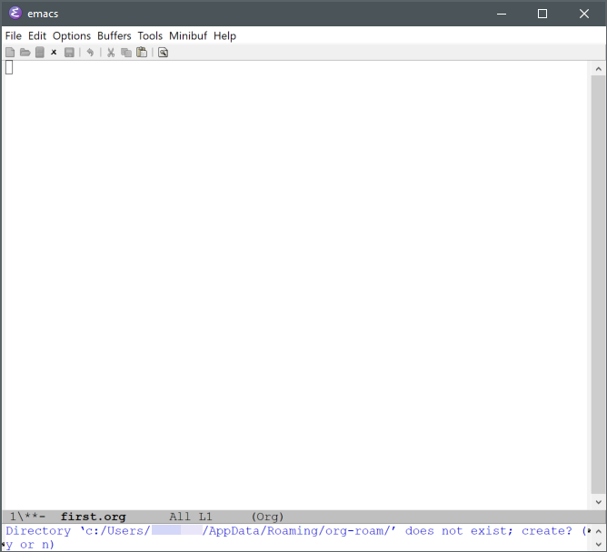

You can confirm the dialog by pressing <kbd>Y</kbd> or <kbd>N</kbd> (yes or no). Now you have saved the file in your computer.

## Edit the Org file

Let's add a heading and some texts. You can just type `*` of course. Or start inserting `#+title:` It's totally up to you. Just to know that if you have created a `.org` file like in my example, you will see a whole new section on the menu bar dedicated to Org mode. It is not the exhaustive list of things you can do with Org mode, but it is handy for a beginner. 


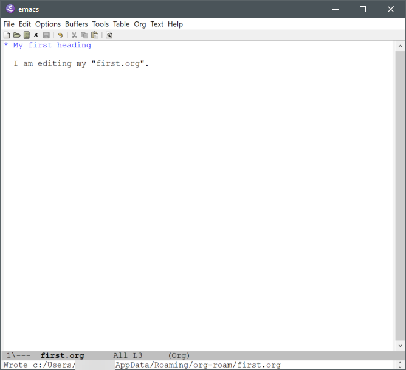

Not particularly useful or interesting, but this will do as an example. 
`C-x C-s` to save. 

And create another `.org` file, so that you can have a link from one to the other. 

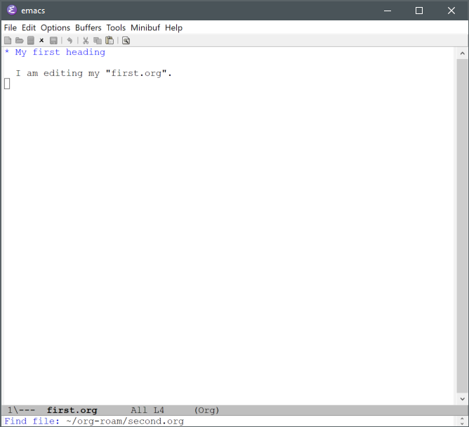

You can insert a link via the menu or `C-c C-l`, 

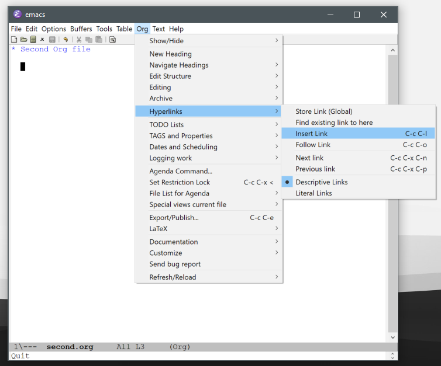

you will be asked to specify what type of link you are inserting. Choose `file:`. 


And then choose the file. In the image below, I'm using the completion via <kbd>TAB</kbd> to let Emacs propose existing files. I'm using keyboard to type the file name. If you use mouse to click, you would see Windows dialog box. Either way, you can insert a link to another file.

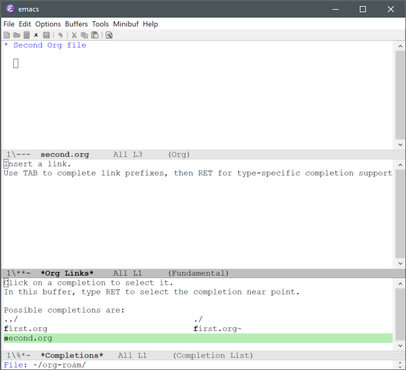


After selecting the file to link to, you will be asked to provide a description. You can press <kbd>Enter</kbd> to leave it empty, or provide a description that will appear in the body text for the hyperlink.

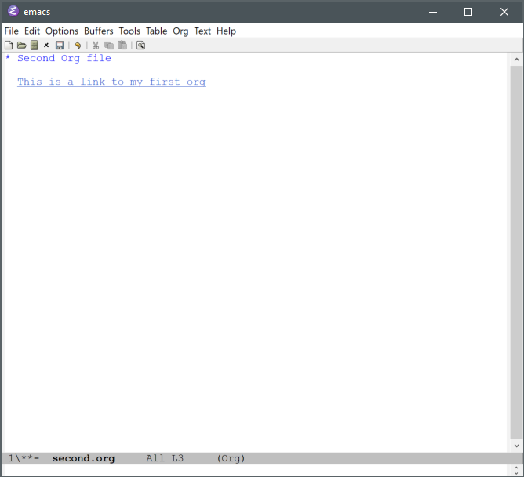

If you do `M-x org-toggle-link-display` (or the menu item as shown below), you will see that it is typed as 

`[[file:file-name.org][description]]`

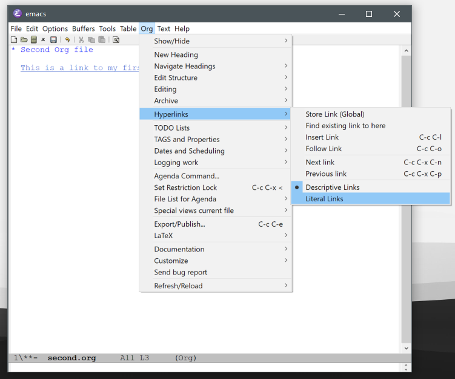

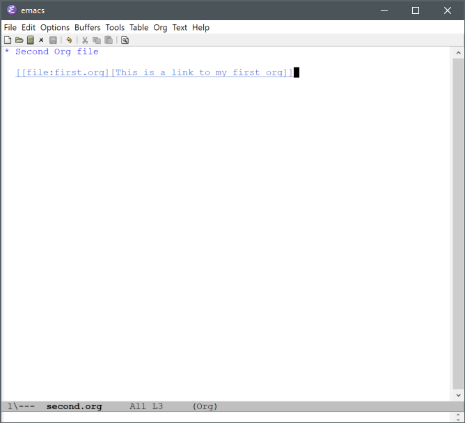

Clicking on the hyperlink should open the file; you can also use the menu item / command to follow the link as shown.


## Undo, copy, paste, and cut text

Go to `Options` in the menu bar, and toggle on "Use CUA Keys" as shown below if you struggle with undo, copy, paste and cut text. Using CUA keys means you can use the familiar keyboard shortcuts for undo, copy, paste and cut.

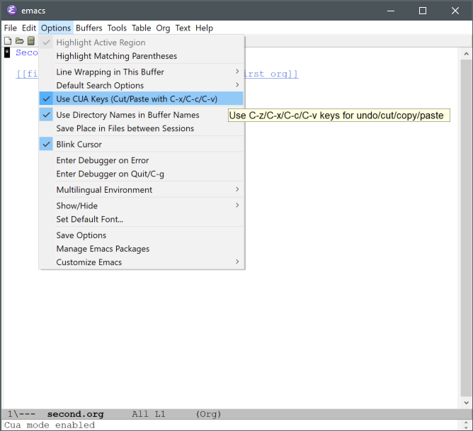

Once you have selected the option, you will see a check mark next to the "Use CUA Keys" option. It's a toggle, so if you do not like it, it's easy to turn it off [^1].

[^1]: At this stage, CUA option will only work until you quit Emacs; next time, you will need to select it again. There is a way to save your selection. That is called "customizing" or "configuration" ("config" for short). We will look at configuration later after we install Org-roam.

Your kind and experienced Emacs friends will very likely tell you not to do this. Many Emacs experienced people would recommend that you should learn the Emacs way. 

But know that CUA keys are an option in Emacs. Personally, I use the CUA keys with Emacs now -- in the previous version of this guide, I said I didn't but I changed. A good thing is that you can still use the Emacs way in parallel with the CUA way when you turn it on. 

Use your good judgment. If you are not intending to use Emacs any other way than Org-roam and writing long-form materials such as academic papers, maybe you don't need to listen to the advice. It's your system, your application, your personalization; this is your decision. Don't let others dictate what you want. Know that you can easily switch between the two ways. 

My suggestion is to try both CUA and Emacs way. The Emacs way is explained in many placed on the internet. But very briefly (with unofficial function names), they are:

- `C-w cut`
- `M-w copy`
- `C-y paste`
- `C-z hide Emacs window`

If you toggle CUA keys on in this way, you keep it only until you quit Emacs this time. There is a way to do it more permanently in configuration, if you want to. 

One thing that is mostly accepted probably is that the default `C-z` is not useful. Even if you decide to use the Emacs way, it's very likely that you would prefer `C-z` to be assigned to an undo function. We'll see how to do that later in the section to set up Org-roam.

## Ctrl + A, and select area of text

Similarly with CUA keys, <kbd>Ctrl</kbd> + <kbd>A</kbd> is not what it is in Windows. In Emacs `C-a` takes you to the beginning of the line. Probably the easiest to select an area of text is to use your mouse; just drag an area (called a "region" in Emacs).

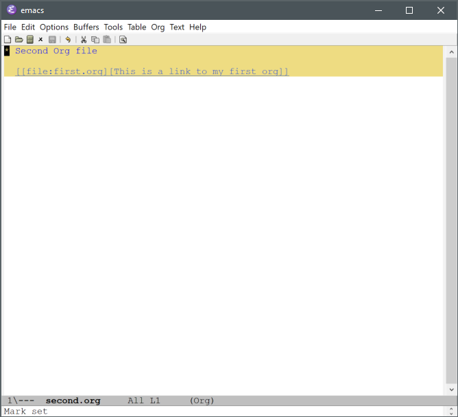

You can use `C-g` to remove the selection. 

If you are looking for a way to select the whole text, try the menu bar, `Edit > Select All`. It's also assigned to `C-x h`. This operation to select an area of text is called "mark" (you are marking a region), and selecting the whole text you are looking at is done via a function called `mark-whole-buffer`.

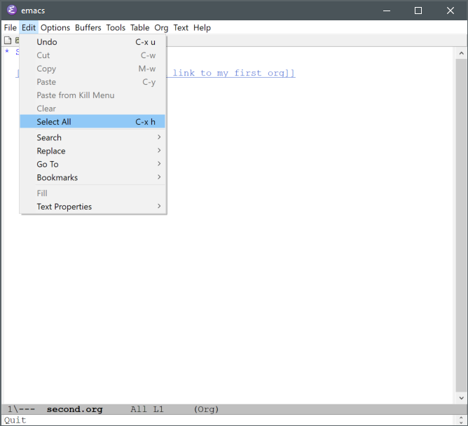

The Emacs way for selecting text is to press `C-SPC` (`SPC` stands for the space bar), and then move your cursor. You might have learned that `C-n` (move the cursor to the next line) `C-p` (move the cursor to the previous line). Or you can use arrow keys, too. 

There are more to creating and editing texts in Emacs, of course. But I'm hoping we have covered enough grounds to get you going with Emacs. Next section, we will look at how we can install Org-roam and set it up.
