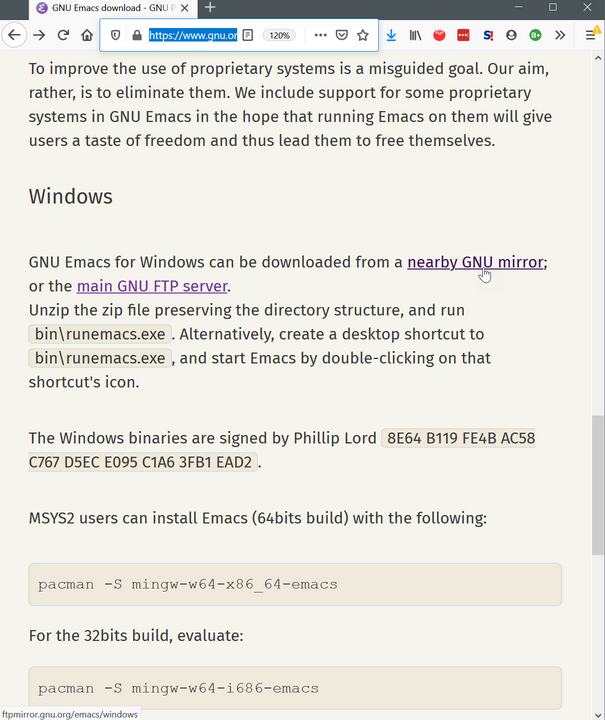
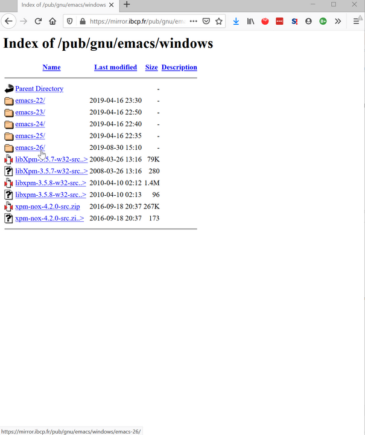

# Steps to start with Org-roam on Windows

1. Get Emacs for Windows
2. Make dot files (hidden files) visible on Explorer
3. Get sqlite3, and set up the path
5. Set up Org-roam
6. Set up Org-ref and Org-roam-bibtex (ORB)
7. Get a spell checker for Emacs
8. Write, and export to MS Word or PDF

## How do I get Emacs for Windows?
There are many ways to get Emacs for Windows. If you Google it, you are likely end up in tihs GNU official website.
Let's follow this way.
https://www.gnu.org/software/emacs/download.html


Go "nearby GNU mirror", and then click on the lastest version (as at the time of writing, it is emacs-26).
Some experienced people might talk about version 27. I don't even know how to get that version for Windows. I think you need to build it from source. Don't worry about all this. Version 26 is good. 


### 64-bit or 32-bit version?
You can see if your Windows is 64-bit or 32-bit version in Control Panel > System Security > System.


### Which Emacs?
I will assume you have the 64-bit version of Windows OS. Get the second one from the bottom, named `emacs-26.3-x86_64.zip`. This includes software that Emacs uses to show JPG and other image files, and so on. You can learn more about what these all mean by reading README. You can open it in your text editor. I'm using Typora here, but it can be Atom, Notepad, etc...


### Make hidden files visible (just in case)

This may not be necessary for you, but it might help you if you know about hidden files on Windows.

Open File Explorer, and go to your home folder – this should be `C://Users/your-user-name`.
On the ribbon menu at the top, open View tab. Make sure the check box "Hidden items" is ticked on. Explorer will display files and folders that are marked as "hidden". In the example below from my PC, the icon next to the folder named `.cf` is half-transparent. It means it is a hidden folder – you can see this by showing its properties (right click on the folder, and show them).

Starting a folder or file name with a dot `.` is Unix convention to indicate that these are "hidden" – in most cases, they are files and directories used for technical configuration. Windows does not necessarily follow this convention, and you may not have noticed this feature before.

For Emacs, you will be likely dealing with a folder named `.emacs.d` or a file named `.emacs` to configure your Emacs – have you seen people refer to their Emacs configuration file as "dotemacs", dot-Emacs? I have not had them to be set as hidden by default on Windows. But just in case, as a good measure, tick the checkbox to show hidden items. You may save a lot of time trying to find them. 


### Install Emacs
You might be wondering where the installer is to double-click on. There is no such a thing. README says put the zip file anywhere you like and extract it. That's it, really. 

Minds you, though, it's a big zip file. You may not have seen anything like it before – it has more than 26,000 files and it will take a while to extract – maybe half an hour, or 10 minutes. See the images below. This is compeletely normal.

In my example below, I'm putting the Emacs zip file in a folder named `bin` (it stands for binary) under my home folder. Right click on the file, select "Extract All…". Choose the name of the folder to extract to, if you like. I just used the default. 


## Use Emacs

So Let's open Emacs. And more importantly, let me show you how to quit it. 

Why mention quitting, you may ask. When I first started using Emacs, my first question was "How do I quit this thing?". I panicked becasuse I didn't know what I was doing. I don't remember how I managed to close it. Probably I googled. And I did not open Emacs again for a while; I was traumatized. 

And let me also show you how to cancel stuff you are doing in Emacs. 

I think knowing you can quit and stop will make you more comfortable using Emacs. You can avoid the pain I experienced.

### Open Emacs
Double-click on `runemacs.exe`. That's it. It's located wihtin the `bin` folder under the Emacs installation folder. You can pin it to your Start Menu, or have a shortcut on your desktop, etc.

If you see a command promp window pop up when you are runining Emacs, you double-clicked on the wrong one – `emacs.exe`. 

All this is explained in README, if you wish to understand more. 


### Quit Emacs

Use the menu on top of the application window, as shown below. 

```
File > Quit.
```

If you happen to be using Doom or some other framework, you may not see the menu bar on top, becasue many frameworks hide it by default. Don't panic. There is a way to make it appear (see next section).

In the menu selection, there is "C-x C-c" next to "Quit". This is the keyboard shortcut ("key binding") assigned to the "Quit" function. 

`C` stands for <kbd>Ctrl</kbd>.  So `C-x C-c` is:

<kbd>Ctrl</kbd> + <kbd>X</kbd>, then <kbd>Ctrl</kbd> + <kbd>C</kbd> (this will be, while you keep pressing <kbd>Ctrl</kbd>, press <kbd>X</kbd> then <kbd>C</kbd>).


### Call commands, cancel what you are typing

`C-g` is to cancel what you are doing. You will see "Quit" at the bottom of Emacs (but it's not closing Emacs all together…)

Like we saw above, `C` stands for <kbd>Ctrl</kbd>.
There is another important key used throughout Emacs: `M`. For Windows, it's <kbd>Alt</kbd>. 
For example, `M-x` means you press <kbd>Alt</kbd> + <kbd>X</kbd>.

`M-x` is a special command in Emacs. When you do it, your cursor moves to the bottom part of the screen (called "minibuffer"), prompting you to type a command. 

Let's try to hide and show the menu bar as an example – here, you can make the menu bar reappear if you don't see it by default, like when you are using Doom Emacs.

Press `M-x` and type "menu bar mode", and then press <kbd>Enter</kbd>; you will notice that a space is automatically replaced by a hyphen "-". 

This operation is usually written as:

`M-x menu-bar-mode` or  `M-x menu-bar-mode <RET>`.

\<RET\> refers to <kbd>Return</kbd> – on Windows, it's <kbd>Enter</kbd>.

Notice the menu bar on top disappears with the text in minibuffer saying, "Menu Bar mode disabled". If you invoke the same command again, the menu bar appears again ("Menu Bar mode enabled").

You can cancel calling a command by pressing `C-g` in the middle of typing a command.


## Theme
- modus operandi
- elegant emacs

## Autoinstall init.el

Something like this might be useful.
```
;; Added by Package.el.  This must come before configurations of
;; installed packages.  Don't delete this line.  If you don't want it,
;; just comment it out by adding a semicolon to the start of the line.
;; You may delete these explanatory comments.
(package-initialize)

(require 'package)
(add-to-list 'package-archives '("melpa" . "https://melpa.org/packages/"))

(defvar bootstrap-version)
(let ((bootstrap-file
       (expand-file-name "straight/repos/straight.el/bootstrap.el" user-emacs-directory))
      (bootstrap-version 5))
  (unless (file-exists-p bootstrap-file)
    (with-current-buffer
	(url-retrieve-synchronously
	 "https://raw.githubusercontent.com/raxod502/straight.el/develop/install.el"
	 'silent 'inhibit-cookies)
      (goto-char (point-max))
      (eval-print-last-sexp)))
  (load bootstrap-file nil 'nomessage))

(straight-use-package 'use-package)

(use-package org-roam
  :hook
  (after-init . org-roam-mode)
  :straight (:host github :repo "jethrokuan/org-roam" :branch "develop")
  :custom
  (org-roam-directory "/path/to/org-files/")
  :bind (:map org-roam-mode-map
	      (("C-c n l" . org-roam)
	       ("C-c n f" . org-roam-find-file)
	       ("C-c n g" . org-roam-show-graph))
	      :map org-mode-map
	                    (("C-c n i" . org-roam-insert))))
  ```