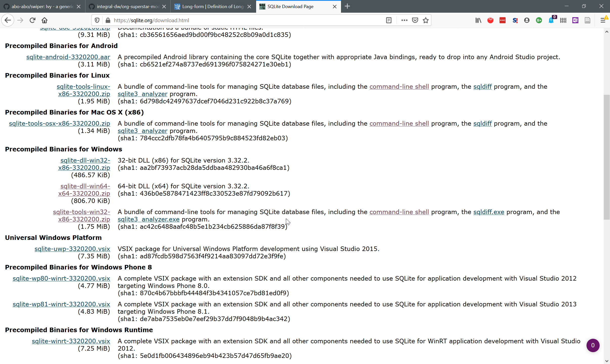
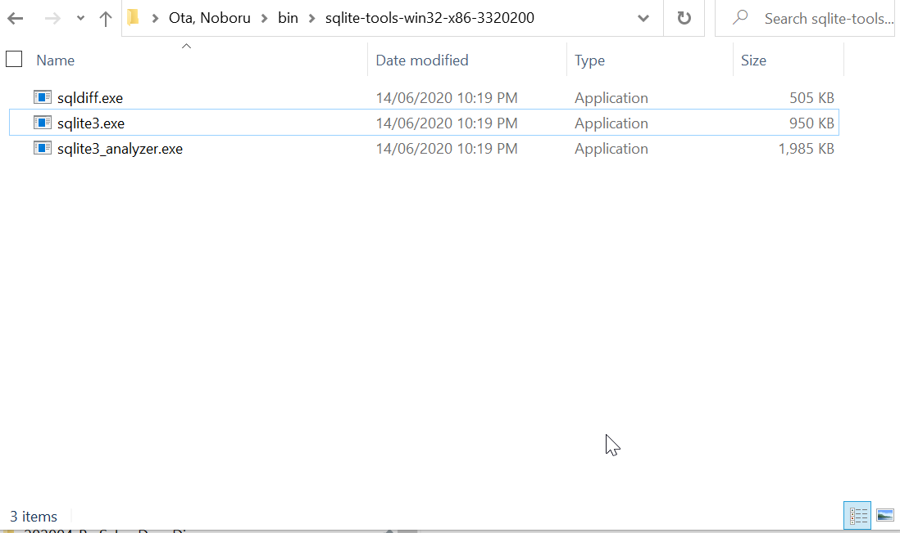
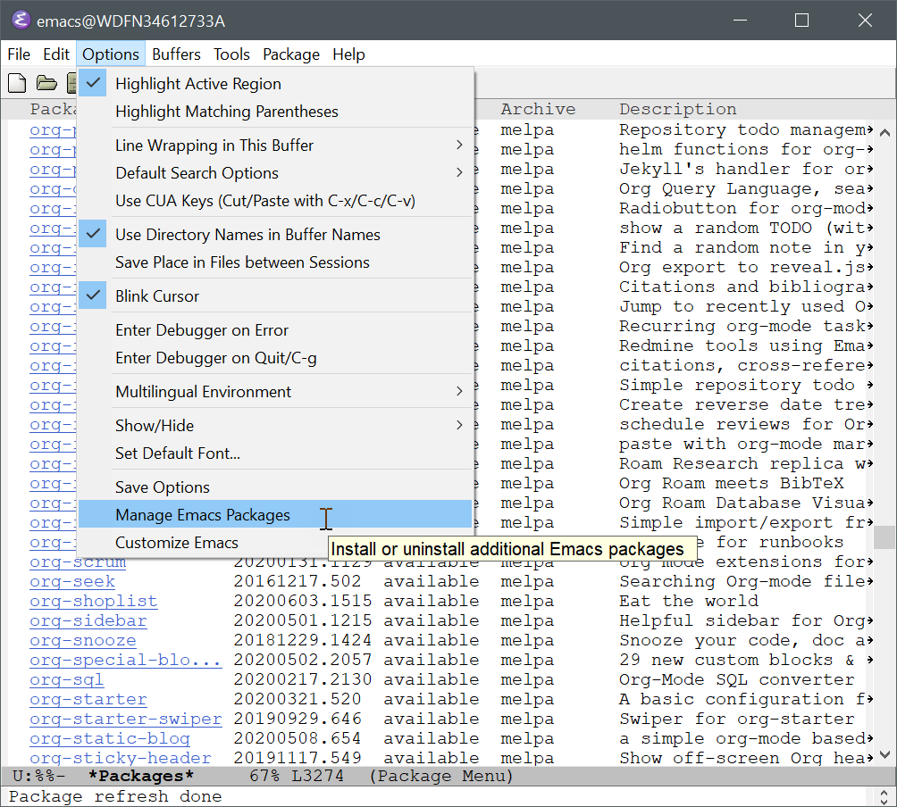
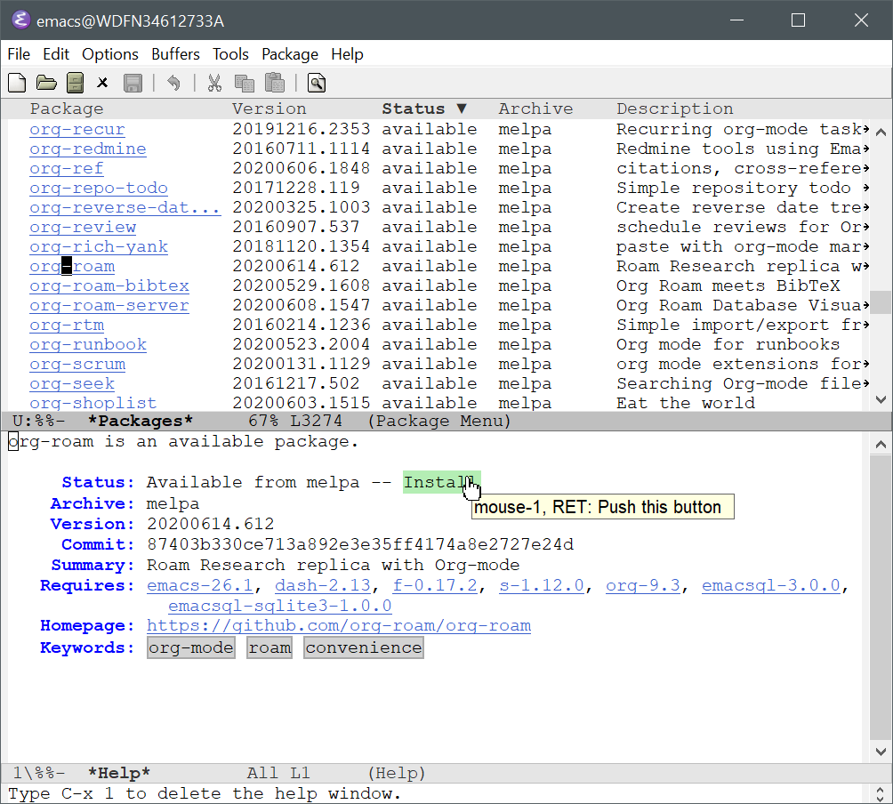
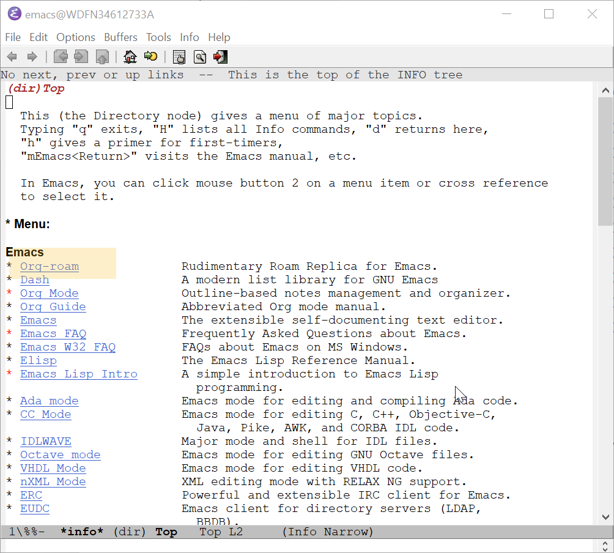
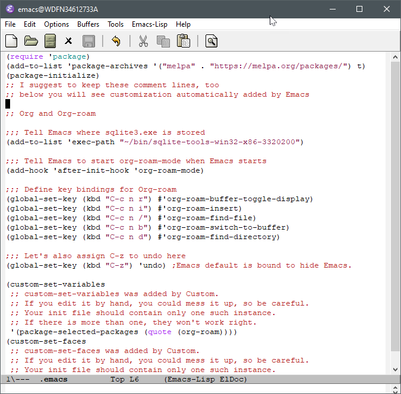
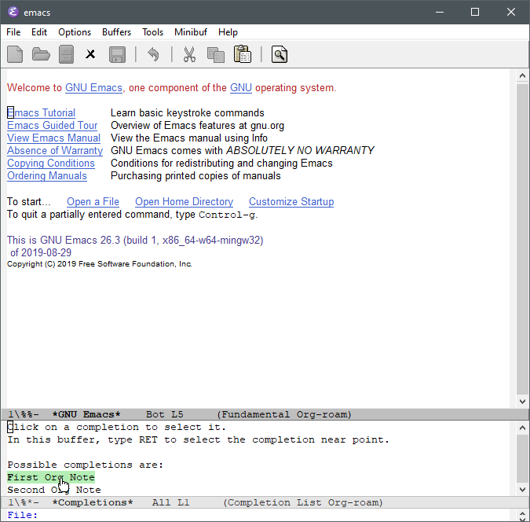
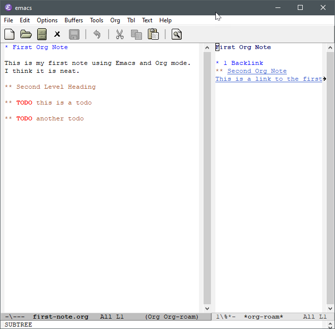

## Set up Org-roam (including sqlite3)

### Install SQLite

Org-roam relies on database software called SQLite. macOS comes with it, and Linux users would not have a problem installing it. For Windows, you need to manually download it and place it in your PC, in the same way as you did for Emacs.

Go to this [official downloading](https://sqlite.org/download.html) site.



Download the biggest "bundle of command-line tools" named `sqlite-tools-win32-x86-3320200.zip`. 

The location you put the zip file does not matter. I choose the `bin` within my home folder, the same one as I put Emacs. Extract the zip file to get these executable. What is required for Org-roam is `sqlite3.exe`.




You have two options to let Emacs know where to find the executable.

1. [Set environmental variable](https://www.opentechguides.com/how-to/article/windows-10/113/windows-10-set-path.html) (you will probably need to log off and log on for your Windows to recognise the new path)
2. [Set a variable within Emacs](https://org-roam.github.io/org-roam/manual/Post_002dInstallation-Tasks)

Org-roam manual mentions the latter, so I'll follow it. This is done in your configuration file (we will see it later after installing Org-roam).

### Install Org-roam

Finally, it's time to edit your configuration file. In your Emacs, create a new file named `.emacs` (no extension) directly within your home folder [^1].


[^1]:  Many people use `.emacs.d/init.el` as their dotemacs configuration file. There is no problem with it ;however, for the reasons we will see later when you install packages, I recommend to use `.emacs` for now until you see how you can configure Org-roam. This way, you can track what what Emacs does automatically, and avoid confusion. We will come back to this point soon.

Type the following lines in `.emacs`

```
(require 'package)
(add-to-list 'package-archives '("melpa" . "https://melpa.org/packages/") t)
(package-initialize)
;; I suggest to keep these comment lines, too
;; below you will see customization automatically added by Emacs
```


You can save this file, if you like. 

Invoke this command `M-x eval-buffer`. Don't worry if it looks like it has done nothing.

Then invoke `M-x package-refresh-contents`.  Emacs should start contacting the MELPA server at https://melpa.org, and tell you "Package refresh done" when done. 

If this refresh is successful, you should see `org-roam` listed as a package available for you to download.



Install Org-roam from the list. It will trigger downloading Org-roam along with all the prerequisite packages. 

You can use `C-s` to **s**earch [^2] for `org-roam`. As soon as you start typing the letters, Emacs will move your screen to get to the first match. Type `org-roam` and then press `C-s` a couple of times to keep looking for `org-roam` – along the way you will probably hit `company-org-roam` first, and then probably something else; in my case, the `org-roam` package was the third hit.

You can use your mouse to click on the hyperlink, and then click on the "Install" button that appears.

[^2]: <kbd>Ctrl</kbd> + <kbd>F</kbd> is **not** bound to "Find…" but it moves your cursor one step "**f**orward" (to the right).



Now you have installed Org-roam(!!)

You can press <kbd>Q</kbd> twice to come back to the `.emacs` file you were editing.

You can confirm that your PC has Org-roam by looking at the folders in your `elpa` folder created automatically within your `.emacs.d` folder.


In addition, if you invoke `C-h i` to open Emacs manual, you will see a section for Org-roam has been added. This is the same [manual you can see online](https://org-roam.github.io/org-roam/manual/) – that's how the Org-roam project makes it available.  

Press <kbd>Q</kbd> again to go back to `.emacs`.



### Configure Emacs for Org-roam

Back in `.emacs`, you will notice that some texts have been added without your knowledge below your comments.


Leave them there. This is the reason why I recommend to use `.emacs` instead of `~/.emacs.d/init.el` or something else for your dotemacs configuration file for now.

This automatic behaviour of "customisation" confuses many Emacs users. If you think you configuration does not work even when you are so sure you have done everything right in your `init.el` file, try to see if Emacs has not added `.emacs` automatically without clearly telling you. You can copy and paste the whole `(custom-set-variables)` and `custom-set-faces)` over to your dotemacs file. 

In our case, we can simply keep these additional parts at the bottm of `.emacs`.

Let's move on with our Org-roam configuration. Type the following, after your comment, and before `(custom-set-variables)`.  The line starting with two semi-commas `;;` is a comment and is not part of the configuration Emacs executes ("evaluate" is the term that Emacs uses).

The first line with `add-to-list` tells Emacs where it can find `sqlite3.exe`.  The lines with`globa-set-key` set your cutom key bindings. You can set whatever you feel comfortable here; I'll just use them in rest of this tutorial. 

```
;; Org and Org-roam

;;; Tell Emacs where sqlite3.exe is stored
(add-to-list 'exec-path "~/bin/sqlite-tools-win32-x86-3320200")

;;; Tell Emacs to start org-roam-mode when Emacs starts
(add-hook 'after-init-hook 'org-roam-mode)

;;; Define key bindings for Org-roam
(global-set-key (kbd "C-c n r") #'org-roam-buffer-toggle-display)
(global-set-key (kbd "C-c n i") #'org-roam-insert)
(global-set-key (kbd "C-c n /") #'org-roam-find-file)
(global-set-key (kbd "C-c n b") #'org-roam-switch-to-buffer)
(global-set-key (kbd "C-c n d") #'org-roam-find-directory)

;;; Let's also assign C-z to undo here
(global-set-key (kbd "C-z") 'undo) ;Emacs default is bound to hide Emacs.

```



Now you can save this. Let's quit Emacs and relaunch it. Once you see the start screen, invoke `M-h e` to view "echo message." Do you notice the two files and one link you created earlier have been added to Org-roam's database?


You cannot close the echo message area by simply pressing the <kbd>Q</kbd>.  Try `File > Remove Other Windows` or `C-x 1` to close others but the one your cursor is in. Notice you can use `C-x 2` and `C-x 3` to open new panes within the same Window (confusingly, these panes are called "Windows" in Emacs).


Invoke `org-roam-find-file` by typing `C-c n /`, and then press <kbd>TAB</kbd> to let Emacs list the titles of your files in `org-roam` folder. You can type the title, or use your mouse to select one.



Once you are in one of your Org notes, invoke `org-roam-buffer-toggle-display` (bound to `C-c n r` in our example) to open the Org-roam's side panel. 



Yes, you have successfully configured Org-roam :)

In the next section, we will look at how we can improve your Emacs and Org-roam life by adding a couple of more packages.