Still work in progress

# Set up Org-roam

## Install MSYS2

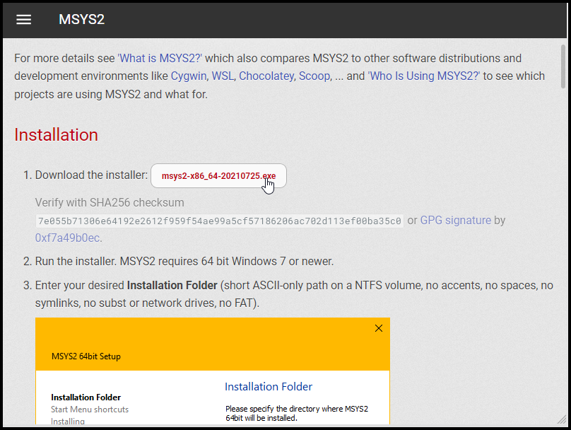

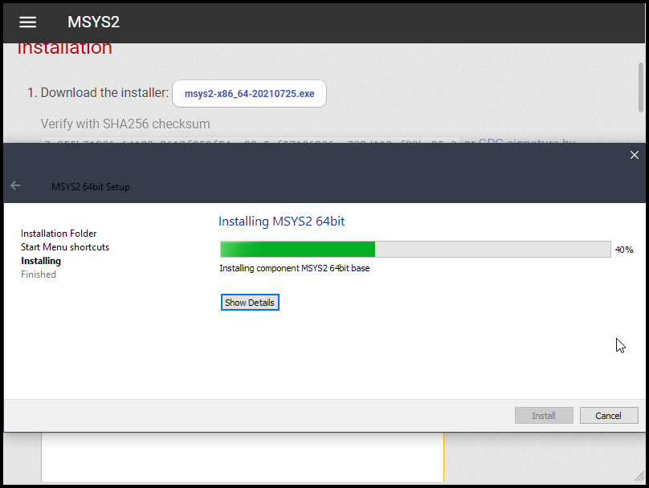

Run MSYS2 after installation completes.
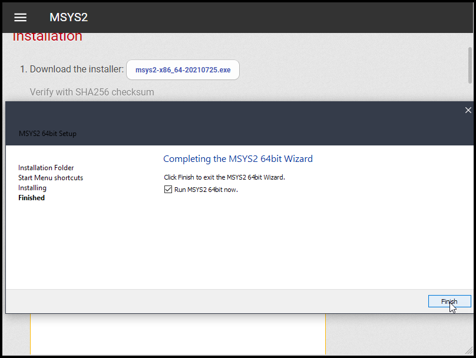

You can simply install `gcc` by typing:

    pacman -S gcc

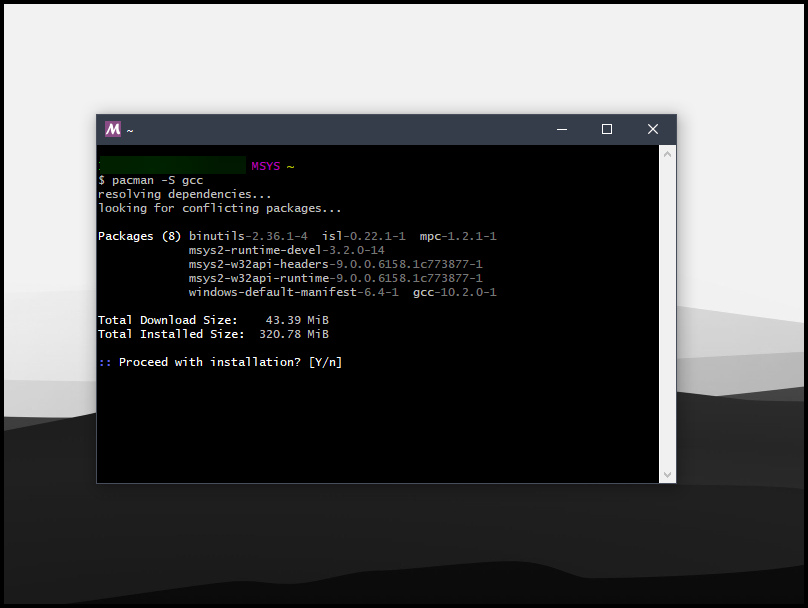

You could update the package repository as instructed in the documentaion; you can do it but you don't have to.

## Install Org-roam in Emacs

```
;; Packages
(require 'package)
(add-to-list 'package-archives '("melpa" . "https://melpa.org/packages/") t)
(package-initialize)

(setq package-check-signature nil)
```

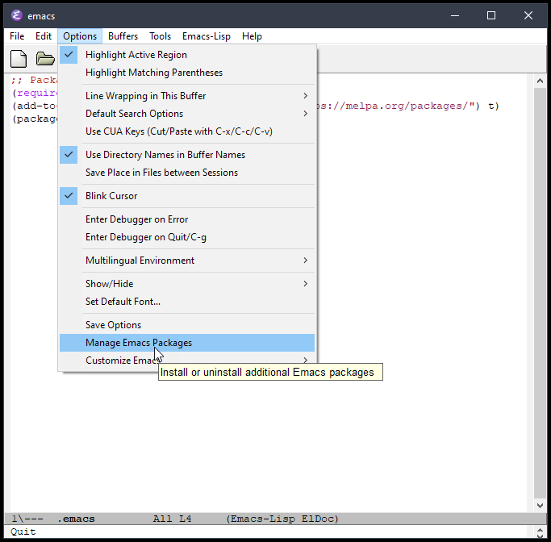


It is important to set this:

    (setq package-check-signature nil)

Otherwise, you will get an error message after running `package-list-packges`

    error in process filter: package--check-signature-content: Failed to verify signature: "archive-contents.sig"
    
Wait for a while (possibly 30 seconds or so) until you see "Package refresh done" message in minibuffer.

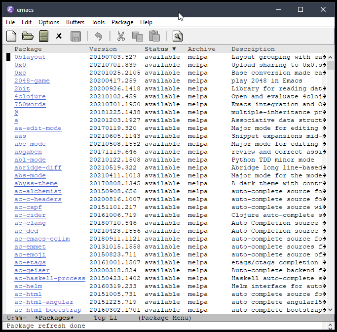
    
Filter by name
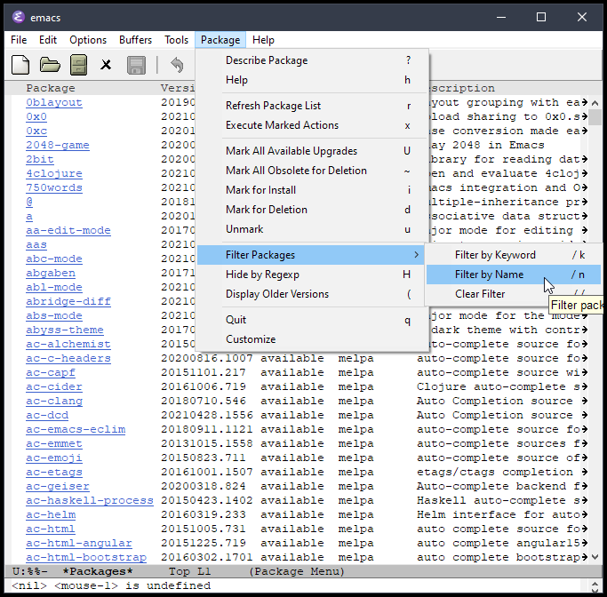

Type "org-roam", press Enter, and you will get this list:

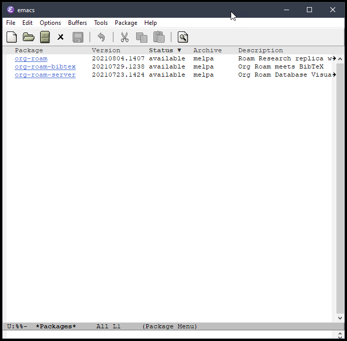

Click on `org-roam` and click on the "Install" button in the bottom half of the screen that opens.

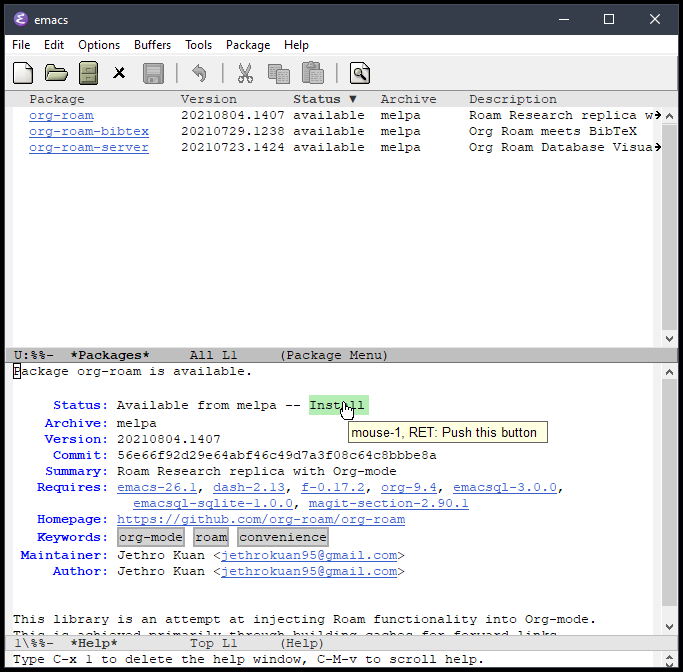

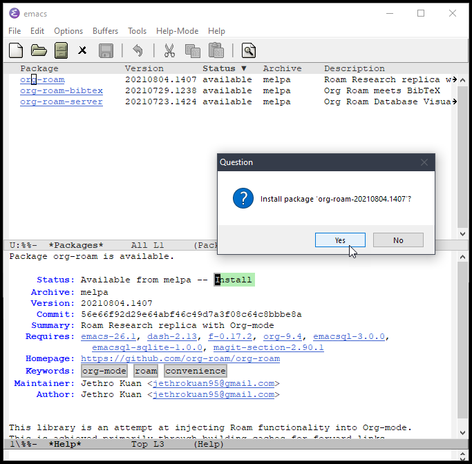

During hte installation, you will see "Comiling EmacSQL SQLite binary ..." message. This will take a while.

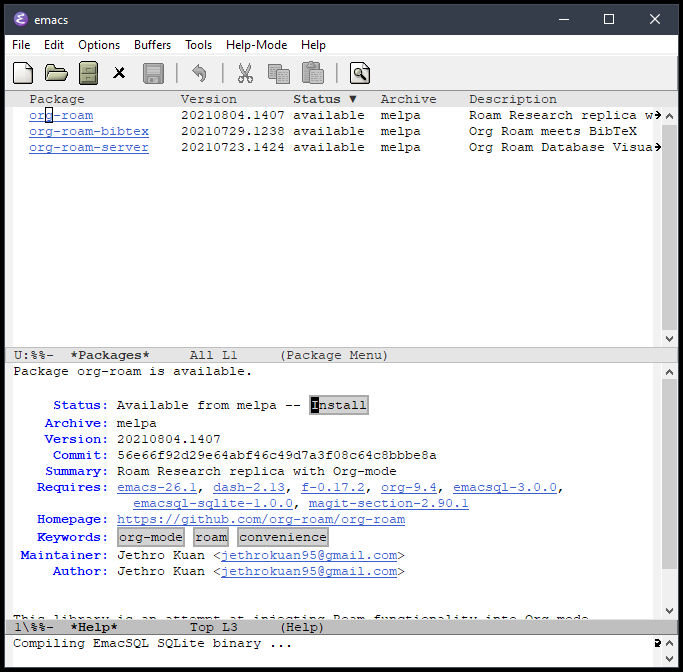


After the installation process.
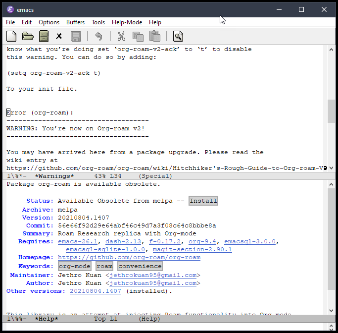

## Configure Org-roam in `.emacs` file

`make-directory` needs to be commented out after the inital creation.
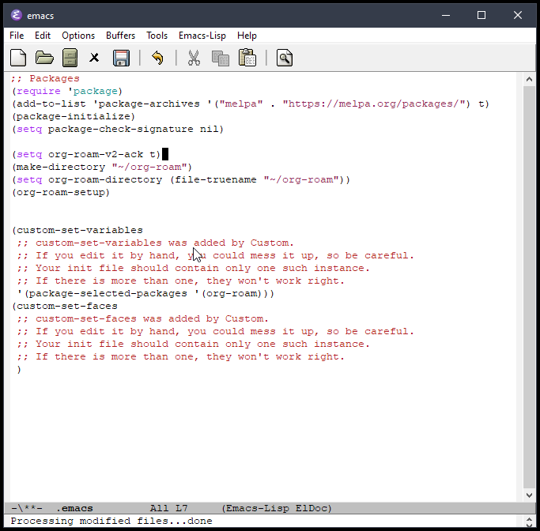

The process works.
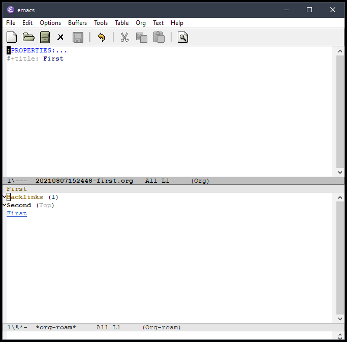


