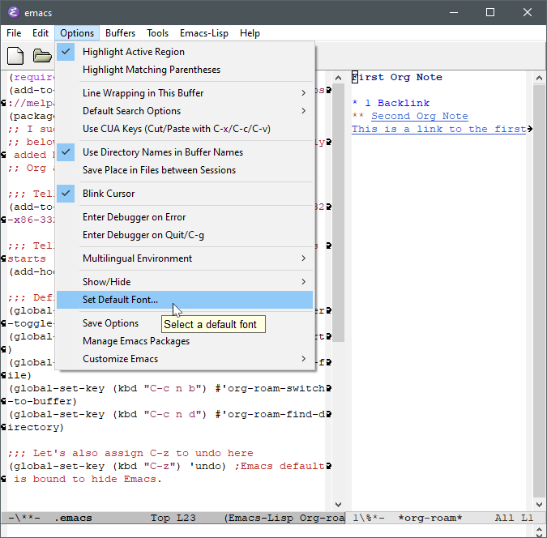
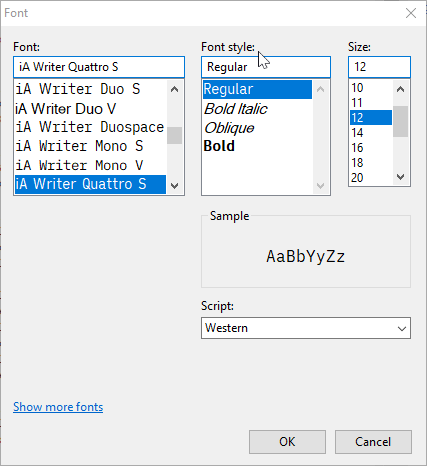
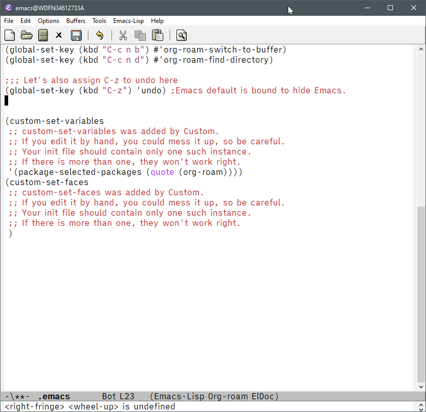
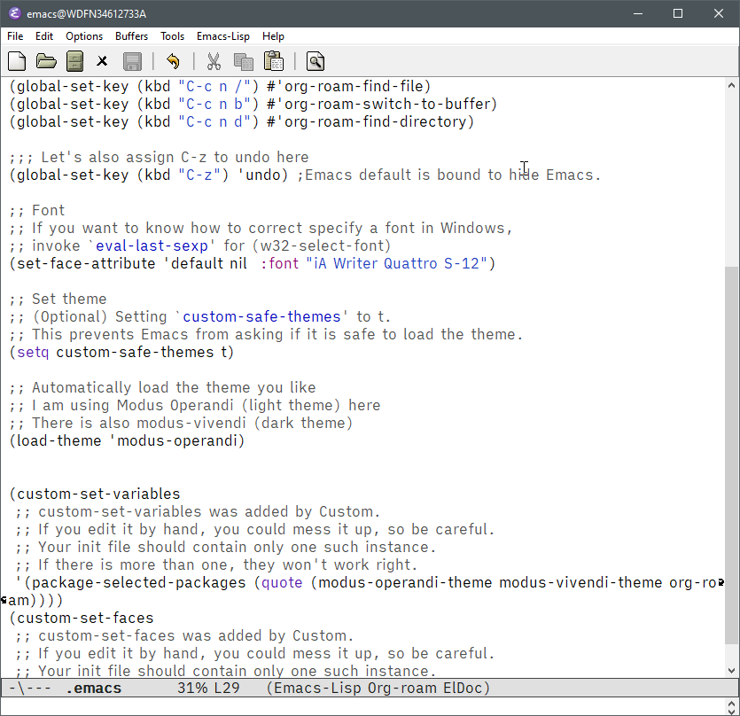
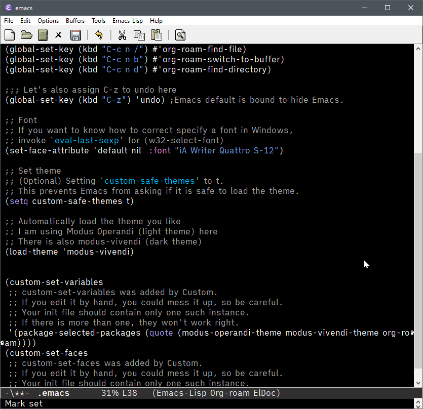
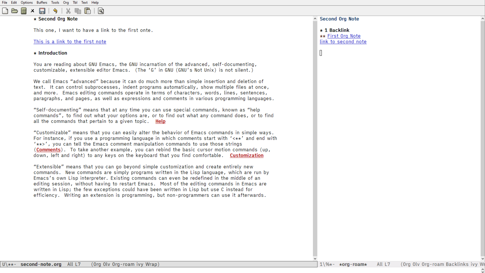
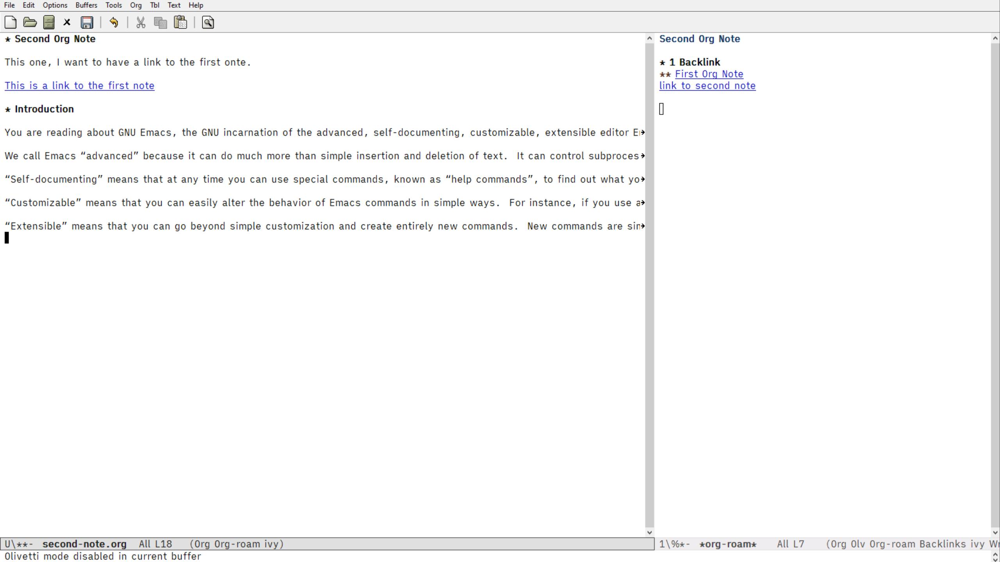
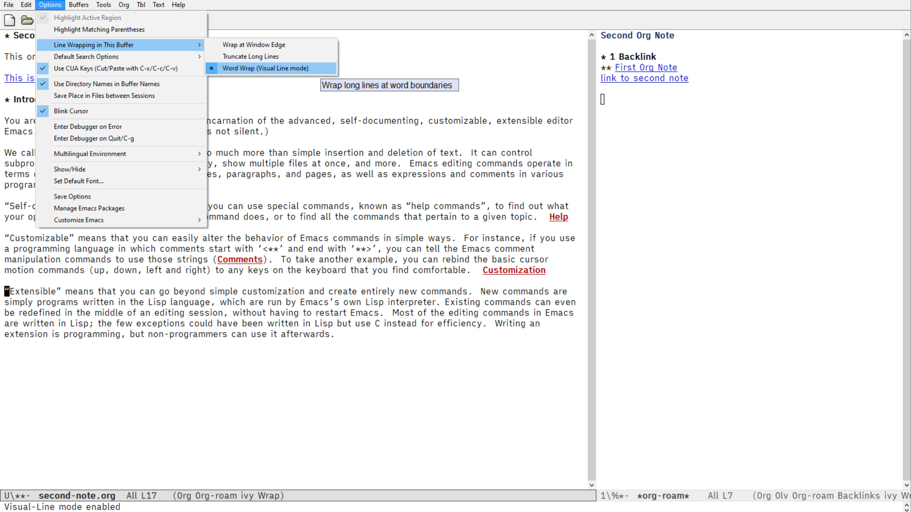
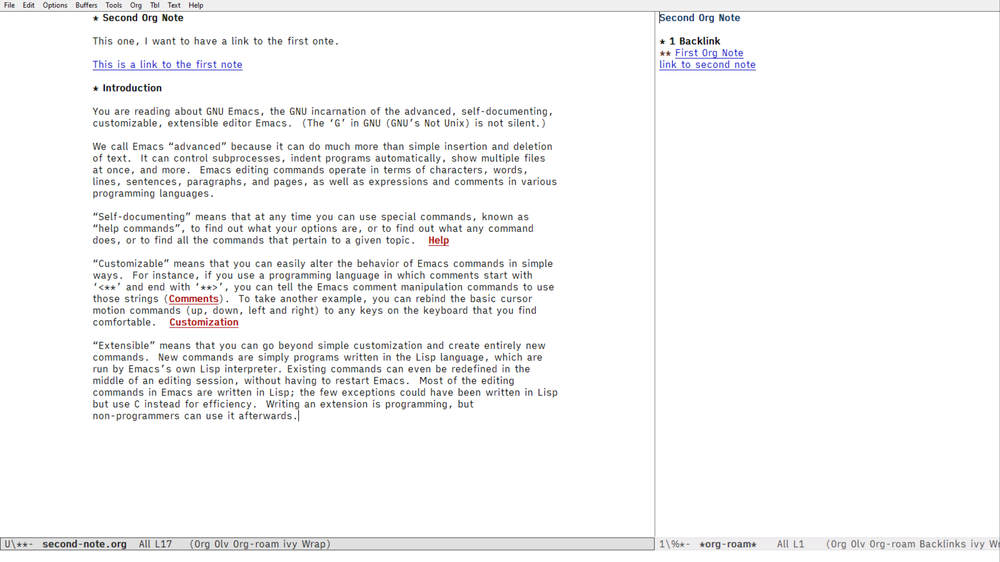

## Improve quality-of-life with your font, theme, and minimal select packages 

You have got Org-roam going, so you should be good to roam around. There is a whole universe of Emacs packages and hacks out there. Let me introduce minimum survival kit to make your Emacs life a little better. Note that this section is completely optional for your Org-roam life, and no problem completely ignoring it, or selectively apply some parts of it. You decide. With just a minimum added to your kit, nevertheless, you might find your quality of life one notch better. 

My selection is purely subjective, and aimed at long-form writing as opposed to programming. Here is my minimum survival kit:

- Font
- Theme
- Ivy
- Olivetti
- Small aesthetic changes


## Set your font

Try setting your default font by `Options > Set Default Fonts`. 



You can choose any font installed in your system.




… Now it's all good… until you quit Emacs. This is not a permanent configuration.

Try this.

```
;; Font
;; If you want to know how to correct specify a font in Windows,
;; invoke `eval-last-sexp' for (w32-select-font)
(set-face-attribute 'default nil  :font "iA Writer Quattro S-12")
```


`M-x eval-last-sexp` is to evaluate a minimum Emacs program just before your cursor. In this case, `(32-select-font)` is a function (a minimum unit of Elisp program in this context). You cannot use it with `M-x`; hence, we use `eval-last-sexp` instead. 

### Set your theme

Get a theme of your choice, for instance from the list of packages. I like Modus-Operandi (light theme) and Modus-Vivendi (dark theme) created by [Prot](https://protesilaos.com/)[^3]. 

In the package list, you may find these themes twice: one from MELPA, and the other from GNU. Choose either one. I believe it's just different archives providing the same theme – in fact, if you download one, the other disappears from the list.

[^3]: Checkout his YouTube tutorials for Emacs; very informative. I really like his no-nonsense style. His dotemacs is also a very good study material. 

Put the following part in your `.emacs`, and invoke `M-x eval-buffer`.

```
;; Set theme
;; (Optional) Setting `custom-safe-themes' to t.
;; This prevents Emacs from asking if it is safe to load the theme.
(setq custom-safe-themes t)

;; Automatically load the theme you like
;; I am using Modus Operandi (light theme) here
;; There is also modus-vivendi (dark theme)
(load-theme 'modus-operandi)
```





### Set Ivy mode

An alternative way to install a package is to invoke `M-x pacakge-install`, and then type the name of package you want, for example, `ivy`, then `RET` (that is, to press <kbd>Enter</kbd>).

Install `swiper` and `counsel` as well as `ivy`; they work together to improve default search and file navigation functions.

Once they are installed, put the following config, and then invoke `M-x eval-buffer`.

```
;; Ivy,Counsel, & Swiper
;; Enable Ivy mode in general
(ivy-mode 1)
(setq ivy-use-virtual-buffers t)
(setq enable-recursive-minibuffers t)

;; Add Counsel and Swiper search functions
(global-set-key (kbd "C-c f r") #'counsel-recentf)
(global-set-key (kbd "C-c C-s") #'swiper)

;; Replace default "M-x" and "C-x C-f" with Counsel version
(global-set-key (kbd "M-x") #'counsel-M-x)
(global-set-key (kbd "C-x C-f") #'counsel-find-file)

;; Optionally, you can replace these default functions with Counsel version, too
;;(global-set-key (kbd "C-h f") 'counsel-describe-function)
;;(global-set-key (kbd "C-h v") 'counsel-describe-variable)

```

I sugget you to try all the functions added here. But one thing to note here is that Org-roam related search functions are **autoamtically** improved by Ivy. For example, try `C-x n /` to find Org-files. See this in action.


Also see the enhanced `M-x`.  Notice the keybindings you have assigned to the respective commands.


### Set Olivetti

Ivy and its companions were for functional improvements. Olivetti is for UX improvement for writing and reading in Emacs. Install it in the same way, like `package-install RET olivetti RET` – notice that Ivy is also enabled here for searching packages.

Put the following in, and invoke `M-x eval-buffer`.

```
;; Olivetti
;; Look & Feel for long-form writing

;; Set the body text width
(setq olivetti-body-width 80)

;; Enable Olivetti for text-related mode such as Org Mode
(add-hook 'text-mode-hook 'olivetti-mode)
```

Open your long-form Org note, like this one.



Notice that you have very generous margins on both sides in the main body – you set the width by the variable, `olivetti-body-width`. The texts are also wrapped on the right. They are "visually" wrapped. You can see the difference Olivetti makes by turning it off with `M-x olivetti-mode`. 

Notice that each paragraph continues onto the invisible end to the right. 



You can manually turn on the visual line wrapping with `Option > Word Wrap (Visual Line mode)`. Olivetti turns Visual Line mode  for you and add the margins to make writing and reading long texts more comfortable. To me, it's a simple and beautiful solution for readability. 



### Add small aesthetic changes

Lastly, throw in some aesthetic changes. For example, one of the things we can do is to remove the vertical scroll bar between the main body and the Org-roam side pane. To me, it is a little too prominent and gets in the way. 

I like the way Elegant Emacs by Nicolas Rougier (rougier on GitHub) deals with these changes in a compact package. Below, I have liberally copied from his code. 

Put the following in your `.emacs`, and invoke `M-x eval-buffer`.

```
;; Optional additional aesthetic changes
;; Adapted from `sanity.el' in Elegant Emacs by Nicolas P. Rougier (rougier)
;; https://github.com/rougier/elegant-emacs

(setq inhibit-startup-screen t)
(setq inhibit-startup-echo-area-message t)
(setq inhibit-startup-message t)
(setq initial-scratch-message nil)
(setq initial-major-mode 'org-mode)
(setq-default indent-tabs-mode nil)
(setq pop-up-windows nil)
(tool-bar-mode 0) 
(tooltip-mode  0)
(scroll-bar-mode 0)
(menu-bar-mode 1) ;menu bar is explicitly turned on for beginners. Change the value to 0.

;; Optional aditional aesthetic changes
;; Adapted from `elegance.el' in Elegant Emacs by Nicolas P. Rougier (rougier)
;; https://github.com/rougier/elegant-emacs

;; Line cursor and no blink
(set-default 'cursor-type  '(bar . 1))
(blink-cursor-mode 0)

;; Line spacing, can be 0 for code and 1 or 2 for text
(setq-default line-spacing 0)

;; Underline line at descent position, not baseline position
(setq x-underline-at-descent-line t)
```

The end result looks like this.



This is the end of Part 1. We have covered a lot, from zero Emacs footprint in your Windows PC, all the way to using Org-roam with some quality enhancements in your Emacs. 

It has been a long walk, but I hope it has been worth your time. Now you can roam on your own.

Let me know your thoughts on how I can improve contents.

Happy note taking. 
