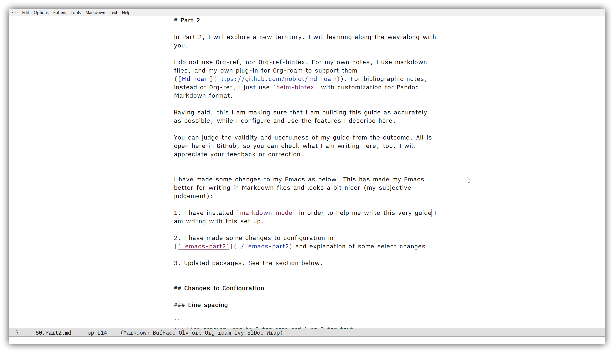

## Additional configuration to improve your writing environment

The last chapter shows you how small amount of configuration changes the look & feel of your Emacs -- I believe this is an important part of our writing system. In this section, I will introduce a little more of configuration I have done for myself. This section is also completely optional, and can be used for you to pick and choose ideas you find useful.



To improve my own writing environment, I have made some changes to my Emacs as below. This has made my Emacs better for writing in Markdown files and looks a bit nicer (my subjective judgement):

1. I have installed `markdown-mode` in order to help me write this very guide I am writing with this set up.

2. I have made some changes to configuration in [`.emacs` at the commit before Part 2](https://github.com/nobiot/Zero-to-Emacs-and-Org-roam/blob/a3e74aaef1cebb7b80f44ed5aa6634c4837c4a90/.emacs) and provided explanation of these select changes below

3. Updated packages. See the section below.

### Get `M-x` to remember commands I have used

You seem to call the same command again and again?

Install a package called Smex. That's it. It works out-of-the-box with Ivy with no need for additional configuration.

Now Emacs remembers the commands you have called, and list the immediate last one on top of the `M-x` list. 

### Line spacing

```
;;; Line spacing, can be 0 for code and 1 or 2 for text
(setq-default line-spacing 2)
```

The spacing is measured in pixels[^1]. 

[^1]: Refer to the in-system manual via `C-h v line-spacing RET` -- this is a great way to discover things to help you personalise Emacs. 

### Fixed-pitch fonts

The font section of my .emacs now looks like this.

```
;; Font
;;; If you want to know how to correct specify a font in Windows,
;;; invoke `eval-last-sexp' for (w32-select-font)
(set-face-attribute 'variable-pitch nil :font "iA Writer Quattro S-13")
(set-face-attribute 'fixed-pitch nil :font "iA Writer Mono S-12")
(set-face-attribute 'default nil :font "iA Writer Mono S-12")
(set-fontset-font nil 'symbol (font-spec :family "Segoe UI Symbol" :size 11.0))
(add-hook 'text-mode-hook 'variable-pitch-mode)
```

This way, when you are in Markdown or Org mode, you will get variable-pitch font, and fixed-pitch font when you are in programming mode or Helm buffer (e.g. to select a bibliographic entry to cite).

### Stop Emacs from "littering" your folder with #file# and file~

These configurations will stop Emacs creating backup files, etc. I find them annoying. Some of you may find them useful as backup files -- in this case, there is no problem keeping them. 

```
;; Avoid #file.org# to appear
(auto-save-visited-mode)
(setq create-lockfiles nil)
;; Avoid filename.ext~ to appear
(setq make-backup-files nil)
```

This one is handy when you are dealing with links and images in Markdown files, in addition to Emacs configuration. It highlights the pair of parentheses and brackets.

```
;; Turn on highlighting the pair of parenthesis when cursor is on one of the pair
(show-paren-mode 1)
```

Refer to the [`.emacs` at the commit before Part 2](https://github.com/nobiot/Zero-to-Emacs-and-Org-roam/blob/a3e74aaef1cebb7b80f44ed5aa6634c4837c4a90/.emacs), and [its history](https://github.com/nobiot/Zero-to-Emacs-and-Org-roam/commit/a3e74aaef1cebb7b80f44ed5aa6634c4837c4a90#diff-1281e836e719f3cdc3750acfe4a4cf89) to see the incremental changes.

### Updating (upgrading) packages installed

`M-x package-list-packages` or equivalently `M-x list-packages`, and then in the list <kbd>Shift</kbd> + <kbd>U</kbd> to mark packages installed. Press <kbd>X</kbd> to execute the update.


```
Package menu: Operation finished [Upgraded 7]
```
