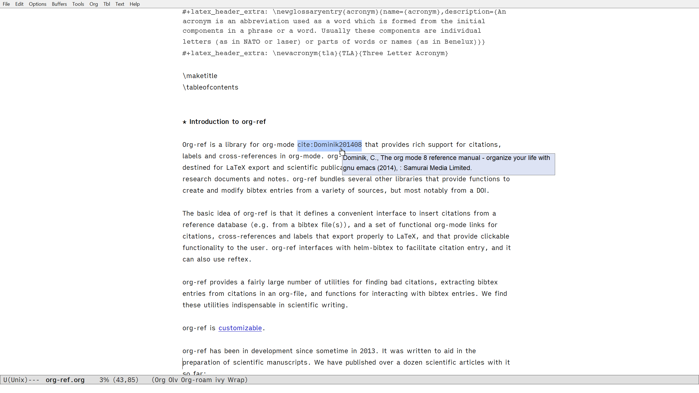
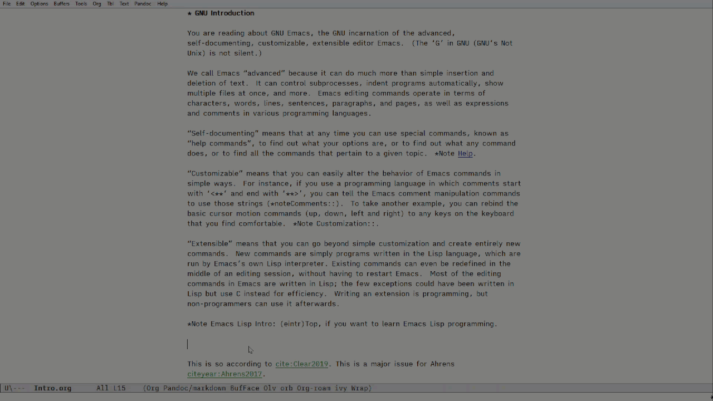
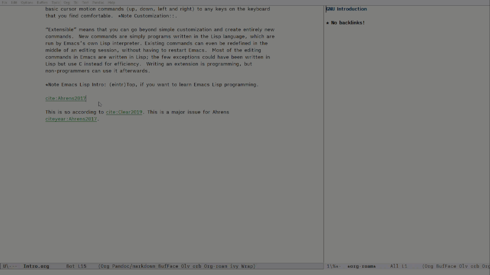

## Set up Org-ref and Org-roam-bibtex (ORB)

In this section, we will look at how to quickly set up ORB together with Org-ref to manage your bibliographic notes.

I will leave the ORB project to explain how you can use it in the best way. 

### Install ORB (`org-roam-bibtex`)

Install ORB via `M-x package-install RET org-roam-bibtex RET`. Install `org-ref`, too: `M-x package-install RET org-ref RET`.

After installation is done, `M-x org-ref-help`. You can see that tooltips are working -- here, you might need to call `M-x tooltip-mode` to turn tooltips on; it was turned off in my `.emacs` in Part 1.



### Set up

Let's set up Org-ref and ORB following their respective documentation: [Org-ref](https://github.com/jkitchin/org-ref#configuration), and [ORB](https://github.com/org-roam/org-roam-bibtex#without-use-package).

Put the code below in your `.emacs` and call `M-x eval-buffer`.

Make sure to replace the path to `.bib` file with your own bibliography file.

I am assuming that you have your bibliography database set up with using a `.bib` file. I have mine synced with [Zotero](https://www.zotero.org/) with [Better BibTex for Zotero extension](https://retorque.re/zotero-better-bibtex/).

I have also added a keybinding to open my list with <kbd>F6</kbd>. The command I have chosen for this is `org-ref-helm-insert-cite-link`. Helm is another completion framework, similar to Ivy. For bibliography, Helm might looks to be a common way; it opens the full screen with more options for academic web libraries, etc. Ivy can be used with `org-ref-ivy-cite-completion`, which is more minimalistic. I will not talk about Ivy for bibliography in this short guide.

```
;; Org-ref
;; Set up bibliography
(setq org-ref-default-bibliography '("~/iCloudDrive/bibliography/myBibliography.bib"))
(setq bibtex-completion-bibliography "~/iCloudDrive/bibliography/myBibliography.bib")
(global-set-key (kbd "<f6>") #'org-ref-helm-insert-cite-link)

;; Org-roam-bibtex
(require `org-roam-bibtex)
(add-hook 'after-init-hook #'org-roam-bibtex-mode)
(define-key org-roam-bibtex-mode-map (kbd "C-c n a") #'orb-note-actions)

```




The configuration is smaller than that is described in Org-ref documentation. For our purpose of this guide, this is enough to get you going with Org-roam and ORB with citation. In a section later, we will see how this can be used for exporting documents with references. 

Just to note the variables we omitted, the following ones are not needed if you are only using ORB as far as I could test.

```
;; This one does not seem to be needed unless You use reftex.
(setq reftex-default-bibliography '("~/iCloudDrive/bibliography/myBibliography.bib"))

;; These two below do not seem to be used by ORB. If you maintain notes
;; for your reference material, then I think you need to keep ORB and
;; these settings in sync, so that you will be editting the same notes.
;; That's beyond the scope of my quick guide.

(setq org-ref-bibliography-notes "~/org-roam/notes.org")
(setq bibtex-completion-notes-path "~/org-roam/notes.org")
```

You have got ORB up and running. 

Next section, we will look at exporting your write-up to MS Word, etc.
