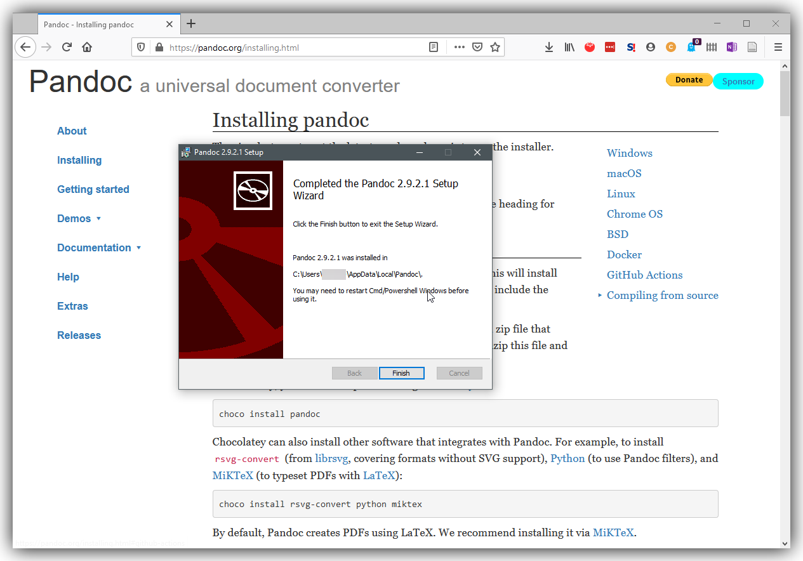
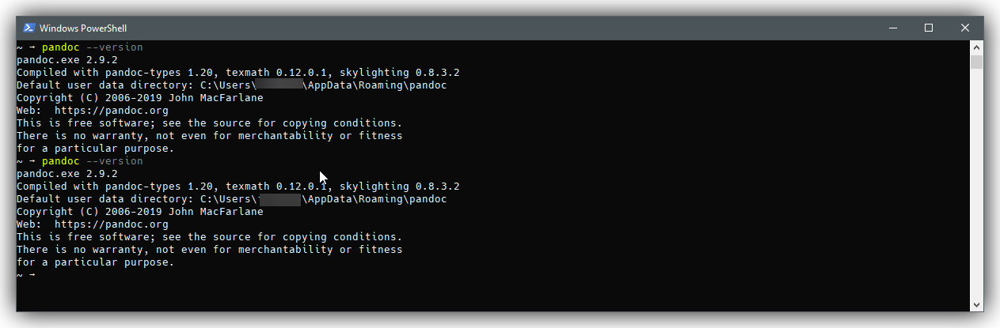
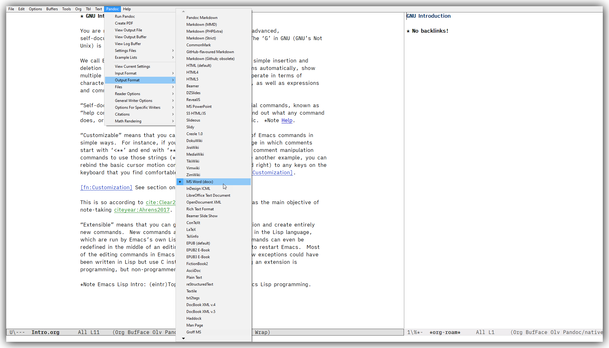
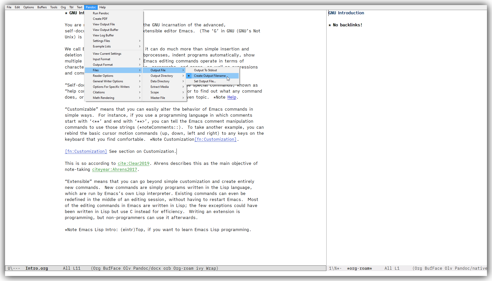
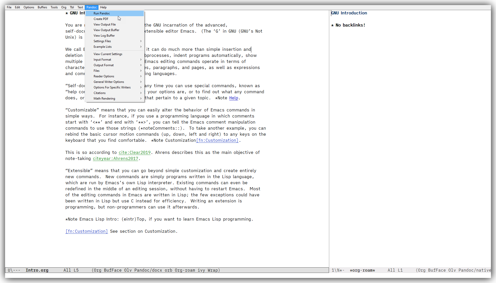
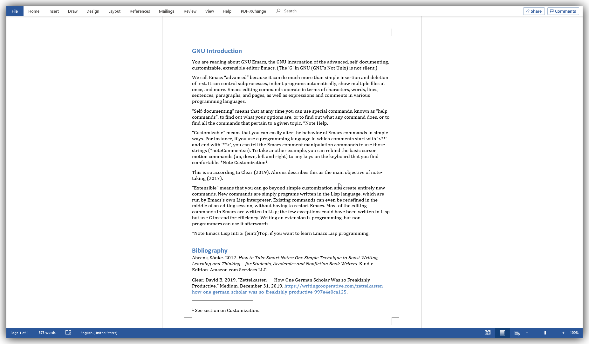
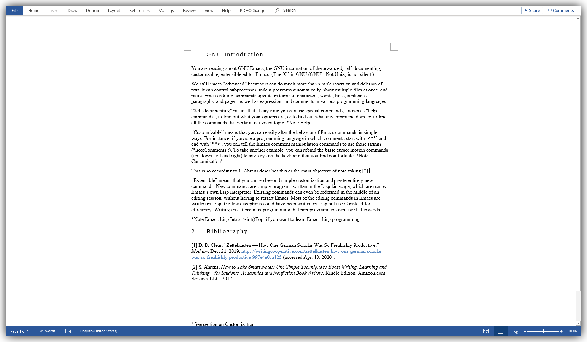

## Export to Microsoft Word docx

Now you have written some notes. You want to export them into another format. Microsoft Word `.docx` is one of the most widely used one, especially if you are on Windows. Let's try export one of your notes into a `.docx` file.

In practice, you may not just export one note, but compose a long-form paper out of multiple ideas from your notes, other materials such as image files, and so on. You may split your long-form work into smaller files (like I do here with this guide), and want to combine them to produce one big `.docx` file (or `.pdf`).

All that is good, and can be done with Emacs. In this guide, nevertheless, let us focus on a basic way: exporting one note into one `.docx` file. You can extend this method to suite your owin workflow. 

### Install Pandoc

If your target file format is `.docx`, I beleive the easiest and most common way is to use [Pandoc](https://pandoc.org/). It is a cross-platform program you install in your OS, not from within Emacs, is cross-platform (Linux, macOS, Windows, etc.), and converts one text file format into another. It is so versatile that practically it feels like it can take any text-file format known to human kind, and export to any other text-file format you wish -- I am exaggerating, but it supports so many formats that it feels this way.

Go to Pandoc's [intallation page](https://pandoc.org/installing.html), donwload the installer, and run it. The installer also automatically updates the path to the executables for you.



You can check that Pandoc is installed by calling `pandoc --version` and `pandoc-citeproc --version` in PowerShell or cmd (if you are already in it, you probably need to relaunch it for it to recognise the new path added by the installer). [Cite-proc](https://pandoc.org/MANUAL.html#citations) is important because it is the program that interprets and processes the citations in your note, and adds a bibliography at the end of it in the format you need. The installer covers it for you; if you use a different way to install Pandoc, make sure you have it in your system. 



### Install Pandoc-mode in Emacs

Launch Emacs, and call `M-x package-install RET pandoc-mode`. Once you have it in your Emacs, feel free to explore the manual via `C-h i m Pandoc-mode`. 

For our purpose, there is no need for additional configuration now.

Optionally, you can add something like this to automatically turn on Padoc-mode when Markdown-mode or Org-mode is enabled.

```
;; Pandoc mode to conver org files to other formats such as .docx, .md, or .pdf via LaTex
(add-hook 'text-mode-hook 'pandoc-mode)
```

### Use Pandoc-mode to export an Org note as a `.docx` file

You just need to set up the following three things.

1. Set output format to MS Word (docx)
2. Set to create an output file
3. Set Pandoc to use your bibliography file -- I am assuming you are using a `.bib` file like I do






Once that's done, simply run Pandoc. You will get your note in the `.docx` format. 





You can see the sample [Org note](./output-files/Intro.org) and the [output Word file]((./output-files/Intro.docx)) in this repo as a sample. 

### Different Word styles, citation and bibliography styles

One of the great benefits of writing in text file format like Org or Markdown is that you can easily switch different citation styles. 

Look for "Citation Style Language" in [Pandoc manual ](https://pandoc.org/MANUAL.html#Citations) for options avaialble. 

You can also change the "template" docx file used for styling your output Word document. Look for "reference docx" in the manual above for more detail on how you could personalize the reference docx.

Below is a result of my experiement. I don't think it is perfect for the CSL chosen ([IEEE](https://www.zotero.org/styles?q=IEEE)) and the reference docx. But I hope you get the idea of what you could do customize the output format to suite your needs (academic, aesthetic, or any other). The [reference docx](./output-files/custom-reference.docx) and [CSL file](./output-files/ieee.csl) I used are stored in this repo, too.



### Saving the settings for export

You can view and save the settings you have done, so that you do not have to do it again for the same file. You can also choose to apply the same setting to all the other files under the same project, or globally as your default setting. Refer to the manual (`M-x i m Pandoc-mode`) for more detail and other resources available online.

```
Current settings:

((bibliography "../iCloudDrive/bibliography/myBibliography.bib")
 (read . "org")
 (write . "docx")
 (output . t))
```

I have not explored configuration options any furhter, but I have a feeling you can also set some other defaults in `.emacs` or project configuration. If I find something useful, I'll come back to this section to add them.

### Note about Ox-pandoc

John Kitchin, the author of Org-ref talks about exporting Org files to a MS Word format in [his website](https://kitchingroup.cheme.cmu.edu/blog/2015/06/11/ox-pandoc-org-mode-+-org-ref-to-docx-with-bibliographies/) in 2015. In it, he uses an alternative to Pandoc-mode called Ox-pandoc. This does not really help us here, because his advice is to change the way to define citation from the Org-ref style (cite:citekey) to LaTex style (\cite{citekey}). This is not compabitle with our intention to use Org-ref togther with Org-roam, which does not support the LaTex style of citation for cite backlinks. 

Having said this, in 2020 now, Ox-pandoc may be a good alternative -- at the end of the day, it is another bridge from Emacs to Pandoc, like Pandoc-mode is. It might be just matter of quick set up for Ox-pandoc to make it work for the Org-ref style of citations... I will not investigate this further, though; Pandoc-mode works just fine.
