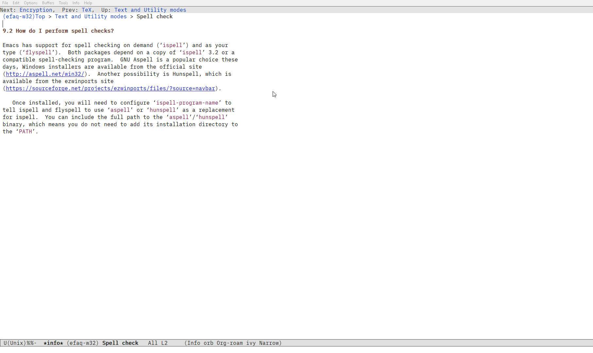
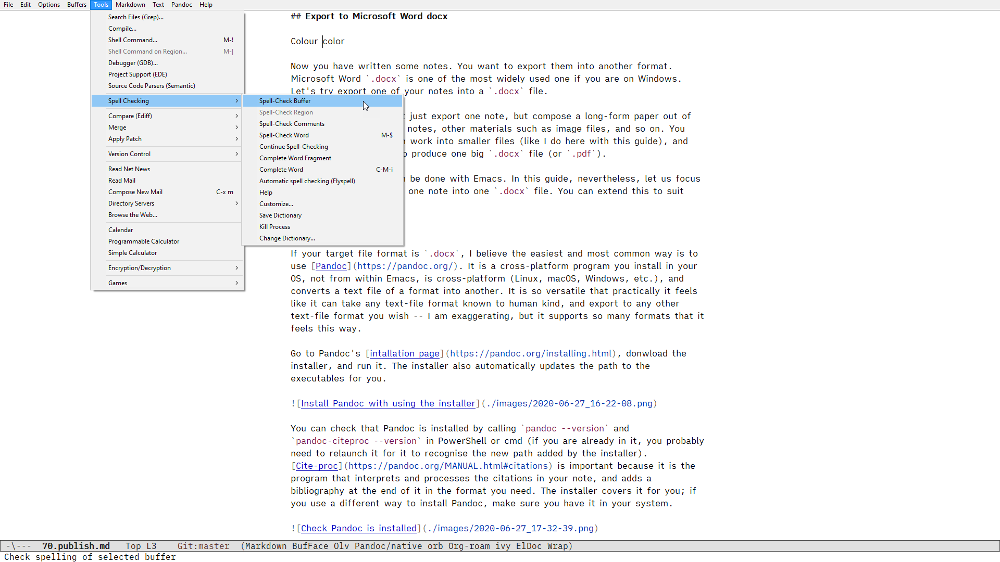
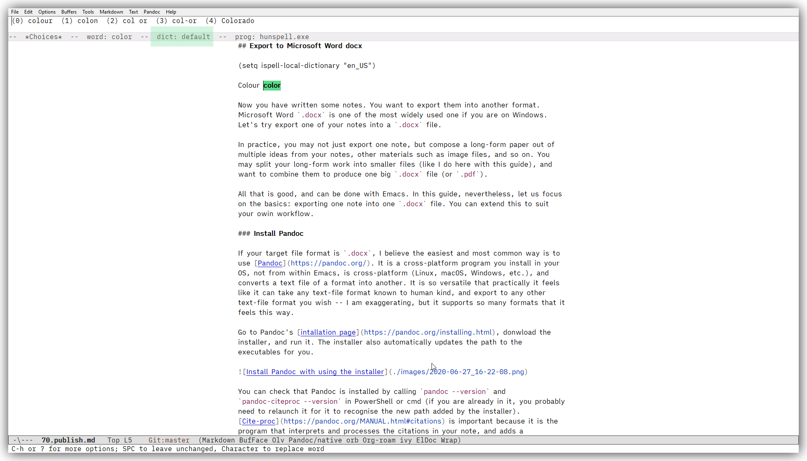
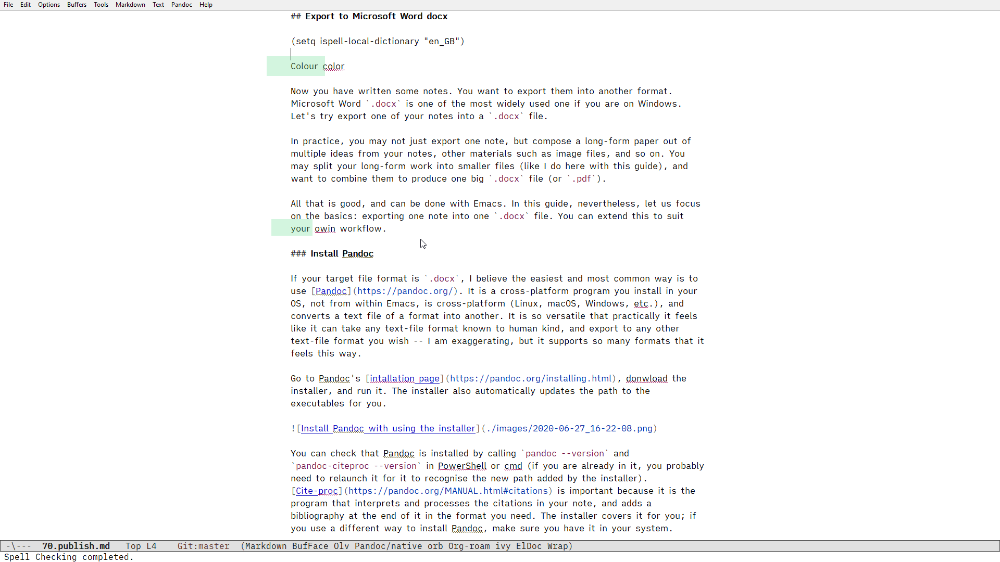
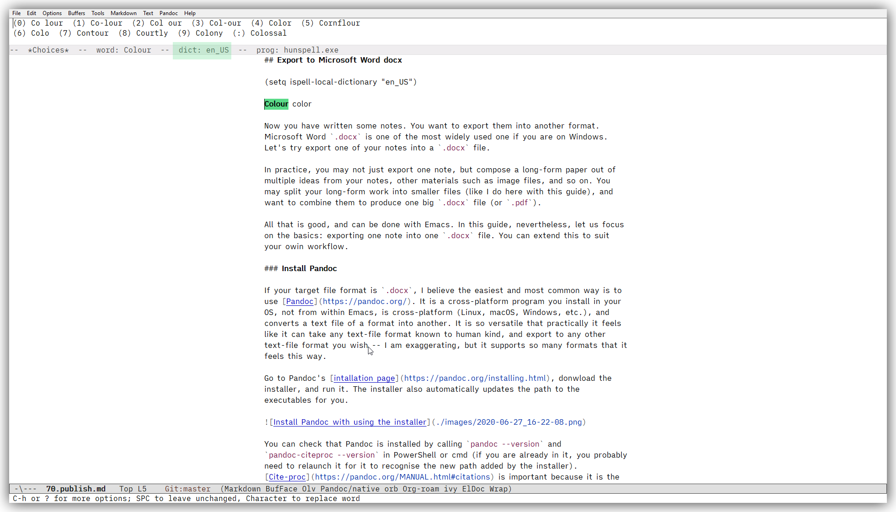

## Set up a spell checker (Hunspell, including how to get it)

I take spell checking for granted; and yet, I find it very tricky to set it up for Emacs on Windows. Let's crack this hard nut. 

We need to install a spell checking program, and get Emacs to work with it. I suggest Hunspell for that.

The reason is simple; have a look at this page from the in-system manual on the topic for Windows. 



Here is the [online version](https://www.gnu.org/software/emacs/manual/html_node/efaq-w32/Spell-check.html) of same manual page.

If you visit http://aspell.net/win32/ to get the installer for Aspell, you will notice this message "This port is no longer supported."; and the last release was 2002. 

On the [download page (SorceForge)](https://sourceforge.net/projects/ezwinports/files/?source=navbar) for Hunspell, you can find `hunspell-1.3.2-3-w32-bin.zip`, which was last updated in April 2014. You can also visit Hunspell's [GitHub page](https://hunspell.github.io/), which announces this: 

> Hunspell is the spell checker of LibreOffice, OpenOffice.org, Mozilla Firefox 3 & Thunderbird, Google Chrome, and it is also used by proprietary software packages, like macOS, InDesign, memoQ, Opera and SDL Trados.

### Install Hunspell

As for an installer, I cannot locate a binary for Windows anywhere in the official GitHub site, so let's download `hunspell-1.3.2-3-w32-bin.zip` from the SourceForge site above.

Like other programs we have installed so far (e.g. [Emacs itself](./10.Get-Emacs.md) , and [SQLite](./30.Set-up-Org-roam.md)), unzip the archive file under `~/` (home folder). The `hunspell-1.3.2-3-w32-bin/bin` folder contains the executable file, and the `hunspell-1.3.2-3-w32-bin/share/hunspell` folder contains dictionary files (US and UK English dictionaries come with the program). 

This is it. The PATH we added for ~/bin/ for Emacs in the environmental variable does not seem to find `hunspell.exe`, but that's fine. We can tell Emacs where to look. 

### Set up Emacs to work with Hunspell

If you search on the internet, you can find a variety of advice from StackExchange (e.g. [here](https://emacs.stackexchange.com/questions/30008/hunspell-flyspell-and-emacs-on-windows), and [here](https://emacs.stackexchange.com/questions/19982/hunspell-error-in-emacs)), and [Emacs Wiki](https://www.emacswiki.org/emacs/InteractiveSpell#toc4), and etc.. In writing this guide, I reviewed these sources, and my configuration as well. I synthesised different pieces of advice and comments, and came up with the config below.

I believe this two-line config below is the simplest I have done for spell-checker on Emacs so far. It works. It has allowed me to simplify my config. Stick it in your configuration file.

Note that I don't have to add `DICPATH` in my environmental variable (I used to have it before; now I have removed it).

```
;; Set up spell checker using Hunspell
(setenv "LANG" "en_GB")
(setq ispell-program-name
      "~/bin/hunspell-1.3.2-3-w32-bin/bin/hunspell.exe")
```

Adjust the language value for your needs, such as "en_US". 

It is important to match "en_GB" (or your dictionary language of choice) **exactly** with the file names of your dictionary file ("en\_GB.dic") and affix file ("en\_GB.aff") in the dictionary folder (`~/hunspell-1.3.2-3-w32-bin/share/hunspell`). 

I noticed that the more up-to-date dictionary files came with the name "en-GB"; notice the hyphen, not underscore?

### Use the spell checker in Emacs

You can call the spell checker from the menu.



Alternatively, you can call `M-x ispell` or `M-x ispell-buffer`. 



If you want to see the "red squiggle lines" under misspelt words like MS Word does, you can turn on Flyspell-mode via `M-x flyspell-mode`.



If you want to switch the spell-check language to another, you can use this variable. Evaluate the following expression (e.g. `M-x eval-last-sexp`, or `C-x C-e`). 

```
(setq ispell-local-dictionary "en_US")
```




### How to get more up-to-date dictionaries, or ones for other languages

Hunspell GitHub page is not necessarily the most user-friendly when it comes to finding information about language dictionaries. Through the `wget` example in this page, however, you can get a list available from the LibreOffice project: https://cgit.freedesktop.org/libreoffice/dictionaries/ .

It's probably easier if you search for Hunspell dictionary for your language, in the language. I have to admit, I could not find one for Japanese; your mileage depends on the language you are looking for.

Getting different variants of English dictionaries is perhaps the easiest. I got more up-to-date en\_GB dictionary than the ones that came with Hunspell in this [GitHub repo](https://github.com/marcoagpinto/aoo-mozilla-en-dict).


### Emacs file at the end of Chapter 8

At the end of this chapter, my `.emacs` looks like [this](./.emacs-end-of-ch8).
