## Set `org-protocol`, `org-roam-graph`, and `org-roam-server` (incl. Windows registry)

You will need to modify [Windows registry](https://en.wikipedia.org/wiki/Windows_Registry#Registry_editors), and some Elisp coding. These are not difficult to do, but proceed at your own risk, especially with Windows registry. There is some risk of messing up Windows, and potentially security risk. I just do this without fully understanding what I am doing. 

To set up all the stuff in this chapter, we will look at the following:

1. Install Graphviz on Windows, and try `org-roam-graph`
2. Start Emacs Server
3. Set up `org-protocol` and `org-roam-protocol`
4. Set up your Windows registry for `emacsclientw.exe`
5. [Chrome only] Patch Org Mode for `org-protocol`
6. Install and set up `org-roam-server`
  
This is a lot to chew. If you just want to see the end result, refer to [.emacs as at the end of this chapter](https://github.com/nobiot/Zero-to-Emacs-and-Org-roam/blob/16ae4d2fb595db9a64934328c8abf8bbeca2e1a0/.emacs) and history to view the incremental updates from previous chapters.
 
### Before we begin, set encoding to UTF-8

Add the following in your configuration file.

I have put it at the top of `.emacs`, before the "Packages" section, but it should not matter where.

You should be also fine without it. Without it, `org-roam-graph` asks encoding -- in my case, with a default of a Chinese variant. By specifying the "language environment" (whatever it means), it will not ask what encoding I want every time I want to the graph. I think it makes sense to set it to "UTF-8" in the modern, Unicode world. 

```
;; UTF-8 as default encoding
(set-language-environment "UTF-8")
```

### Install Graphviz on Windows, and try `org-roam-graph`

Go to Graphviz [download site](https://graphviz.org/download/).

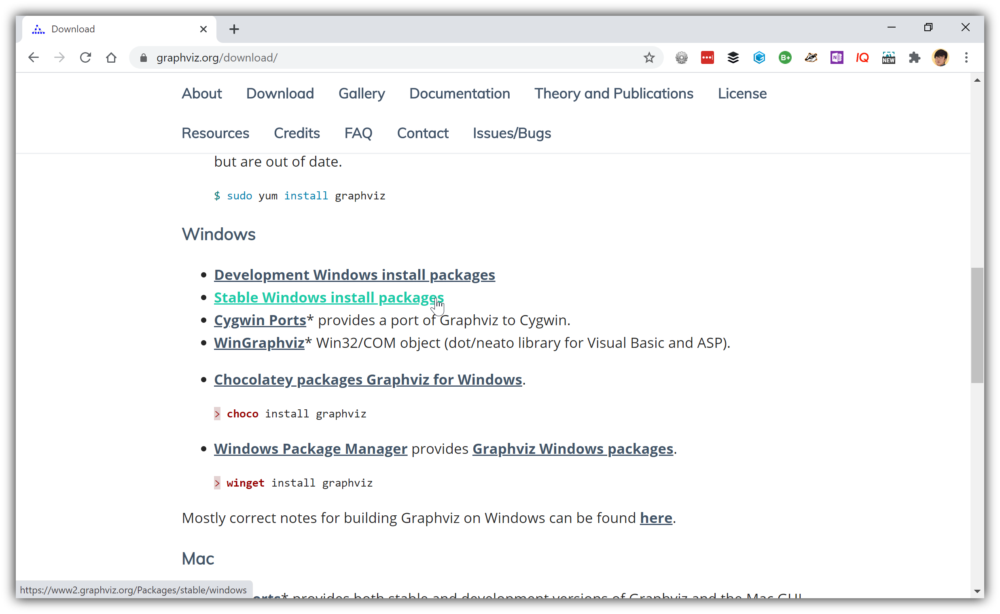

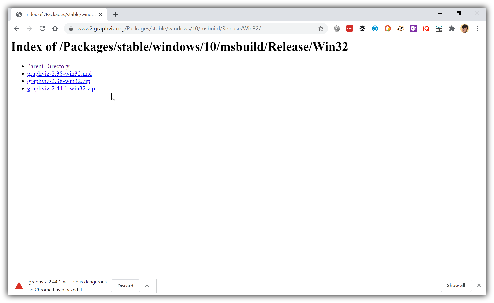

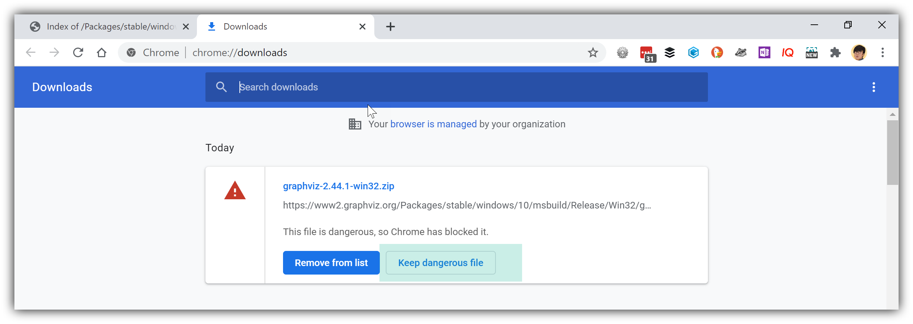

For Chrome, you might get these "error" messages -- I just took the risk and kept the file. Decide whether or not it's worth moving forward for yourself.

Unzip the archive. You get folders and files like this.

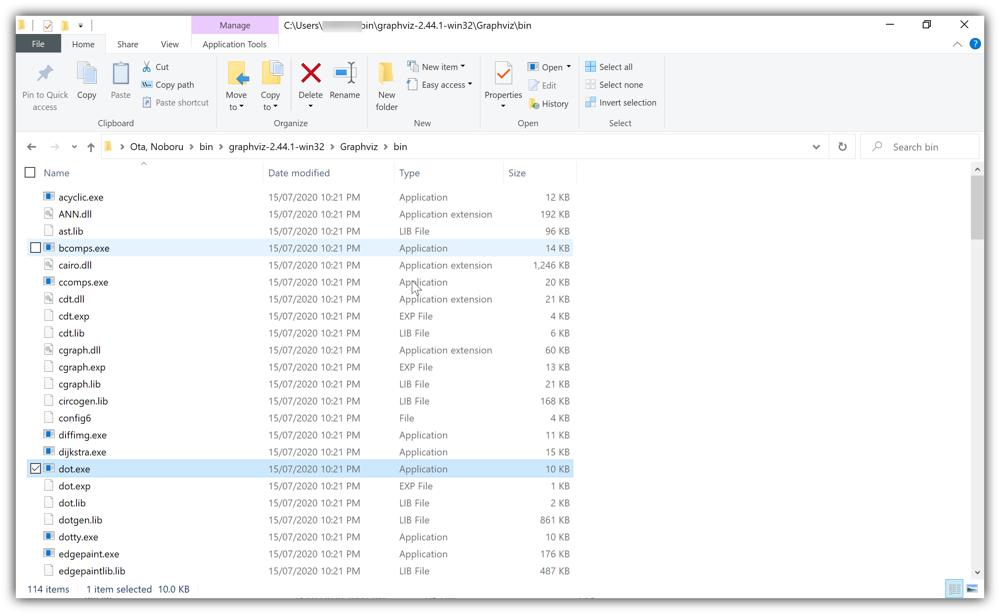

Place the whole folder in your `~/bin/` folder in the same way as other software we have seen in previous chapters (that is, there is no "installer"; just unzip and place). 

Put the following in your Emacs configuration file (if you have been following this guide from earlier chapters, it is `~/.emacs`).

```
(setq org-roam-graph-executable "~/bin/graphviz-2.44.1-win32/Graphviz/bin/dot.exe")
```
    
Evaluate it -- you can use `eval-buffer`, or more specific ones such as `eval-region` or `eval-last-sexp`.

Call `M-x org-roam-graph RET`. You should be able to view the graph of your notes in `org-roam-directory` in a buffer within Emacs.

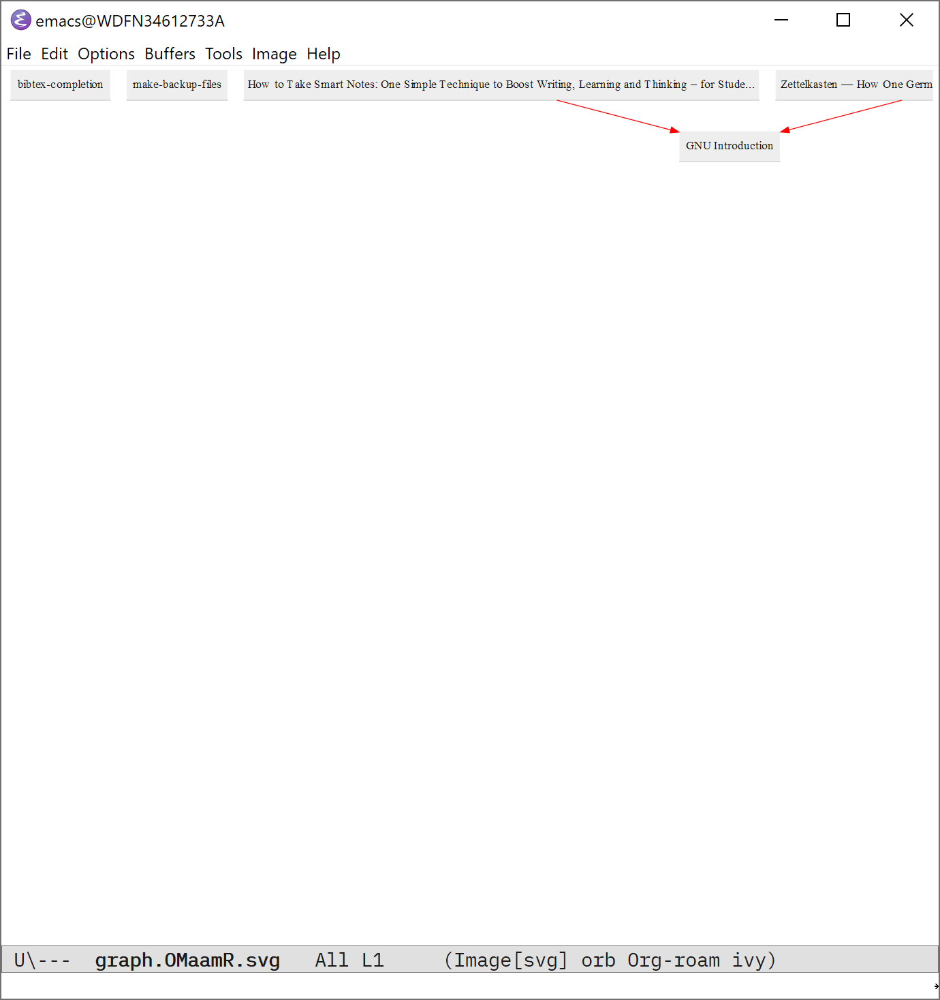

The reason why `org-roam-graph` does not call a browser is because this behaviour is controlled by variable `org-roam-graph-viewer` -- it should be `nil` if you are on Windows by default[^1]. 

If you see a graph displayed, then Graphviz is working for your Emacs. Let's move on to the next part of the configuration.

[^1]: There is a little more to it behind the scenes. The default is call Firefox, but because the default path is not recognised on Windows, and so Emacs sets the variable to `nil`. You can see what is "really" happening if you inspect the source code of of `org-roam-graph.el`. Look at the `defcustom` for `org-roam-graph-viewer`. You can do so via `M-h v RET org-roam-graph-viewer RET` to view the definition and its current value, and then jump to `org-roam-graph.el`.

### Display the graph in a browser

Getting `org-roam-graph` to launch and display the graph in Chrome is easy. Set variable `org-roam-graph-viewer` to the path to `chrome.exe`.

With my PC, it is this path below. Adjust the path for your PC, evaluate the following, and call `org-roam-graph` to see it in action.

```
;; in your Emacs config file

(setq org-roam-graph-viewer "C:/Program Files (x86)/Google/Chrome/Application/chrome.exe")
```

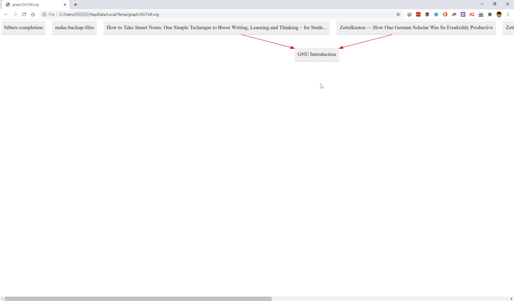

If you want to use Firefox, setting the path is not enough. You will notice that Emacs launches Firefox, but it does not directly show the graph -- in my case, Firefox opens my default search engine with the file path to the graph put in the search box.

Set `org-roam-graph-viewer` to the following value, instead of the path to`firefox.exe`.

```
;; in your Emacs config file

(setq org-roam-graph-viewer '(lambda (file) (let ((file-file (concat "file://" file)))
    (call-process "C:/Program Files/Mozilla Firefox/firefox.exe" nil 0 nil file-file))))
```

Adjust it with the path to `firefox.exe` in your PC. 

What it does is simple. The variable accepts a function. So an anonymous function is set to the variable. The function simply adds "file://" to the front of the file path, and then calls `firefox.exe` with passing the edited path to it.

Now you can display the graph in your browser, Chrome, Edge (it should work in the same way as Chrome), or Firefox. Great!

But you will soon notice that clicking on the box does not do anything. For this to work, you need to enable Emacs Server, `org-protocol`, and `org-roam-protocol`.  Following sections explain how to make them work.

### Emacs Server

Emacs Server lets Emacs run as a server in the background, waiting for an external program to interact with it -- in this case, the external program is your browser. 

This is easy to do. Try the following.

1. In Emacs, `M-x server-start` (if this is your first time, it will create a folder named "server" in your `.emacs.d`, and a file named "server" in the "server" folder)
2. In PowerShell, call the following command. Adjust the path to `emacsclientw.exe` for your PC.

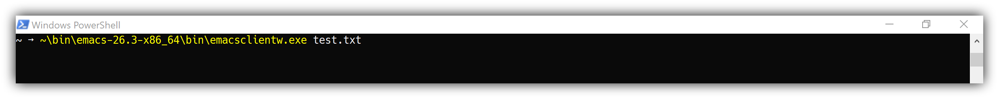

Your Emacs should respond by opening a file named `test.txt`.  See the screen shot below:


Use `C-x #` to close this buffer.

You might see this error below; there are two possible ways to fix it.

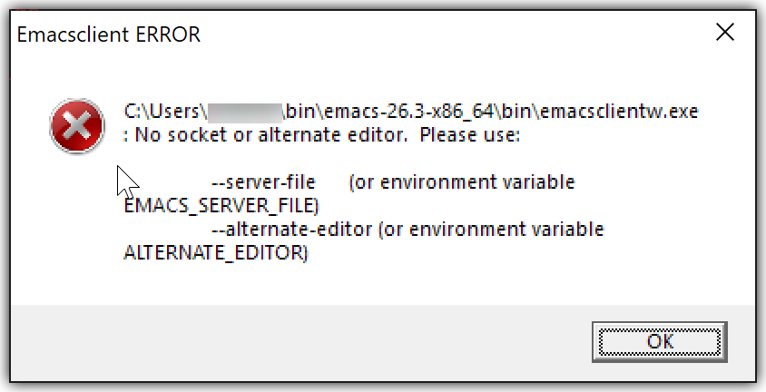

1. Emacs Server is not started. Make sure to call `M-x server-start`
2. This is not your first time to run it, and your `server` file is confused. Delete the whole `server` folder within your `.emacs.d`, and then start Emacs Server again.

So... what have we done so far? You have started Emacs as a server, and learned that Emacs Server can be accessed via `emacsclientw.exe` on Windows. You have also seen that it can take a parameter (argument) as the name of the file to open. 

This is great... But how can we make our browser interact with Emacs Server? We will use the HTML hyperlink for this. 

Then how can a hyperlink do something very specific to Org-roam (or Org Mode)? 

This is where `org-protocol` and `org-roam-protocol` come in. They specify "interfaces" for external programs (such as browsers, PowerShell, etc.) to send specific commands to Emacs Server to do more than just to open a file[^2].

[^2]: Try something like this below in PowerShell -- the file name is an existing note's filename in the `org-roam-directory`; you should see an empty file open, instead of your note. Without `org-protocol` properly set up, Emacs does not understand this argument correctly.

```
# PowerShell

~\bin\emacs-26.3-x86_64\bin\emacsclientw.exe "org-protocol://roam-file?file=c:/Users/nobiot/org-roam/20200711125208-bibtex_completion.org"
```

### `org-protocol` and `org-roam-protocol`

Let's continue, and see what these "protocols" can do for us. 

Put these two lines below in your configuration file, and evaluate. Alternatively, you can use `M-x load-library RET org-protocol` and the same command for `org-roam-protocol`. 

```
(require 'org-protocol)
(require 'org-roam-protocol)
```

If you call the following (adjust the path to your `emacsclientw.exe` and your note), your Emacs should now display the note correctly. 

```
# PowerShell

~\bin\emacs-26.3-x86_64\bin\emacsclientw.exe "org-protocol://roam-file?file=c:/Users/nobiot/org-roam/20200711125208-bibtex_completion.org"
```

Now we know that `org-protocol`, and its adaptation by Org-roam, `org-roam-protocol` work from PowerShell. Why does it not work from our browser?

To understand why, you can inspect the URL attached to one of the boxes in the graph in your browser. It should look like this (from Chrome).

```
org-protocol://roam-file?file=c%3A%2FUsers%2Fnobiot%2Forg-roam%2F20200711125208-bibtex_completion.org
```

Your browser (or your Windows) does not know how to respond to `org-protocol://` -- its a "protocol", just like `http://` or `https://` that your browser and Windows know by default how to treat[^2].

[^2]: To be a bit more precise,[Wikipedia page on URL](https://en.wikipedia.org/wiki/URL) tells me that the protocol part in a URL is "https" not "https://". For our purpose, though, I think this distinction is not relevant. Let’s not split hairs.

  > A typical URL could have the form http://www.example.com/index.html, which indicates a protocol (http), a hostname (www.example.com), and a file name (index.html).

### Set up your Windows Registry for `emacsclientw.exe`

For your browser and Windows to recognise an URL with `org-protocol://`, you need to edit the Windows registry to define a custom "protocol for URL".

You do not need to understand what exactly the [Windows registry](https://en.wikipedia.org/wiki/Windows_Registry#Registry_editors) is. I admit I do not have full understanding of it. For our purpose, it is enough to understand that it can be used to define a custom "protocol for URL" for the browser. 

Just a word of caution, however, before we proceed. He Windows registry is very technically "low-level", meaning close to the fundamental part of Windows. [You could mess up your Windows](https://docs.microsoft.com/en-us/office/vba/Library-Reference/Concepts/security-notes-for-microsoft-office-solution-developers#modifying-the-windows-registry) (also [this](https://support.microsoft.com/en-us/help/256986/windows-registry-information-for-advanced-users)), if you touch anything else. It might also open up some security risk. I cannot fully assess the security risk posed by `org-protocol` in the context of Windows registry -- I assume it will be low, because the parameter you pass to `emacsclientw.exe` is treated as a text string unless you explicitly tell Emacs to treat it differently -- `org-protocol` and `org-roam-protocol` are such explicit ways to treat the parameter differently. Proceed at your own risk.

Now the warning is out of the way, let's focus on how we can configure the Windows registry for our purpose. You can follow any of the three documents listed below -- the latter two seem to refer to the first one anyway[^3]. The explanation there might be a bit be too terse. I'll break it down more below. 

[^3]: Do not try the JavaScript bookmarklet for `org-protocol-store-link` in Org-mode's manual -- it does not work for me; my conclusion is that it is obsolete if you have Org Mode 9.3.6 from MELPA, or 9.4 that Doom Emacs gets you. If you are interested, see an additional section later if you wish to see the JavaScript I have done to make the bookmarklet work.

- [Org mode's manual on `org-protocol`](https://orgmode.org/worg/org-contrib/org-protocol.html#org124a1fc)
- [Org-roam's manual on `org-roam-protocol`](https://www.orgroam.com/manual/Installation-_00281_0029.html)[^4]
- [Sacha Chua's post on `org-protocol` from 2015 ](https://sachachua.com/blog/2015/11/capturing-links-quickly-with-emacsclient-org-protocol-and-chrome-shortcut-manager-on-microsoft-windows-8/)

[^4]: Now it's great that Org-roam's official manual contains the information for Windows. This is thanks to the contribution of GitHub user karamme via https://github.com/org-roam/org-roam/pull/882. Really cool; thank you.

Follow the steps below.

1. Open a text editor (e.g. Notepad, Emacs). Create a new file, paste the following in, and save as "org-protocol.reg". The name does not matter, but the extension must be `.reg`.

```
REGEDIT4

[HKEY_CLASSES_ROOT\org-protocol]
@="URL:Org Protocol"
"URL Protocol"=""
[HKEY_CLASSES_ROOT\org-protocol\shell]
[HKEY_CLASSES_ROOT\org-protocol\shell\open]
[HKEY_CLASSES_ROOT\org-protocol\shell\open\command]
@="\"C:\\Programme\\Emacs\\emacs\\bin\\emacsclientw.exe\" \"%1\""
```

2. In the text editor, adjust the path for your Windows.

Adjust the following part for your system. It is important to keep the double backslashes. Also note the trailing backslash.

```
"C:\\Programme\\Emacs\\emacs\\bin\\emacsclientw.exe\" 
```

Breathe, take a leap of faith, and double-click on the icon.


There is one or two more messages to really, really make sure that you know what you are doing. Say yes to them all.
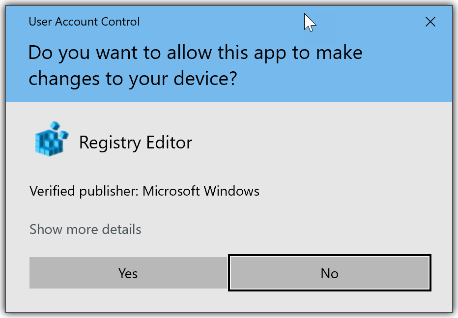

Once you get through them all, you can view and manually edit what you have done with Registry Editor, which comes with Windows by default. You can even delete to undo what you have added via the `.reg` file -- try not to touch anything else. 

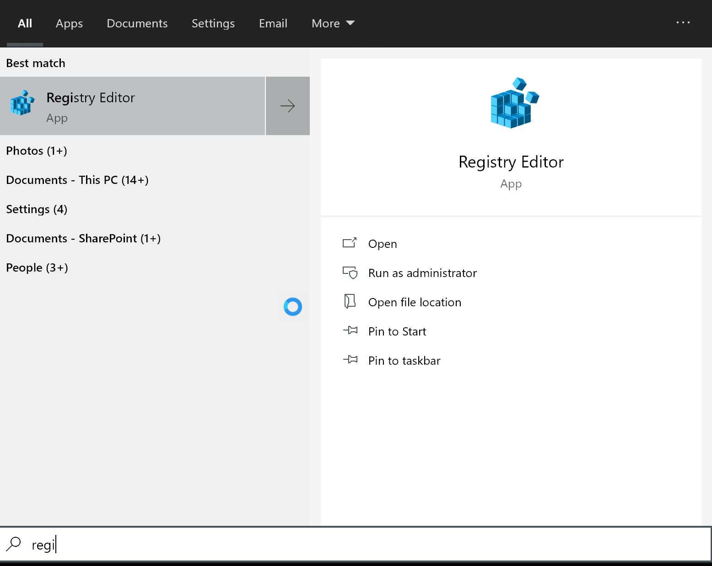

You should see `org-protocol` added in the registry like so:

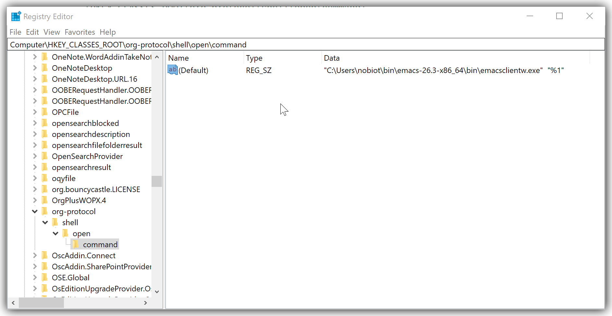

You can edit the path if you double-click on the `ab(Default)` part. Notice that the double backslashes are changed to the normal single backslash to specify a path.

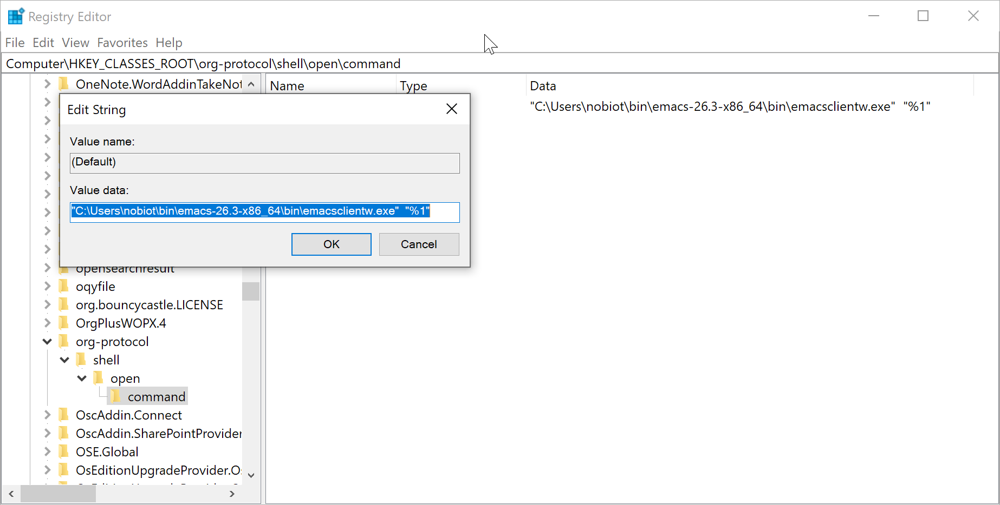

Once that's done, you should be able to see your browser behave differently from before your editing Windows registry.

If you are using Firefox and use Org Mode 9.3.6 or higher[^6], you should see a dialogue box like this. Choose the path to `emacsclientw.exe`; if you tick the checkbox "Remember my choice for org-roam protocol links", you won't see it again. You can change this via Options. With Firefox, you should be good to go!

[^6]: If you are on a lower version of Org Mode, you might also have the same problem as for Chrome described below. I would suggest to upgrade it. If you want to stay with the version you are on, it has been reported that the “patch” for Chrome described works (the [report](https://github.com/nobiot/Zero-to-Emacs-and-Org-roam/issues/4) is for Org Mode 9.19).

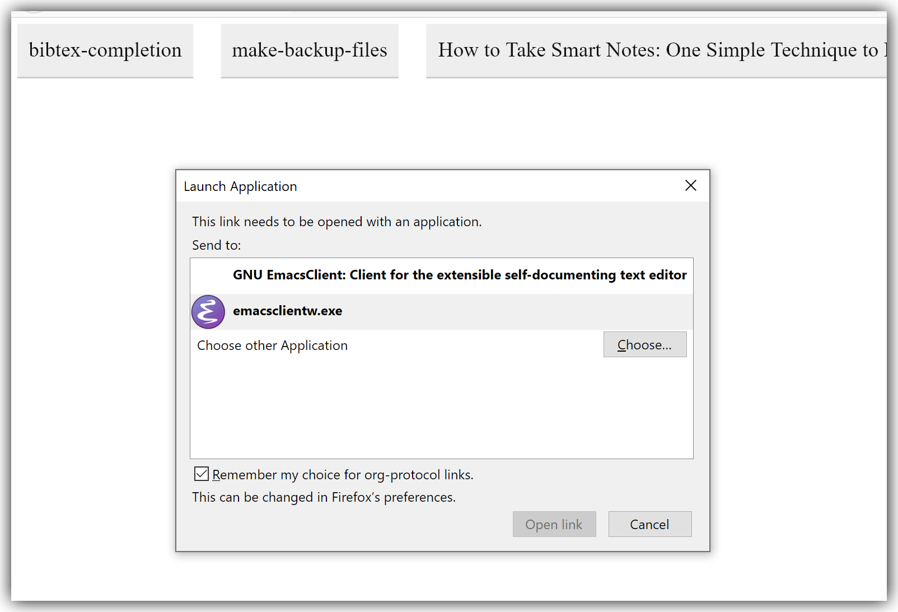

If you are using Chrome, you will get this dialogue box. I don't know how to make the selection default on Chrome yet -- you will get it every time. 

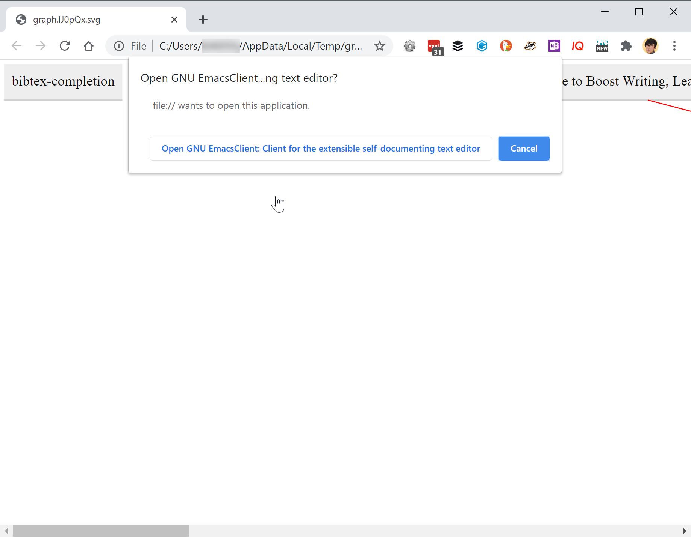

If you are using Doom, you should be good to go; it gets you the cutting-edge Org Mode version 9.4, which does not have the problem I will be describing here. If you are using Org Mode from MELPA, etc., you would be on 9.3.6 or 9.3.7 (`M-x org-version` to see it), and you likely end up opening an empty note. No worries, there is a fix. Move on to the next section, though it will be a bit technical.

### [Chrome only] Patch Org Mode for `org-protocol` and `org-roam-protocol`

The reason why clicking on a box in Chrome opens an empty buffer is because of function `org-protocol-check-filename-for-protocol`. A regular expression does not correctly parse the string passed to the function. This is part of Org Mode, not Org-roam. If you know how to upgrade your Org Mode to 9.4, which is not released yet, go ahead; that should do the trick. For the rest of us, my humble suggestion is as follows.

Override function `org-protocol-check-filename-for-protocol` (and only this function) with the one that comes with version 9.4.

1. Get the [source code of the function](https://code.orgmode.org/bzg/org-mode/src/master/lisp/org-protocol.el). I have extracted just the function we want, and put a copy in [this repo](./+org-protocol-check-filename-for-protocol.el) 
2. Place it somewhere in your PC; I would suggest somewhere under `.emacs.d`
3. Put the following in your configuration file (adjust the file path to the `.el` file). It tells Emacs to load your function copied from version Org Mode 9.4, and override the current version (9.3.x) with it via `advice-add`.

```
(load-file "~/.emacs.d/+org-protocol-check-filename-for-protocol.el")
(advice-add 'org-protocol-check-filename-for-protocol :override '+org-protocol-check-filename-for-protocol)
```

### `org-roam-server` for more powerful graph functions

[`org-roam-server`](https://github.com/org-roam/org-roam-server) is part of Org-roam ecosystem, and lets you visualise and interact with the graph of your notes. Good news is that its really plug-and-play on top of Org-roam once all of the above is working.

1. Install it via `M-x package-install RET org-roam-server RET`
2. Add the following to your configuration file. It's a simple translation from the `use-package` syntax described in its [documentation](https://github.com/org-roam/org-roam-server#installation)
3. Enable it by calling `M-x org-roam-server-mode`

That's it!

You can play with the interactive graph visualisation of your own notes in your browser. Visit localhost:8080 (or equivalently, 127.0.0.1:8080) in your browser.

```
(require 'org-roam-server)
(setq org-roam-server-host "127.0.0.1"
       org-roam-server-port 8080
       org-roam-server-export-inline-images t
       org-roam-server-authenticate nil
       org-roam-server-network-poll t
       org-roam-server-network-arrows nil
       org-roam-server-network-label-truncate t
       org-roam-server-network-label-truncate-length 60
       org-roam-server-network-label-wrap-length 20)
```

Clicking a bubble should take you to the corresponding note in Emacs via `org-roam-protocol`. It’s very intuitive (for me, at least); you  should be able to get many of the features by playing with the UI.


Now you have got graphing functions working!

### [Extra] JavaScript for Bookmarklet

This is an extra section for those who would like to get JavaScript bookmarklets working for org-protocol functions. The best is to inspect the source code and see what string is expected. Below is one example, intended to give you some ideas of what to look for when you look at the source code. 

The documents referenced above contain sample JavaScript code to be used in a bookmarklet for `org-protocol-store-link`. You need to update it for the current Org Mode (tested on 9.3.6 from MELPA, and 9.4 that Doom Emacs installs).

The obsolete code is this:

```
javascript:location.href='org-protocol://store-link://'+encodeURIComponent(location.href)
```

The correct one that I learned from the source code and tested to work is as follows. Note the "?url=" part.

```
javascript:location.href='org-protocol://store-link?url='+encodeURIComponent(location.href)
```


