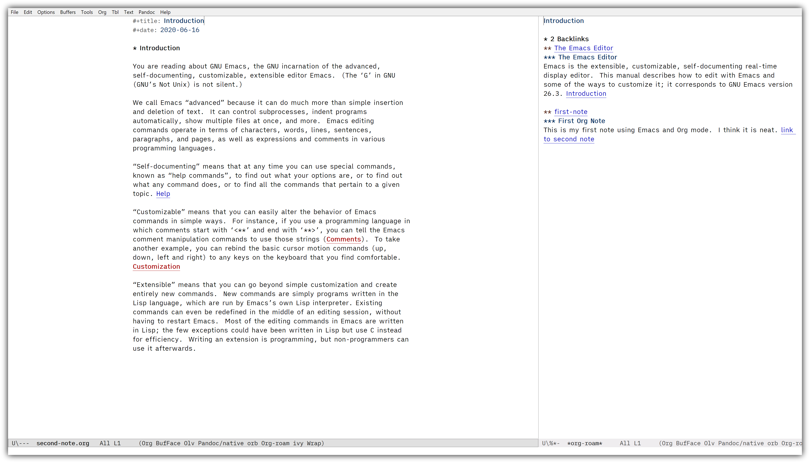
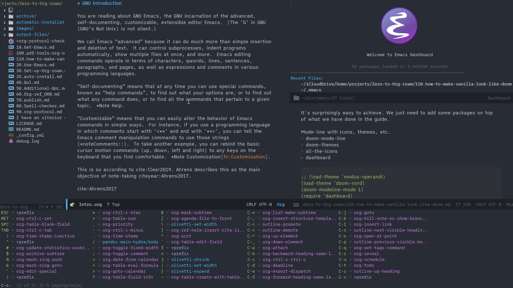
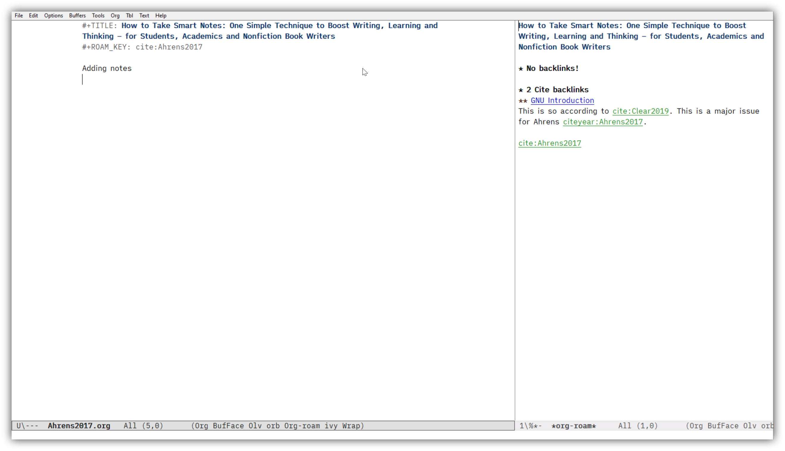
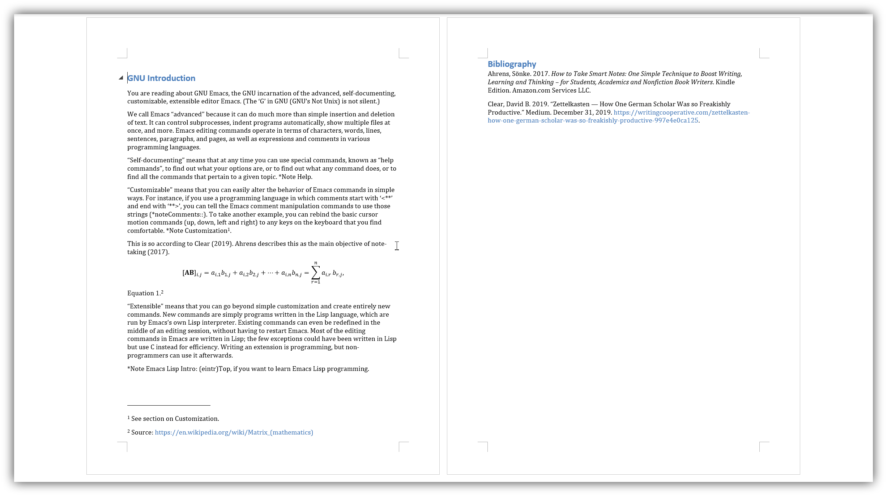
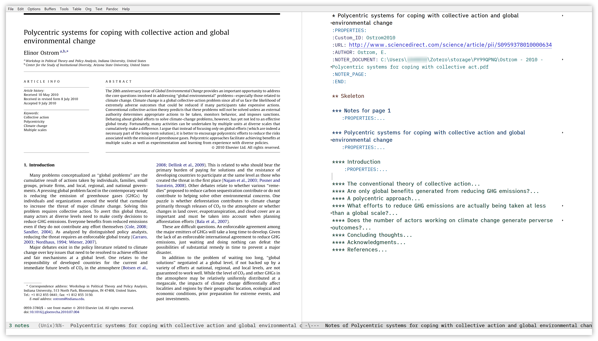

# Notes on Org-roam V2

Org-roam's author Jethro has mentioned his plan to switch to version 2 (v2) [at the end of June 2021](https://github.com/org-roam/org-roam/pull/1401#issuecomment-857646674). It will be markedly different from the current version (v1) for both its initial setup and daily usage. This means that this guide will only be applicable to v1 for Org-roam and its related packages such as Org-roam-bibtex ans Org-roam-server for now.

I am planning to spend some time and try to gradually revise this guide in its entirety for v2. I am hoping that I can do this during the Nothern Hemisphere's summer. Thank you.

# Zero to Emacs and Org-roam: a step-by-step guide on Windows 10

I took the liberty of creating a step-by-step guide for people new to Emacs. I have written this with Windows users with no Linux or programming background in mind, zero about Emacs.

The guide aims to get you going real quick, starting with downloading Emacs with vanilla configuration (no Doom, no Spacemacs).

At the end of step-by-step guide of Part 1, your Emacs will look like this.

In addition, I have added an extra chapter to show you how you might personalize the look & feel of your Emacs, using Doom as a reference. I personally do not use this set up, preferring to be as minimal as I can be for my own purposes. I am aware my preference is perhas rather eccentric (who isn't?); this dark-mode-centric slick look might be something many others want to go for.

*Extra 2*. [Make vanilla Emacs look like Doom](./110.how-to-make-vanilla-look-like-doom.md)

## Audience and purpose in mind

The audience I have had in mind are:

- New to Emacs
- Windows users (Emacs part should be useful for others, I hope)
- No programming or Linux background
- Looking to use Org-roam / Emacs to help write long-form material (essays / papers about life, humanities, or some qualitative social sciences, etc.) as opposed to math and programming

Even if you are already down the path of using a framework like Doom, I hope stepping back a little and actually finishing configuration from scratch will help you understand how things fit together – it’s a bit like DIY making stuff; completing one thing from start to finish seems to help you leap to the next level of understanding and confidence for some reason.

## Part 1

1. [Get Emacs for Windows](./10.Get-Emacs.md)
2. [Use Emacs to write some text (including copy & paste)](./20.Use-Emacs.md)
3. [Set up Org-roam (including sqlite3)](./30.Set-up-Org-roam.md)
4. [Improve quality-of-life with your font, theme, and minimal select packages ](./40.Qol.md)
5. [Some more quality-of-life improvements for your typography -- font variations and line-spacing -- and other things](./50.Additional-QoL.md)

The config file at the end of Part 1 is [located in this repo](https://github.com/nobiot/Zero-to-Emacs-and-Org-roam/blob/926c0f07708514bbdc6952dc3bac520d8668cbc1/.emacs), too. Refer to [its history](https://github.com/nobiot/Zero-to-Emacs-and-Org-roam/commits/main/.emacs) if you wish to see the incremental changes as we move along advanced chapters.

## Part 2

6. [Set up Org-ref and Org-roam-bibtex (ORB)](./60.Org-ref_ORB.md)
7. [Export to MS Word](./70.publish.md)
8. [Set up a spell checker (Hunspell, including how to get it)](./80.Spell-checker.md)

## Part 3 

I consider the following "extra" features because they require a certain level of "hacking the system". I suggest that you selectively decide whether or not you would like to take on the challenges, depending on your familiarity wth the technical stuff on Windows.

9. [Set up `org-protocol`, `org-roam-graph`, and `org-roam-server` (incl. Windows registry)](./90.org-protocol.md)
10. [Work with PDF files in Emacs with PDF-Tools, Org-noter, and ORB](./100.pdf-tools-org-noter.md)
11. [Insert an image from the clipboard, or the Snipping Tool on Windows (incl. in-line display resizing without Imagemagick, or external programs)](115.How-to-enable-insert-image-from-clipboard.md)
12. (maybe) How to swap CapsLock with Ctrl
13. (maybe) Export to PDF

## Extra

*Extra 1*: I have added a [script that automates installation](./35.auto-install.md) of packages that I describe in this guide up to [Chapter 6 on ORB](./60.Org-ref_ORB.md). Let me know how you go. 

*Extra 2*: [Make vanilla Emacs look like Doom](./110.how-to-make-vanilla-look-like-doom.md)

---

At the end of chapter 6 on ORB, you will get to this point where you can use ORB.

Chaper 7 is now published. It demonstrates a way to export your Org notes to MS Word. Resultant `.docx` files look like this:

Chapter 9 lets you play with interactive visualisation of your notes and their relationships via `org-roam-server`:

Chapter 10 provides an easy step-by-step instruction on how to install PDF-Tools on Windows, and configure Org-noter to work with ORB.

Extra 2 [lets you make vanilla Emacs look like Doom](./110.how-to-make-vanilla-look-like-doom.md).

## License

 This work is licensed under a <a rel="license" href="http://creativecommons.org/licenses/by-sa/4.0/">CC BY-SA 4.0 license</a>, except for source code and documentation excerpts from Emacs and Org-roam project.
