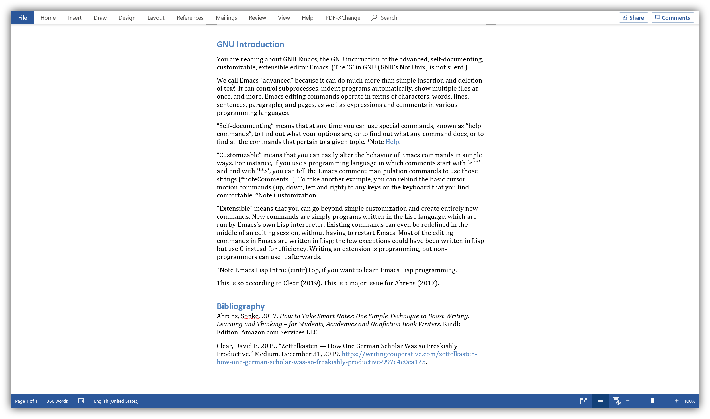

# Zero to Emacs and Org-roam: a step-by-step guide on Windows 10

Part 1

1. [Get Emacs for Windows](./10.Get-Emacs.md)
2. [Use Emacs to write some text (including copy & paste)](./20.Use-Emacs.md)
3. [Set up Org-roam (including sqlite3)](./30.Set-up-Org-roam.md)
4. [Improve quality-of-life with your font, theme, and minimal select packages ](./40.Qol.md)

The config file at the end of Part 1 is [located in this repo](./.emacs), too.

Part 2 (working in progress)

5. [Before we start Part 2 -- some notes](./50.Part2.md)
6. [Set up Org-ref and Org-roam-bibtex (ORB)](./60.Org-ref_ORB.md)
7. Write, and export to MS Word or PDF
8. Get a spell checker for Emacs
9. How to swap CapsLock with Ctrl
10. Set up the graph function within Org-roam

At the end of chapter 5, you willl get to this point where you can use ORB.

I am still writing the chapter on exporting to MS Word, but based on what I have done, the outcome should look something like this (the final result may look a bit different, but I hope you get an idea where this is going).

## License

 This work is licensed under a <a rel="license" href="http://creativecommons.org/licenses/by-sa/4.0/">Creative Commons Attribution-ShareAlike 4.0 International License</a>.
